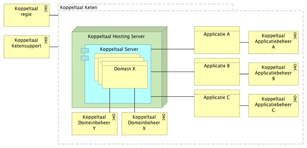
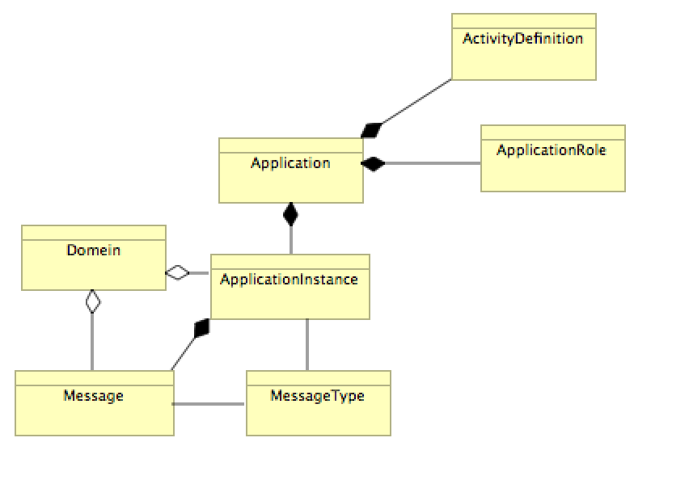
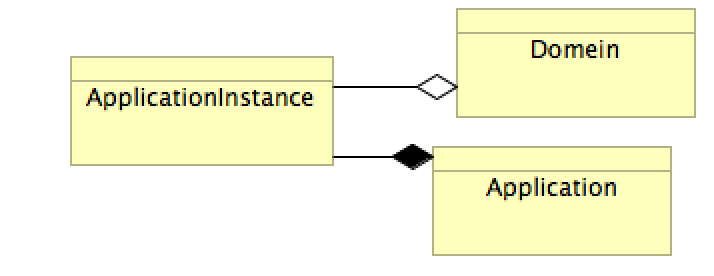
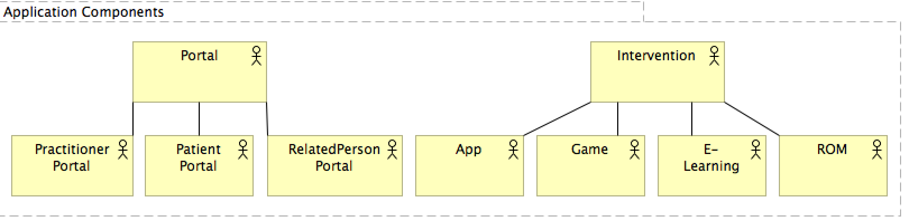
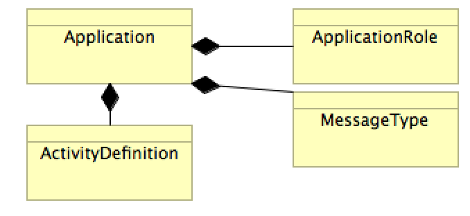
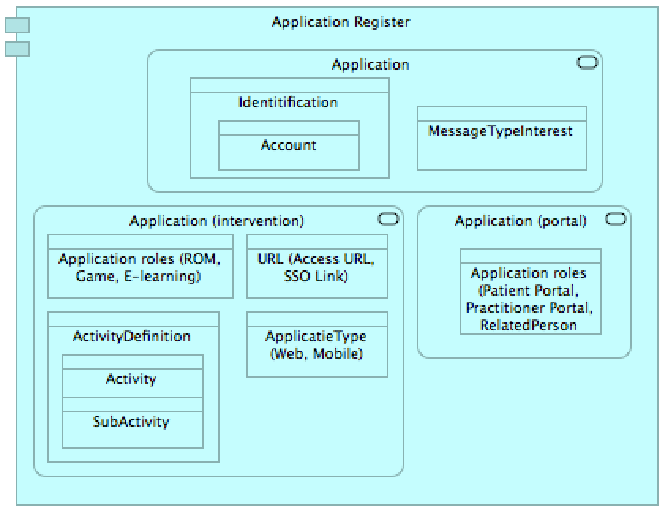
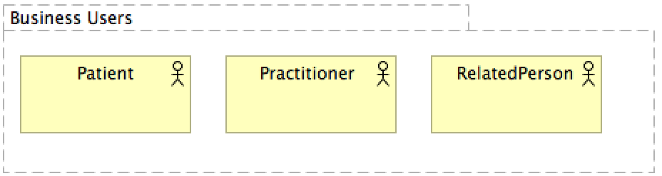
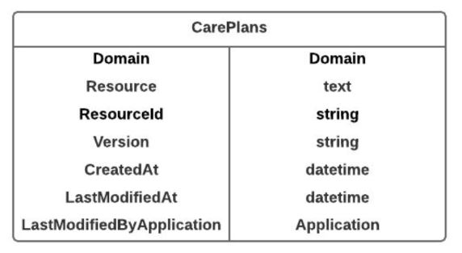

# Koppeltaal Architectuur 1.3.x

<table>
  <thead>
    <tr>
      <th style="text-align:left"></th>
      <th style="text-align:left"></th>
    </tr>
  </thead>
  <tbody>
    <tr>
      <td style="text-align:left">
        
postadres: Postbus 30920, 2500 GX Den Haag

        
bezoekadres: Oude Middenweg 55, 2491 AC Den Haag

        
telefoon: (070) 317 34 50; fax: (070) 320 74 37; e-mail:info@vzvz.nl www.vzvz.nl

        

        
Het is niet toegestaan om zonder voorafgaande toestemming van VZVZ Servicecentrum
          de gegevens te kopi&#xEB;ren, te wijzigen, te distribueren, te verspreiden,
          of op andere wijze te gebruiken en / of te exploiteren..

      </td>
      <td style="text-align:left"></td>
    </tr>
    <tr>
      <td style="text-align:left"></td>
      <td style="text-align:left"></td>
    </tr>
    <tr>
      <td style="text-align:left">Datum</td>
      <td style="text-align:left">2 april 2020</td>
    </tr>
    <tr>
      <td style="text-align:left">Versie</td>
      <td style="text-align:left">1.4.4</td>
    </tr>
    <tr>
      <td style="text-align:left">Status</td>
      <td style="text-align:left">GitBook Draft</td>
    </tr>
    <tr>
      <td style="text-align:left">Classificatie</td>
      <td style="text-align:left">Koppeltaal</td>
    </tr>
    <tr>
      <td style="text-align:left">Contact</td>
      <td style="text-align:left">koppeltaal-architectuur@vzvz.nl</td>
    </tr>
    <tr>
      <td style="text-align:left"></td>
      <td style="text-align:left"></td>
    </tr>
  </tbody>
</table>Wijzigingen

<table>
  <thead>
    <tr>
      <th style="text-align:left">Versie</th>
      <th style="text-align:left">Datum</th>
      <th style="text-align:left">Omschrijving</th>
      <th style="text-align:left">Auteur</th>
    </tr>
  </thead>
  <tbody>
    <tr>
      <td style="text-align:left">0.1</td>
      <td style="text-align:left">20-03-2018</td>
      <td style="text-align:left">Draft</td>
      <td style="text-align:left">Reli Todea</td>
    </tr>
    <tr>
      <td style="text-align:left">0.11</td>
      <td style="text-align:left">6 april 2018</td>
      <td style="text-align:left">Review draft voor feedback aan Reli en toets door Wouter Tesink op passendheid
        vorm</td>
      <td style="text-align:left">Sergej van Middendorp</td>
    </tr>
    <tr>
      <td style="text-align:left">0.17</td>
      <td style="text-align:left">25 Mei 2018</td>
      <td style="text-align:left">Review Tom Deijman en Wouter Tesink</td>
      <td style="text-align:left">Reli Todea</td>
    </tr>
    <tr>
      <td style="text-align:left">0.19</td>
      <td style="text-align:left">30 mei 2018</td>
      <td style="text-align:left">Aanvullingen business laag</td>
      <td style="text-align:left">Sergej van Middendorp</td>
    </tr>
    <tr>
      <td style="text-align:left">0.19a</td>
      <td style="text-align:left">3 juni 2018</td>
      <td style="text-align:left">Review Tom Deijman en Johan verwerkt</td>
      <td style="text-align:left">Reli Todea</td>
    </tr>
    <tr>
      <td style="text-align:left">0.20</td>
      <td style="text-align:left">3 juni03 Juni 2018</td>
      <td style="text-align:left">Aanvullingen business laag n.a.v. overleg Tom &#x2013; Sergej en samenvoeging
        0.19a Reli</td>
      <td style="text-align:left">Sergej van Middendorp</td>
    </tr>
    <tr>
      <td style="text-align:left">0.20 feedback PBK</td>
      <td style="text-align:left">9 juni</td>
      <td style="text-align:left">Schriftelijke feedback als vervolg op de reviewsessie 8 juni.</td>
      <td
      style="text-align:left">PBK</td>
    </tr>
    <tr>
      <td style="text-align:left">0.21</td>
      <td style="text-align:left">14 juni</td>
      <td style="text-align:left">Opmerkingen aangevuld met reacties en plan voor verwerking door Tom, Reli,
        Sergej</td>
      <td style="text-align:left">Sergej van Middendorp</td>
    </tr>
    <tr>
      <td style="text-align:left">0.5</td>
      <td style="text-align:left">22 juni</td>
      <td style="text-align:left">Review comments volgens plan voor verwerking verwerkt.</td>
      <td style="text-align:left">Reli Todea, Sergej van Middendorp</td>
    </tr>
    <tr>
      <td style="text-align:left">0.6</td>
      <td style="text-align:left">29 juni</td>
      <td style="text-align:left">Laatste opmerkingen van Tom verwerkt</td>
      <td style="text-align:left">Sergej van Middendorp</td>
    </tr>
    <tr>
      <td style="text-align:left">1.0</td>
      <td style="text-align:left">6 juli 2018</td>
      <td style="text-align:left">
        
Kleine zaken verduidelijkt. Diagrammen in eenheid van taal (Engels of
          Nederlands) voor versie 1.1

        
Overdracht naar documentatie beheer.

      </td>
      <td style="text-align:left">Tom Deijmann</td>
    </tr>
    <tr>
      <td style="text-align:left">1.1</td>
      <td style="text-align:left">16 juli 2018</td>
      <td style="text-align:left">Klein tekstuele wijzigingen. Datadiagram in appendix toegevoegd. MaximumMessageAgeInDays
        vervangt de 56 dagen maximale bewaartijd van berichten.</td>
      <td style="text-align:left">Tom Deijmann</td>
    </tr>
    <tr>
      <td style="text-align:left">1.2</td>
      <td style="text-align:left"></td>
      <td style="text-align:left">Update a.d.h.v. TO release 1.3.5.</td>
      <td style="text-align:left">Tom Deijmann</td>
    </tr>
    <tr>
      <td style="text-align:left">1.3</td>
      <td style="text-align:left">26-11-2018</td>
      <td style="text-align:left">Kleine tekstuele aanpassingen</td>
      <td style="text-align:left">Tom Deijmann</td>
    </tr>
    <tr>
      <td style="text-align:left">1.4</td>
      <td style="text-align:left">17-12-2019</td>
      <td style="text-align:left">
        
1.4 Kaders en uitganspunten toegevoegd

        
2.3 Privacy by Design toegevoegd en aanpassingen doorgevoerd n.a.v. feedback
          van Edward van Kampen en Tony Slamet

        
2.4 CE-markering

        
6.3 Care Plan uitwisseling uitgebreid met CareTeam

        
4.4 Timestamp in UTC

        
5.2.2 Alle berichttypen benoemd.

        
MessageHeader.processingStatus.statusLastChanged

        
Appendix: Server Datadiagram verwijderd. Niet noodzakelijk voor IT-deelnemers.

        
6.6 Opvragen van de &#x2018;Conformance Statement&#x2019; aangepast

        
10 Appendix: FHIR DSTU 1 (v0.0.82) Berichten aangepast en uitgebreid met
          FHIR resources, identifiers en value sets n.a.v. feedback van Wouter Priem
          en Joos Brokamp

      </td>
      <td style="text-align:left">Tom Deijmann/Bernard Stibbe</td>
    </tr>
    <tr>
      <td style="text-align:left">1.4.1</td>
      <td style="text-align:left">13-01-2020</td>
      <td style="text-align:left">
        
Kleine aanpassing mbt 10.2.5 CarePlan

        <ul>
          <li>Participant.member</li>
          <li>Activity.participant.member</li>
          <li>Activity.simple.performer</li>
        </ul>
      </td>
      <td style="text-align:left">Bernard Stibbe</td>
    </tr>
    <tr>
      <td style="text-align:left">1.4.2</td>
      <td style="text-align:left">07-02-2020</td>
      <td style="text-align:left">
        
Naar aanleiding van de Good&amp;Best practices en input van Joris Scharp,
          volgende punten aangepast:

        <ul>
          <li>6.3 Care Plan uitwisseling. Patient is standaard de actieve uitvoerder
            van een CarePlan</li>
          <li>6.7 Activity Status en Result updates. Het toewijzen van activiteiten</li>
          <li>6.8 User berichten. User berichten zijn geen notificatie payloads.</li>
          <li>10.2.5 CarePlan. Het gebruik van het activity element voor participant
            en simple.performer binnen CarePlan verder aangescherpt.</li>
        </ul>
      </td>
      <td style="text-align:left">Bernard Stibbe</td>
    </tr>
    <tr>
      <td style="text-align:left">1.4.3</td>
      <td style="text-align:left">19-02-2020</td>
      <td style="text-align:left">Naar aanleiding van feedback van Joos Brokamp het type Practitioner.telecom
        gelijk gemaakt aan Patient.telecom en RelatedPerson.telecom. Dit is het
        Contact type zoals vastgelegd in <a href="http://hl7.org/fhir/DSTU1/datatypes.html#Contact">http://hl7.org/fhir/DSTU1/datatypes.html#Contact</a>
      </td>
      <td style="text-align:left">Bernard Stibbe</td>
    </tr>
    <tr>
      <td style="text-align:left">1.4.4</td>
      <td style="text-align:left">23-03-2020</td>
      <td style="text-align:left">Display waarden van ActivityKind aangepast. Zie &#x201C;ELearning&#x201D;
        en &#x201C;Multiple Activity Template&#x201D;. Hfd 10.4.5 ActivityKind</td>
      <td
      style="text-align:left">Bernard Stibbe</td>
    </tr>
  </tbody>
</table>## Doel en aanleiding

### Doel en scope

Het doel van dit document is om de architectuur van Koppeltaal GGZ te beschrijven, zoals deze is in versie 1.3.x. Versie 1.3.x van Koppeltaal is op FHIR Messaging API gebaseerd. Met deze beschrijving kan VZVZ-verantwoordelijkheid nemen voor de architectuur van Koppeltaal en kunnen toekomstige plannen voor Koppeltaal onder architectuur doorgevoerd worden. De scope is een beschrijving van de architectuur op ‘Enterprise Architectuur’ niveau, waarbij het TOGAF-raamwerk, en de Archimedes methode zoveel mogelijk gebruikt worden als taal voor vastlegging van de architectuur.

De architectuurbeschrijving beperkt zich tot het wat en hoe van Koppeltaal ‘zelf’. Daar waar relaties met de organisatie en de processen van Koppeltaal en VZVZ relevant zijn worden deze relaties wel benoemd, maar niet verder uitgewerkt. In dit document vind je bijvoorbeeld geen beschrijving van het proces van ketenbeheer, maar wel een beschrijving van voor de architectuur belangrijke rollen en functionaliteiten voor Ketenbeheer. Voor de zaken buiten scope wordt op een nader te bepalen plaats de beschrijving ontwikkeld en beheerd. Waar deze beschikbaar is proberen we daarnaar te verwijzen.

Tenslotte beperkt deze architectuur zich in deze versie tot de beschrijving die is vastgesteld aan de hand van de beoordeling van de architectuur zoals door VZVZ uitgevoerd. Daarin is een aantal aspecten van architectuur benoemd die in de documentatie van Koppeltaal ontbraken, of niet op het juiste kwaliteitsniveau waren. Deze zijn met dit document geadresseerd.

Buiten scope ontstaat daarbij een lijst met eisen en wensen voor verdere ontwikkeling van de documentatie na deze mijlpaal. Deze eisen en wensen worden na afronding van dit document opgepakt onder coördinatie van de architecten van VZVZ-servicecentrum.

### Leeswijzer

Dit architectuurdocument is bedoeld voor VZVZ om vragen te kunnen beantwoorden over huidige mogelijkheden en beperkingen van de Koppeltaal infrastructuur en dient als basis voor eventuele uitbreiding van functionaliteiten. Het document bevat eveneens \(verwijzingen naar\) standaarden die door GGZ-instellingen en ICT-leveranciers voor die instellingen voor behandelprocessen en de daarbij behorende gegevensuitwisseling.

De architectuurbeschrijving in dit document is globaal onder te verdelen in drie secties, namelijk de ‘Business Architectuur’, de ‘Informatiesysteem Architectuur’ en de ‘Technische of Infrastructuur Architectuur’.

De samenhang van Koppeltaal is gecompliceerd. De keuze voor beschrijving in lagen zorgt ervoor dat aspecten die eerst op hoofdlijnen zijn besproken, in een later hoofdstuk in detail worden uitgewerkt. Ook gebeurt het in dit document dat een aspect van de architectuur eerst vanuit een bepaald gezichtspunt wordt beschreven \(bijvoorbeeld de gebruiker\) en dat datzelfde aspect in een later hoofdstuk opnieuw wordt beschreven, maar dan vanuit een ander gezichtspunt \(bijvoorbeeld de beheerder\).

Als je na het lezen van een sectie dus meer detail nodig hebt om het goed te begrijpen, dan volgt dat detail meestal later, in een ander hoofdstuk. Ook als je na het lezen van een sectie denkt dat een beschrijving beperkt is, dan is de kans groot dat het even later vanuit een ander gezichtspunt verder wordt uitgewerkt of aangevuld.

Het leesadvies is dus wees geduldig en lees het geheel door. Maak eventueel een aantekening van je vraag en check of de vragen die je hebt na het lezen van het document beantwoord zijn. Zo niet laat het ons weten.

### Eenheid van taal

De architectuur van Koppeltaal GGZ heeft zich over de afgelopen vier jaar ontwikkeld op basis van de visie op architectuur die in 2014 ontwikkeld is aan de start van het project. Gedurende die vier jaar is er veel gebeurd en zijn er steeds meer leveranciers aangesloten uit de complexe en multidisciplinaire ‘sector’ die de GGZ is. Om ons heen is in diezelfde tijd ook veel gebeurd. Denk aan het programma MedMij, de nieuwe GGZ, Positieve gezondheid, het informatieberaad, en de wereldwijde adoptie van FHIR. De invloed van deze factoren, en het voortschrijdend inzicht hebben ironisch genoeg, geleid tot een diversiteit van gebruik van begrippen binnen Koppeltaal GGZ.

Met dit document proberen we ook daar een integratie te bewerkstelligen. Dit doen we door in de businessarchitectuur zoveel mogelijk van de kernbegrippen in Koppeltaal een definitie te geven. Daarnaast hebben we een begrippenlijst ontwikkeld die aan het eind van het document als bijlage kan helpen om de definities te overzien en tevens synoniemen of relaties tussen begrippen te duiden.

Ondanks al deze maatregelen, kan het nog voorkomen dat in deze versie imperfecties op dit gebied te vinden zijn. Ook is het soms bewust zo dat een term in het gebruik binnen Koppeltaal verschilt. Ter illustratie. We kiezen ervoor om het begrip cliënt te hanteren op de ‘business architectuur’ laag. Terwijl het in de tweedelijns GGZ en ook bij de huisarts in het algemeen over een patiënt gaat. Op de informatiesysteem architectuur laag, spreekt Koppeltaal van Patient, omdat deze term in de FHIR standaard weer de norm is. Waar mogelijk verklaren we deze wisseling bij het eerste gebruik in de tekst, en anders in de begrippenlijst.

In Koppeltaal worden ook Nederlands en Engels door elkaar gebruikt. Over het algemeen wordt in de technische context van Koppeltaal Engels gesproken. Met name omdat veel softwareontwikkelaars, ook in Koppeltaal, niet Nederlands zijn. Waar mogelijk wordt in dit document een Nederlandse term voor een architectuur artefact gedefinieerd. En waar relevant worden de Engelse varianten daarvan benoemd en eventuele synoniemen gedefinieerd. Ook in de begrippenlijst proberen we deze te bundelen.

### Kaders en uitganspunten

#### Normatief

De onderstaande documenten zijn normatief en leidend voor dit document.

<table>
  <thead>
    <tr>
      <th style="text-align:left">Referentie</th>
      <th style="text-align:left">Document</th>
      <th style="text-align:left">Versie</th>
    </tr>
  </thead>
  <tbody>
    <tr>
      <td style="text-align:left">[HL7v3]</td>
      <td style="text-align:left">
        
HL7 Version 3 Standard

        
www.hl7.org

      </td>
      <td style="text-align:left"></td>
    </tr>
    <tr>
      <td style="text-align:left">[URI]</td>
      <td style="text-align:left">URI (Uniform resource identifier): https://nl.wikipedia.org/wiki/Uniform_resource_identifier</td>
      <td
      style="text-align:left">RFC3986</td>
    </tr>
    <tr>
      <td style="text-align:left">[HTTP]</td>
      <td style="text-align:left">
        
RFC 2616 Hypertext Transfer Protocol -- HTTP/1.1

        
http://www.ietf.org

      </td>
      <td style="text-align:left">RFC2616</td>
    </tr>
    <tr>
      <td style="text-align:left">[Namespaces]</td>
      <td style="text-align:left">
        
Namespaces in XML 1.0 (Second Edition)

        
www.w3.org/TR/xml-names/

      </td>
      <td style="text-align:left">1.0</td>
    </tr>
    <tr>
      <td style="text-align:left">[XML]</td>
      <td style="text-align:left">
        
Extensible Markup Language (XML) 1.0, W3C Recommendation, Fourth Edition,
          16 August 2007

        
http://www.w3.org/TR/xml

      </td>
      <td style="text-align:left">16-aug-2007</td>
    </tr>
    <tr>
      <td style="text-align:left">[HL7 FHIR]</td>
      <td style="text-align:left">
        
HL7 FHIR DSTU1

        
<a href="http://hl7.org/fhir/DSTU1/index.html">http://hl7.org/fhir/DSTU1/index.html</a>
        

      </td>
      <td style="text-align:left">
        
DSTU1

        
0.0.82

      </td>
    </tr>
    <tr>
      <td style="text-align:left">[JSON]</td>
      <td style="text-align:left">
        
JavaScript Object Notification

        
<a href="http://www.ecma-international.org/publications/files/ECMA-ST/ECMA-404.pdf">http://www.ecma-international.org/publications/files/ECMA-ST/ECMA-404.pdf</a>
        

      </td>
      <td style="text-align:left"></td>
    </tr>
    <tr>
      <td style="text-align:left">[Atom]</td>
      <td style="text-align:left">
        
RFC4287 The Atom Syndication Format a December 2005 Proposed Standard
          developed by the <a href="http://www.ietf.org/html.charters/atompub-charter.html">IETF atompub Working Group</a>.

        
<a href="https://www.w3.org/2005/Atom.html">https://www.w3.org/2005/Atom.html</a>
        

      </td>
      <td style="text-align:left">12 dec 2005</td>
    </tr>
    <tr>
      <td style="text-align:left">[RFC4287]</td>
      <td style="text-align:left">
        
Atom is an XML-based document format that describes lists of related information
          known as &quot;feeds&quot;. Feeds are composed of a number of items, known
          as &quot;entries&quot;, each with an extensible set of attached metadata.

        
<a href="https://tools.ietf.org/html/rfc4287">https://tools.ietf.org/html/rfc4287</a>
        

      </td>
      <td style="text-align:left"></td>
    </tr>
    <tr>
      <td style="text-align:left">[OAuth2]</td>
      <td style="text-align:left">
        
RFC6749 OAuth 2.0 Framework, RFC6750 Bearer Tokens

        
<a href="https://oauth.net/2/">https://oauth.net/2/</a>
        

      </td>
      <td style="text-align:left">
        
RFC6749

        
RFC6750

      </td>
    </tr>
    <tr>
      <td style="text-align:left">[OpenID Connect]</td>
      <td style="text-align:left">
        
OpenID Connect 1.0 is a simple identity layer on top of the OAuth 2.0
          protocol allows Clients to verify the identity of the End-User based on
          the authentication performed by an Authorization Server, as well as to
          obtain basic profile information about the End-User in an interoperable
          and REST-like manner.

        
<a href="https://openid.net/connect/">https://openid.net/connect/</a>
        

      </td>
      <td style="text-align:left"></td>
    </tr>
    <tr>
      <td style="text-align:left">[WebHook]</td>
      <td style="text-align:left">
        
A webhook (also called a web callback or HTTP push API) is a way for an
          app to provide other applications with real-time information.

        
See supported channel type: rest-hook <a href="http://www.hl7.org/fhir/subscription.html">http://www.hl7.org/fhir/subscription.html</a>
        

      </td>
      <td style="text-align:left"></td>
    </tr>
  </tbody>
</table>#### Informatief

De onderstaande documenten hebben gediend als bron voor dit document:

<table>
  <thead>
    <tr>
      <th style="text-align:left">Referentie</th>
      <th style="text-align:left">Document</th>
      <th style="text-align:left">Versie</th>
    </tr>
  </thead>
  <tbody>
    <tr>
      <td style="text-align:left">[NEN7510]</td>
      <td style="text-align:left">NEN 7510 &#x2018;Medische informatica - Informatiebeveiliging in de zorg&#x2019;
        is een Nederlandse norm die maatregelen beschrijft die zorginstellingen
        moeten nemen om op adequate wijze met pati&#xEB;ntgegevens om te gaan.</td>
      <td
      style="text-align:left">2011</td>
    </tr>
    <tr>
      <td style="text-align:left">[NEN7512]</td>
      <td style="text-align:left">NEN 7512 gaat over de maatregelen die partijen moeten nemen bij uitwisseling
        van pati&#xEB;ntgegevens.</td>
      <td style="text-align:left">2015</td>
    </tr>
    <tr>
      <td style="text-align:left">[NEN7513]</td>
      <td style="text-align:left">NEN 7513 heeft betrekking op logging - het vastleggen van acties - op
        elektronische pati&#xEB;ntendossiers.</td>
      <td style="text-align:left">2010</td>
    </tr>
    <tr>
      <td style="text-align:left">[Technisch ontwerp Koppeltaal 1.3.5]</td>
      <td style="text-align:left">Technische design van het Koppeltaal Server versie 1.3.5 van Stichting
        Koppeltaal</td>
      <td style="text-align:left">2.1</td>
    </tr>
    <tr>
      <td style="text-align:left">[Conceptual Design Koppeltaal 1.3.x naar 2.0]</td>
      <td style="text-align:left">Beschrijft welke richting gekozen wordt om van Koppeltaal 1.3.x naar 2.0
        te komen.</td>
      <td style="text-align:left">0.2 19-02-2018</td>
    </tr>
    <tr>
      <td style="text-align:left">[CE-markering]</td>
      <td style="text-align:left">De CE (Conformit&#xE9; Europ&#xE9;enne)-markering die op software producten
        te vinden is geeft aan dat het product voldoet aan de daarvoor geldende
        regels binnen de Europese Economische Ruimte.</td>
      <td style="text-align:left"></td>
    </tr>
    <tr>
      <td style="text-align:left">[Verordening Medische Hulpmiddelen]</td>
      <td style="text-align:left">
        
Deze verordening vervangt vanaf 2020 de Richtlijn Medische Hulpmiddelen
          en bevat een aantal belangrijke verduidelijkingen op dit gebied.

        
<a href="https://eur-lex.europa.eu/legal-content/NL/TXT/HTML/?uri=OJ:L:2017:117:FULL&amp;from=EN">https://eur-lex.europa.eu/legal-content/NL/TXT/HTML/?uri=OJ:L:2017:117:FULL&amp;from=EN</a>
        

      </td>
      <td style="text-align:left">
        
Verordening 2017/745

        
Europees Parlement van 5 april 2017

      </td>
    </tr>
  </tbody>
</table>## Koppeltaal

### Business architectuur

#### Primaire interacties: behandelplan, activiteiten, en workflow

De stichting Koppeltaal heeft als doel een **integratiestandaard** te ontwikkelen, beheren, en implementeren, waarmee interne **gegevensuitwisseling** en **applicatie-integratie** tussen **ICT-systemen** en **eHealth-platformen** wordt geregeld bij **zorginstellingen** die diensten voor gedragsverandering en daarmee direct samenhangende diensten verlenen in het algemeen en instellingen voor **Geestelijke Gezondheidszorg** \(GGZ\) in het bijzonder[\[1\]]().

Gegevensuitwisseling tussen ICT-systemen en eHealth-platformen via de integratie standaard van de stichting Koppeltaal \(Koppeltaal\) is relevant in de context van **blended care in de GGZ**. Bij blended care in de GGZ worden reguliere face-to-face gesprekken gecombineerd met **online interventies** zoals bijvoorbeeld chat, beeldbellen, **online behandelmodules** en **online inzage in het eigen gezondheidsdossier**[**\[2\]**](). Hierdoor kan een cliënt niet alleen tijd, maar ook plaats-onafhankelijk zorg gebruiken via een tablet of smartphone[\[3\]]().

Een blended care behandeling vormt een geheel met een begin en een eind, in Koppeltaal noemen we dat een **behandelplan**. In dat plan worden verschillende **activiteiten** uitgevoerd, eventueel ondersteund door een bepaalde, logische, volgorde \(**workflow**\). Deze activiteiten kunnen zijn, het samenstellen van het zorgteam, het bepalen van de doelen van een behandeling, het maken van een afspraak, het uitvoeren van een \(online\) interventie, het bespreken of bekijken van **voortgang**, **status**, **resultaten**, en het **evalueren** van de vooruitgang van de conditie van de Cliënt ten opzichte van de behandeldoelen. Voor zover deze activiteiten door een ICT-systeem of een eHealth platform worden ondersteund, is gegevensuitwisseling via Koppeltaal mogelijk.

Bij een blended care behandeling zijn tenminste een **cliënt** en een **behandelaar** betrokken. En steeds vaker ook **‘derden’**, zoals vrienden, familie, lotgenoten, en ervaringsdeskundigen.

#### Positie van Koppeltaal in het GGZ-referentiedomeinen model[\[4\]]()

In het door GGZ Nederland en Nictiz opgestelde GGZ Domein referentiemodel speelt Koppeltaal een mogelijke rol in de met een groene cirkel aangeduide sub domeinen.

Primair helpt Koppeltaal om behandeling te ondersteunen. Specifiek eHealth in blended care processen[\[5\]](). Secundair kan het ook aanmeldingsprocessen helpen ondersteunen via het synchroniseren van patiëntgegevens over verschillende applicaties. Daarnaast kan Koppeltaal ook een rol spelen in de zorgrelatie en de resourceplanning, omdat er rond een behandelplan met Koppeltaal relaties gelegd kunnen worden tussen cliënt, behandelaar, en derden \(zoals familie, vrienden, ervaringsdeskundigen, etc.\).

Koppeltaal kan ook een rol spelen in de informatievoorziening, en de informatie-uitwisseling. Zolang de scope daarvan is voorziening en uitwisseling binnen de verantwoordelijkheid van de aan Koppeltaal deelnemende zorgaanbieder.

Ten slotte kan Koppeltaal een rol spelen in de verantwoording en de innovatie. Via Koppeltaal kan informatie voor besturing verkregen worden over de inzet van eHealth in blended care processen geïntegreerd over verschillende applicaties heen. Daarnaast kan met Koppeltaal de adoptie van eHealth onder cliënten en behandelaren versneld worden via de door Koppeltaal veroorloofde keuzevrijheid, flexibiliteit, en gebruikersgemak.

#### Interoperabiliteit: domein en applicaties

In de doelstelling van stichting Koppeltaal is middels het woord ‘interne’ een beperking voor de gegevensuitwisseling opgenomen. Met deze beperking wordt bedoeld dat de gegevensuitwisseling altijd plaatsvindt onder de verantwoordelijkheid van één **zorgaanbieder.** In de Koppeltaal architectuur is daarom gekozen voor het concept **domein.** Een domein, in Koppeltaal, is synoniem aan een zorgaanbieder, en beperkt de gegevensuitwisseling tot _interne gegevensuitwisseling_ onder verantwoordelijkheid van de betreffende zorgaanbieder.

Gegevens worden uitgewisseld tussen verschillende **applicaties.** In Koppeltaal staat het begrip applicaties voor alle vormen van ICT-systemen en eHealthplatforms die voor een zorgaanbieder relevant zijn om gegevens tussen uit te wisselen in de context van blended care behandelingen in de **instelling**. Applicaties worden geleverd door verschillende **leveranciers.** Deze leveranciers gebruiken Koppeltaal om gegevens uit te wisselen onder verantwoordelijkheid van de zorgaanbieder in een domein. Domeinen zijn voor applicaties beschikbaar via de **Koppeltaal Server**, een applicatie die via internet beschikbaar is voor bij Koppeltaal aangesloten leveranciers.

#### Beheer interacties:

Om Koppeltaal als dienst aan het hierboven beschreven netwerk ter beschikking te stellen is er interactie tussen de beheer rollen van zorgaanbieders, leveranciers, en stichting Koppeltaal. **Koppeltaal regie** zorgt voor optimale beschikbaarheid van informatie in de **Koppeltaal keten**. Koppeltaal regie wordt gevoerd door VZVZ-servicecentrum. De rol **Koppeltaal ketensupport**[**\[6\]**]() zorgt voor de dienstverlening aan alle domeinen en applicaties die aangesloten zijn bij Koppeltaal. Koppeltaal ketensupport wordt op dit moment uitgevoerd door VitalHealth Solutions. De rol **Koppeltaal domeinbeheer**[**\[7\]**]() is de gedelegeerd verantwoordelijke namens een zorgaanbieder voor het domein van de zorgaanbieder. Namens de zorgaanbieder bepaalt de Koppeltaal domeinbeheerder welke applicaties met elkaar informatie in een domein uitwisselen op basis van overeenkomsten tussen de zorgaanbieder en de applicatie-leveranciers. De rol Koppeltaal **domeinbeheer** is daarnaast verantwoordelijkheid voor de beschikbaarheid van dienstverlening via Koppeltaal voor behandelaars en cliënten in het betreffende domein. De rol van Koppeltaal domeinbeheer wordt uitgevoerd door VitalHealth Solutions onder verantwoordelijkheid van de deelnemende zorgaanbieder. En per applicatie zorgt de rol **Koppeltaal applicatiebeheer**[**\[8\]**]() voor de beschikbaarheid van de betreffende applicatie voor de verschillende domeinen waarop deze applicatie is aangesloten. De rol van Koppeltaal applicatiebeheer wordt door VitalHealth Solutions uitgevoerd onder verantwoordelijkheid van de betreffende Koppeltaal IT-deelnemer.

Lokale verstoringen, ketenverstoringen, en veranderingen van belang voor het functioneren van Koppeltaal worden tussen deze rollen gecoördineerd afgehandeld volgens het proces ketensamenwerking in de productiefase.

#### Specificatie van informatiemodel applicaties

In Koppeltaal worden veel verschillende termen gebruikt voor het begrip applicatie. Het is voor de coherentie van de architectuur belangrijk het gebruik van deze verschillende termen nader te specificeren. Hiervoor dient het onderstaande informatiemodel.

**eHealth** is volgens GGZ Nederland “elektronische gezondheid, ofwel zorg via internet”[\[9\]](). Volgens het KNMG is eHealth: “het gebruik van informatie- en communicatietechnologie ter ondersteuning of verbetering van de gezondheid en de gezondheidszorg”[\[10\]](), en volgens een analyse in zorgvisie: “\[is\] de definitie van eHealth \[…\] breed en beperkt zich niet tot één specifieke technologie, al speelt internettechnologie een prominente rol. EHealth is evenmin gericht op specifieke gebruikersgroepen.”

Voor Koppeltaal hanteren we de eHealth definitie van de website ggzstandaarden.nl die zegt:

_“Het gebruik van informatie- en communicatietechnologie om mensen met psychische klachten en/of aandoeningen te informeren en/of te ondersteunen met betrekking tot hun psychische gezondheid om zo het herstelproces en daarmee hun kwaliteit van leven te verbeteren._[_\[11\]_]()_”_

Daarnaast hanteren we vanaf hier ook de schrijfwijze van deze standaard en die is: **eHealth**.

We maken onderscheid tussen twee typen **eHealth applicaties: eHealthplatforms** en **eHealth modules.** EHealthplatforms bieden zowel interactie ‘over’ een behandeling als modules voor interventie ‘in’ behandeling. Interactie ‘over’ een behandeling gaat bijvoorbeeld over diagnose, behandelplan, activiteiten, voortgang en resultaten van een behandeling. EHealth modules zijn specifieke interventies voor gebruik ‘in’ een behandeling. Het VIPP GGZ programma definieert een eHealth module als “Een eHealth module is onderdeel van de behandeling en/of de data die verzameld en gebruikt in het zorgproces \(Het kan bijvoorbeeld gaan om \(een combinatie van\) instructies, vragenlijsten en bewegend beeld in interactie met de cliënt”.

In een behandeling kunnen cliënten bijvoorbeeld een level van een game spelen waarmee ze werken aan een verbetering van hun conditie. EHealth modules worden ‘los’ van het eHealthplatform aangeboden, en een eHealthplatform omvat altijd één of meerdere modules. In een platform zijn de modules over het algemeen ook sterk geïntegreerd in de overige functionaliteiten. Naast eHealth applicaties spelen ook ROM en EPD-systemen een rol in Koppeltaal. Deze typen systemen worden later beschreven.

EHealth wordt ook ontsloten via **portalen**. Volgens Wikipedia is een portaal: “een webpagina die dienstdoet als "toegangspoort" tot een reeks andere websites, die over hetzelfde onderwerp gaan”. Via portalen kunnen Cliënten, behandelaars, en derden toegang krijgen tot functionaliteiten ‘over’ een behandeling en interventies voor gebruik ‘in’ een behandeling.

Naast eHealthmodules, eHealthplatforms en portalen spelen **Routine Outcome Measurement \(ROM\)** en **Elektronische Cliënt Dossier \(EPD\)** systemen een rol in Koppeltaal. ROM-systemen worden ingezet om voor, tijdens, en na de behandeling te meten wat de conditie van de cliënt is. Het doel van deze metingen is om te kunnen sturen in de behandeling, om te leren wat werkt en wat niet werkt, om te verantwoorden, en voor onderzoek[\[12\]]().

EPD’s worden ingezet voor veel verschillende functies. In de context van Koppeltaal zijn besturing op eHealth en de behandelomgeving voor de behandelaar relevant.

In de eerstelijns GGZ, bij de huisarts, wordt blended care aangeboden door de Praktijk Ondersteuner Huisarts \(POH\) voor de GGZ \(POH-GGZ\). Het EPD voor de POH is het Keteninformatiesysteem \(**KIS**\). Ook deze applicaties worden via Koppeltaal geïntegreerd met eHealthplatforms en eHealthmodules.

Naast de beschreven applicatie gebruiken GGZ-instellingen nog een veelheid aan applicaties, waaronder Elektronische Voorschrijfsystemen \(EVS\), Kantoorautomatisering, etc. Deze applicaties vallen buiten de scope van Koppeltaal.

#### Ondersteunende interacties: scenario’s en usecases

Koppeltaal biedt via de standaard flexibiliteit, keuzevrijheid en gebruiksgemak in blended care processen. Om te illustreren hoe de standaard dat doet beschrijven we hieronder twee voorbeeld scenario’s van verschillende blended care behandelingen. Een in de eerstelijns zorg en een in de gespecialiseerde GGZ zorg. De stappen in de scenario’s staan in de linker kolom beschreven, en in de rechterkolom staan de Koppeltaal usecases die gebruikt worden in de ondersteuning van de betreffende stap in het proces.

<table>
  <thead>
    <tr>
      <th style="text-align:left"><b>Scenario per stap</b>
      </th>
      <th style="text-align:left"><b>Use case / functie Koppeltaal</b>
      </th>
    </tr>
  </thead>
  <tbody>
    <tr>
      <td style="text-align:left">
        <ul>
          <li>Een cli&#xEB;nt meldt zich bij de huisarts met chronische spanning en
            hoofdpijn. De huisarts constateert dat er veel angst speelt bij deze cli&#xEB;nt
            en vraagt de praktijkondersteuner GGZ (POH) de cli&#xEB;nt te begeleiden.
            De POH opent de pagina van deze cli&#xEB;nt in het behandelaarsplatform
            (KIS) van VitalHealth, en kijkt in de lijst met beschikbare modules welke
            angstmodule de cli&#xEB;nt het best kan volgen. Ze ziet de module angst
            en spanning van New Health Collective.</li>
        </ul>
      </td>
      <td style="text-align:left">
        <ul>
          <li>(Sub)activiteiten publiceren voor gebruik in andere applicaties in het
            domein</li>
        </ul>
      </td>
    </tr>
    <tr>
      <td style="text-align:left">
        <ul>
          <li>Ze wijst deze module toe aan de cli&#xEB;nt. Het handige is dat wanneer
            dit gebeurt, er ook een identiteit voor de cli&#xEB;nt wordt aangemaakt
            in Pazio, het cli&#xEB;ntportaal van de praktijk. Daar wordt de module
            ook &#x2018;klaargezet&#x2019;.</li>
        </ul>
      </td>
      <td style="text-align:left">
        <ul>
          <li>(Sub)activiteiten uit applicaties toekennen aan een gebruiker in een andere
            applicatie</li>
        </ul>
      </td>
    </tr>
    <tr>
      <td style="text-align:left">
        <ul>
          <li>De cli&#xEB;nt ontvangt in de mail een uitnodiging voor toegang tot het
            cli&#xEB;ntportaal van de huisarts. In dit geval Pazio. De cli&#xEB;nt
            klikt op de link en komt op Pazio terecht. Daar logt de cli&#xEB;nt in.
            In het cli&#xEB;ntportaal van Pazio staat de module angst en spanning als
            een &#x2018;blok&#x2019; klaar zoals besproken. De cli&#xEB;nt klikt op
            het blok en de module wordt geopend. De cli&#xEB;nt gaat aan de slag. &#x201C;Handig
            dat ik zo kan starten zonder nog een keer in te loggen&#x201D;, denkt de
            cli&#xEB;nt. De cli&#xEB;nt werkt een half uur aan de module en sluit deze
            na afronding af en gaat slapen.</li>
        </ul>
      </td>
      <td style="text-align:left">
        <ul>
          <li>Single-Sign-On realiseren tussen Koppeltaal applicaties en het lanceren
            van de bijbehorende (sub)activiteit</li>
        </ul>
      </td>
    </tr>
    <tr>
      <td style="text-align:left">
        <ul>
          <li>De POH komt in de ochtend op kantoor en opent het KIS. Ze ziet een notificatie
            dat de cli&#xEB;nt de module heeft geopend, afgerond, en afgesloten.</li>
        </ul>
      </td>
      <td style="text-align:left">
        <ul>
          <li>Voortgang- en statusberichten van (sub)activiteiten delen en ontvangen</li>
        </ul>
      </td>
    </tr>
    <tr>
      <td style="text-align:left">
        <ul>
          <li>Ze klikt door naar de pagina van de cli&#xEB;nt en kan daar direct de
            scores van de app en de reflectie van de cli&#xEB;nt daarop lezen.</li>
        </ul>
      </td>
      <td style="text-align:left">
        <ul>
          <li>Resultaatberichten van (sub)activiteiten delen en ontvangen</li>
        </ul>
      </td>
    </tr>
    <tr>
      <td style="text-align:left">
        <ul>
          <li>Ze twijfelt of ze de reflectie van de cli&#xEB;nt op de afsluitende opdracht
            van de module goed begrijpt. Ze klikt door op het resultaat, daarmee wordt
            de module geopend en kan ze zien wat de cli&#xEB;nt precies gedaan heeft
            in de opdracht. Nu is ze goed voorbereid voor het gesprek van vanmiddag.</li>
        </ul>
      </td>
      <td style="text-align:left">
        <ul>
          <li>Single-Sign-On realiseren tussen Koppeltaal applicaties en het lanceren
            van de bijbehorende (sub)activiteit</li>
        </ul>
      </td>
    </tr>
  </tbody>
</table>Tabel 1. Eerstelijns zorg scenario - Use Cases

In de specialistische GGZ zou Koppeltaal bijvoorbeeld in het volgende scenario ingezet kunnen worden:

<table>
  <thead>
    <tr>
      <th style="text-align:left"><b>Scenario per stap</b>
      </th>
      <th style="text-align:left"><b>Use case / functie Koppeltaal</b>
      </th>
    </tr>
  </thead>
  <tbody>
    <tr>
      <td style="text-align:left">
        <ul>
          <li>Een cli&#xEB;nt is in gesprek met de psychiater. Er is complexe problematiek
            aan de orde, maar de problematiek is niet ernstig. Er kan behandeld worden
            met blended care. De psychiater kiest in de cli&#xEB;ntpagina van het EPD
            (bijvoorbeeld MijnQuarant) een passende ROM-vragenlijst (bijvoorbeeld uit
            VitalHealth Questmanager) om beter beeld te krijgen van de startsituatie
            van de behandeling.</li>
        </ul>
      </td>
      <td style="text-align:left">
        <ul>
          <li>(Sub)activiteiten publiceren voor gebruik in andere applicaties in het
            domein.</li>
        </ul>
      </td>
    </tr>
    <tr>
      <td style="text-align:left">
        <ul>
          <li>De behandelaar kiest de betreffende vragenlijst en kent deze toe aan de
            cli&#xEB;nt.</li>
        </ul>
      </td>
      <td style="text-align:left">
        <ul>
          <li>(Sub)activiteiten uit applicaties toekennen aan een gebruiker in een andere
            applicatie</li>
        </ul>
      </td>
    </tr>
    <tr>
      <td style="text-align:left">
        <ul>
          <li>De cli&#xEB;nt wordt, voor de behandelaar automatisch aangemaakt in het
            eHealthplatform (bijvoorbeeld Karify) en ontvangt via de e-mail een uitnodiging
            om in te loggen</li>
        </ul>
      </td>
      <td style="text-align:left">
        <ul>
          <li>Gebruikers (cli&#xEB;nten, behandelaars, derden) aanmaken of updaten tussen
            applicaties in een domein.</li>
        </ul>
      </td>
    </tr>
    <tr>
      <td style="text-align:left">
        <ul>
          <li>De cli&#xEB;nt logt in op het eHealthplatform en ziet een knop om de vragenlijst
            te starten. De cli&#xEB;nt klikt en de vragenlijst wordt geopend. De cli&#xEB;nt
            vult de lijst in, maar stopt halverwege. Te moeilijk.</li>
        </ul>
      </td>
      <td style="text-align:left">
        <ul>
          <li>Single-Sign-On realiseren tussen Koppeltaal applicaties en het lanceren
            van de bijbehorende (sub)activiteit</li>
        </ul>
      </td>
    </tr>
    <tr>
      <td style="text-align:left">
        <ul>
          <li>De behandelaar krijgt via het EPD een reminder om de status van deze cli&#xEB;nt
            te checken. Er is al een poosje niets gebeurd. In het EPD ziet de behandelaar
            dat de cli&#xEB;nt ingelogd is op het eHealthplatform en dat de ROM lijst
            gestart is, maar halverwege onderbroken, zonder resultaat. Er is nu een
            week niets gebeurd. De behandelaar besluit de cli&#xEB;nt te bellen om
            te vragen wat er misgaat.</li>
        </ul>
      </td>
      <td style="text-align:left">
        <ul>
          <li>Voortgang- en statusberichten van (sub)activiteiten delen en ontvangen</li>
        </ul>
      </td>
    </tr>
    <tr>
      <td style="text-align:left">
        <ul>
          <li>De cli&#xEB;nt geeft aan dat hij de vragenlijst moeilijk vindt en dat
            hij daarop afhaakt. Dat is onderdeel van het probleem waarom de cli&#xEB;nt
            in de eerste plaats kwam. In overleg besluiten behandelaar en cli&#xEB;nt
            een familielid bij te schakelen om te helpen. Het familielid kan dat op
            zijn eigen systeem zien wat de cli&#xEB;nt heeft ingevuld en daarop toelichting
            geven voor de behandelaar. De cli&#xEB;nt nodigt via het eHealthplatform
            zijn vrouw uit om mee te helpen. De behandelaar krijgt in het EPD een signaal
            dat er een relatie is toegevoegd aan de pagina van de cli&#xEB;nt.</li>
        </ul>
      </td>
      <td style="text-align:left">
        <ul>
          <li>Gebruikers (cli&#xEB;nten, behandelaars, derden) aanmaken of updaten in
            een domein.</li>
        </ul>
      </td>
    </tr>
    <tr>
      <td style="text-align:left">
        <ul>
          <li>Met behulp van zijn vrouw lukt het om de vragenlijst af te ronden. De
            behandelaar krijgt signaal van de afronding en bekijkt de resultaten ter
            voorbereiding op het volgende gesprek.</li>
        </ul>
      </td>
      <td style="text-align:left">
        <ul>
          <li>Resultaatberichten van (sub)activiteiten delen en ontvangen</li>
        </ul>
      </td>
    </tr>
    <tr>
      <td style="text-align:left">
        <ul>
          <li>In gesprek besluiten cli&#xEB;nt en behandelaar voor maatwerk op het gebied
            van eHealth en monitoring. De cli&#xEB;nt gaat de Journey app gebruiken
            om zelf doelen te stellen, te monitoren en met zijn familie en vrienden
            passende content voor zelfzorg te verzamelen. De behandelaar kent de Journey
            app toe aan de cli&#xEB;nt.</li>
        </ul>
      </td>
      <td style="text-align:left">
        <ul>
          <li>(Sub)activiteiten uit applicaties toekennen aan een gebruiker in een andere
            applicatie</li>
        </ul>
      </td>
    </tr>
    <tr>
      <td style="text-align:left">
        <ul>
          <li>De cli&#xEB;nt logt thuis in op het eHealthplatform en ziet een code om
            de app te activeren en instructies om de app via de appstore te installeren
            op zijn iPhone. Hij gebruikt de code uit het eHealthportaal om de app te
            activeren. (De app voor die gebruiker wordt aangemeld voor berichten van
            Koppeltaal)</li>
        </ul>
      </td>
      <td style="text-align:left">
        <ul>
          <li>Het uitgeven van een unieke code voor een mobiele applicatie om deze te
            kunnen koppelen aan een behandelplan in een andere applicatie</li>
        </ul>
      </td>
    </tr>
    <tr>
      <td style="text-align:left">
        <ul>
          <li>De behandelaar ziet met regelmaat status, voortgang en resultaten uit
            de Journey app van de cli&#xEB;nt langskomen in het EPD.</li>
        </ul>
      </td>
      <td style="text-align:left">
        <ul>
          <li>Voortgang- en statusberichten van (sub)activiteiten delen en ontvangen</li>
          <li>Resultaatberichten van (sub)activiteiten delen en ontvangen.</li>
        </ul>
      </td>
    </tr>
    <tr>
      <td style="text-align:left">
        <ul>
          <li>Op een gegeven moment denkt de behandelaar aan een filmpje op internet
            waarvan hij denkt dat het behulpzaam kan zijn voor in de &#x2018;rugzak&#x2019;
            van deze cli&#xEB;nt. Hij kopieert een link naar het filmpje in een bericht
            dat hij de cli&#xEB;nt stuurt vanuit het EPD. De cli&#xEB;nt opent de app
            in de ochtend en ziet daar een tip van zijn behandelaar. De cli&#xEB;nt
            bekijkt de tip en voegt deze toe aan zijn &#x2018;rugzak&#x2019; in de
            app.</li>
        </ul>
      </td>
      <td style="text-align:left">
        <ul>
          <li>Algemene gebruikersberichten delen en ontvangen.</li>
        </ul>
      </td>
    </tr>
  </tbody>
</table>Tabel 2. Specialistische zorg scenario - Use Cases

Schematisch is het Blended Care proces weergegeven in Figuur 4. hieronder. Een Blended Care proces bestaat uit verschillende stappen. Na een intake, om te bepalen of, en zo ja, wat voor behandeling aan de orde is, wordt een behandelplan opgesteld. Aan de start van dat plan wordt via ROM gemeten wat de uitgangssituatie is. Daarna volgt een periode van het werken aan eHealth modules en het voeren van gesprekken, met tussentijds, en aan het eind van de behandeling nog ROM-metingen. Het type functies dat Koppeltaal aan behandelaar, cliënt en derden biedt is per type activiteit weergegeven.

Figuur 4. Blended Care proces

Koppeltaal biedt de volgende functionele dekking om scenario’s zoals die hierboven mogelijk te maken:

**Non functioneel:**

* Registratie van applicaties bij een domein
* Berichten delen met, en ontvangen van, andere applicaties in dat domein

Deze functies worden gebruikt bij de configuratie van een domein in Koppeltaal. De verschillende applicaties worden geregistreerd voor dat domein. Daarmee komt er een instantie van de applicatie beschikbaar binnen dat domein. Alle applicaties die via Koppeltaal uit willen wisselen registreren een applicatie instantie voor dat domein.

Daarna kan elke applicatie aangeven welke Koppeltaal functies voor dat domein beschikbaar zijn. En tevens aangeven welke soorten berichten het van de andere applicaties wil ontvangen.

Koppeltaal kan ook functioneren als proxy voor opslag van gegevens. Zo kan een webapplicatie zonder backend geconfigureerd worden om Koppeltaal gegevens in een cliëntportaal op te slaan, zodat de status van die applicatie hersteld kan worden op het moment dat de cliënt er mee verder gaat. Deze functie wordt in de praktijk nog nergens gebruikt.

**Koppeltaal Server Functies:**

1. Gebruikers \(cliënten, behandelaars, derden\) aanmaken of updaten tussen applicaties in een domein.
2. \(Sub\)activiteiten publiceren voor gebruik in andere applicaties in het domein
3. \(Sub\)activiteiten uit applicaties toekennen aan een gebruiker in een andere applicatie dan waar de \(Sub\)activiteiten zijn opgeslagen
4. Single-Sign-On realiseren tussen Koppeltaal applicaties en het lanceren van de bijbehorende \(sub\)activiteit
5. Voortgang- en statusberichten van \(sub\)activiteiten delen en ontvangen
6. Resultaatberichten van \(sub\)activiteiten delen en ontvangen
7. Algemene gebruikersberichten delen en ontvangen
8. Het uitgeven van een unieke code voor een mobiele applicatie om deze te kunnen koppelen aan een behandelplan in een andere applicatie.

Deze functies worden in de twee scenario’s hierboven nader geïllustreerd.

Het figuur hieronder geeft de functionele dekking weer in de context van de verschillende applicatie rollen in Koppeltaal.

Figuur 5. Applicatie rollen in het Koppeltaal Systeem

### Juridisch kader

In de context van Koppeltaal spelen de volgende juridische concepten, relaties, en regels een rol.

Behandelrelatie. Een behandelrelatie in het kader van de WGBO wordt aangegaan door de GGZ-deelnemers van Koppeltaal. De verantwoordelijkheid voor de gegevensverwerking in de context van deze overeenkomst ligt bij de GGZ-deelnemers.

De GGZ-deelnemers van Koppeltaal hebben contractuele relaties met IT-leveranciers die voor hen gegevens verwerken. Deze relatie wordt tevens via een verwerkersovereenkomst geregeld.

GGZ Gebruikers vragen hun IT-leveranciers gegevens uit te wisselen via Koppeltaal in de context van de behandelrelatie. IT-leveranciers worden hiervoor deelnemer in Koppeltaal en accepteren daartoe de IT-deelnemersvoorwaarden. Tevens sluiten ze met Koppeltaal een verwerkersovereenkomst.

Indien gebruik wordt gemaakt van het BSN bij gegevensuitwisseling, geldt ook de wet gebruik Burgerservicenummer in de zorg \(Wgbsn-z\). De wet gebruik Burgerservicenummer in de zorg _verplicht_ zorgaanbieders het Burgerservicenummer \(BSN\) van hun patiënten vast te leggen in hun administratie. Met het BSN kan de identiteit van de patiënt zeker worden gesteld. In het geval een persoon \(patiënt\) zich voor het eerst tot een zorgverlener wendt, _moet_ de zorgverlener bij het eerste fysieke contact het BSN _verifiëren_. Vervolgens valt de interactie tussen de persoon en zijn zorgverlener onder het vervolg van de verlening van zorg. Voor dit vervolg van de verlening van zorg _mag_ het BSN worden verwerkt. IT-leveranciers kunnen het BSN opslaan onder de verantwoordelijkheid van de GGZ-deelnemers \(in het bijzonder EPD leveranciers\), en gebruiken vervolgens een pseudoniem \(EPD-nummer\) bij gegevens uitwisseling via Koppeltaal ter referentie.

Via het privacy beleid van de GGZ-deelnemer, en de keten van verwerkersovereenkomsten zoals hierboven beschreven \(en de maatregelen die ten gevolge van die overeenkomsten in de deelnemende organisaties en de Koppeltaal keten worden ingevoerd\) voldoet Koppeltaal aan de AVG normen. In de volgende paragraaf wordt de verdere invulling en ontwerpbesluiten gegeven ten behoeve van de privacy.

### Privacy by Design

De invulling en ontwerpbesluiten ten behoeve van de privacy, of Privacy by Design, zijn principes waaraan zowel VZVZ Koppeltaal en toeleveranciers zich moeten houden om aan de AVG normen te voldoen. We hebben de volgende eisen voor privacy met de volgende ontwerpbesluiten toegevoegd:

1. _Privacy by Design._ Integreren van gegevensbescherming en beveiliging in het ontwerp \(en pseudonimiseren[\[13\]]()\).   Privacy by design zorgt ervoor dat privacy een kerncomponent wordt van de geleverde producten en/of diensten. Tijdens de ontwikkeling wordt privacy een integraal onderdeel van het product en/of dienst, zonder afbreuk te doen aan de functionaliteit daarvan. Eindgebruikers hebben geen toegang tot Koppeltaal. Applicaties die eindgebruikers gebruiken maken verbinding met Koppeltaal voor gegevensuitwisseling. Deze verbindingen zijn alleen tot stand te brengen via de Koppeltaal beheerorganisatie. Er is geen directe toegang tot de Koppeltaal server voor applicaties.
2. _Toestemming \(Consent\)_. Koppeltaal is een technische hub die voor de eindgebruikers \(behandelaar/cliënt/derde\) niet zichtbaar is. Koppeltaal verwerkt ook geen data, maar routeert data. Het vastleggen van toestemming van de gebruiker is geen Koppeltaal aangelegenheid, maar behoort te liggen bij de organisaties die zich aansluiten.
3. _Recht op inzage, - wijzigen en - verlenen_. Omdat Koppeltaal geen behandelaren/cliënten/derden als eindgebruiker van de applicatie kent is het niet mogelijk om recht op inzage te geven aan een eindgebruiker. Koppeltaal tekent wel bewerker overeenkomsten met IT deelnemer waarin is opgenomen hoe Koppeltaal met de verwerking van privacy data omgaat. Het recht om privacy data te wijzigen is geborgd bij de bron systemen. Het is niet mogelijk om eindgebruikers gegevens, zoals patiëntgegevens, automatisch te verwijderen uit Koppeltaal, als burgers dit verzoeken. De afspraak is om dit handmatig uit te voeren. Recht op burger inzage verlenen wordt geïnitieerd vanuit GGZ instellingen. Een procedure is hiervoor opgesteld. Beperkingen leggen op verwerkingen moet door de implementerende applicaties worden geïmplementeerd.
4. _Audit_. Koppeltaal houdt een audit-trail van de MessageHeader en QueueHeader bij van alle interacties die via de Koppeltaal server verlopen. De MessageHeader geeft aan welk bericht het is, welk patiënt en welke focal resource het betreft en wat de laatste versie is. De QueueHeader geeft aan of dat bericht door een specifieke applicatie ook succesvol opgehaald is.
5. _Data Encryptie_. De verbindingen tussen applicaties en de Koppeltaal server zijn versleuteld middels PKIO servercertificaten.
6. _Data Isolatie_. Berichten in Koppeltaal worden alleen uitgewisseld tussen geregistreerde applicaties in één domein. Dit domein is analoog aan de zorgaanbieder die de verantwoordelijkheid voor de gegevensuitwisseling neemt.
7. _Anonimiseren van data_. Koppeltaal exporteert geen data die gerelateerd is aan persoonlijke gegevens. Wel worden gepseudonimiseerde identifiers geëxporteerd. Koppeltaal berichten vereisen geen verplichte velden. Dat veroorlooft het om de berichten zo in te richten dat cliënten niet geïdentificeerd kunnen worden.
8. _Data minimalisatie_. Dit onderdeel wordt geborgd door de Koppeltaal berichtenstandaard. Door te conformeren aan de berichten standaard wordt dataminimalisatie bewerkstelligd.
9. _Data archivering_. Berichten die via Koppeltaal 1.3.3 of lager worden uitgewisseld ten behoeve van gegevensdeling worden direct verwijderd nadat ze succesvol zijn verwerkt door een applicatie. Koppeltaal 1.3.3 slaat dus geen gegevens op, maar geeft alleen gegevens door. In 99% van de gevallen, gebeurt de uitwisseling in real-time en worden berichten dus direct verwijderd. Alleen als een applicatie in een domein \(tijdelijk\) niet online is, blijft een bericht op de server wachten totdat deze applicatie weer online komt. Berichten die ‘wachten’ om opgehaald te worden blijven maximaal MaximumMessageAgeInDays[\[14\]]() dagen staan en worden daarna ook verwijderd. Deze MaximumMessageAgeInDays dagen noemen we de _maximum wachttijd ophalen bericht_ en deze is tot stand gekomen in overleg met de community van Koppeltaal deelnemers. Het houdt er rekening mee dat een cliënt bijvoorbeeld een aantal weken op vakantie kan zijn en daarna zijn eHealth behandeling wil kunnen hervatten. In Koppeltaal 1.3.5 worden de resources met hun versie uit de berichten bewaard, ook nadat de berichten succesvol zijn bewerkt. Koppeltaal server 1.3.5 is het bronsysteem van alle Koppeltaal berichten, die aan 1.3.5 voldoen.
10. _Data portabiliteit_. Dit wordt door de applicaties die aangesloten zijn op Koppeltaal, ondersteund.

In de documentatie hieronder komen de specificaties van deze uitgangspunten in detail langs. Ze staan hier op een rijtje om overzicht te bieden in de context van het juridische kader.

### CE-markering

Medische hulpmiddelen moeten CE \(Conformité Européenne, wat zoveel betekent als in overeenstemming met de Europese regelgeving\) gecertificeerd worden. Software die essentieel is voor het goed functioneren van een medisch apparaat en/of een diagnostische en/of therapeutische functie – zoals het berekenen van \(medische\) doseringen of adviserende functies, zijn medische hulmiddelen. Software die alleen data opslaat en/of comprimeert of gesprekken tussen zorgverleners faciliteert, is geen medisch hulpmiddel.

De onlangs gepubliceerde Verordening Medische Hulpmiddelen, die vanaf 2020 de Richtlijn Medische Hulpmiddelen gaat vervangen, bevat een aantal belangrijke verduidelijkingen op dit gebied.

Nictiz heeft in december 2019 een White paper gepubliceerd, om te bepalen of een product een medisch hulpmiddel is. \([https://www.nictiz.nl/wp-content/uploads/Whitepaper\_medische\_software.pdf](https://www.nictiz.nl/wp-content/uploads/Whitepaper_medische_software.pdf)\).

De Koppeltaal server verzorgt de interne gegevensuitwisseling en applicatie-integratie tussen ICT-systemen en eHealth platformen en voegt geen informatie toe aan de gegevensuitwisseling. Hierdoor valt de Koppeltaal server niet onder de Medical Device Regulation \(MDR\) of de \[Verordening Medische Hulpmiddelen\].

## Interoperabiliteit: Domein en Applicaties

### Context

Domein is één van de basis concepten van Koppeltaal. Een domein representeert een instelling \(GGZ\) en beperkt de integratiemogelijkheden van de betrokkenen applicaties. Het design van Koppeltaal Applicaties en Koppeltaal Domein wordt gerepresenteerd door het volgende model:

Figuur 6. Registratie op berichttype

Figuur 7. Domein en Applicatie model

Er zijn 4 kernconcepten in onze ontologie:

* _Applicatie_

Een partij die via Koppeltaal Server wil communiceren. Applicaties kunnen een _Rol_ en _ActivityDefinitions_ hebben.

* _Applicatie Instance_

Een _Applicatie_ die via Koppeltaal Server binnen een specifieke _Domein_ wil communiceren.

* _Domein_

Elke _Applicatie_ dat onderdeel van een domein is, wordt _ApplicatieInstance genoemd_. Het domein acteert als een virtuele scheiding voor de het interactie model.

* _Message_

Een bericht \(Message\) kan in een domein gepubliceerd worden. Alleen de _Applicaties_ binnen dat _Domein_ kunnen het bericht zien. Het is niet mogelijk berichten tussen verschillende domeinen uit te wisselen.

* _MessageType_

Elke bericht heeft een type. Een _Applicatie_ _Instance_ zal alleen de berichten kunnen ontvangen van het type waarop de Instance is geabonneerd.

De berichten realiseren de functionaliteit van Koppeltaal. In de tabel hieronder staat welke Koppeltaal usecases door welk\(e\) bericht\(en\) worden gerealiseerd.

<table>
  <thead>
    <tr>
      <th style="text-align:left"><b>Koppeltaal usecase</b>
      </th>
      <th style="text-align:left"><b>Koppeltaal bericht type</b>
      </th>
    </tr>
  </thead>
  <tbody>
    <tr>
      <td style="text-align:left">
        <ol>
          <li>Gebruikers (cli&#xEB;nten, behandelaars, derden) aanmaken of updaten tussen
            applicaties in een domein.</li>
        </ol>
      </td>
      <td style="text-align:left">
        <ul>
          <li>CreateOrUpdatePatient</li>
          <li>CreateOrUpdatePractitioner</li>
          <li>CreateOrUpdateRelatedPerson</li>
        </ul>
      </td>
    </tr>
    <tr>
      <td style="text-align:left">
        <ol>
          <li>(Sub)activiteiten publiceren voor gebruik in andere applicaties in het
            domein</li>
        </ol>
      </td>
      <td style="text-align:left">
        <ul>
          <li>CreateOrUpdateActivityDefinition</li>
        </ul>
      </td>
    </tr>
    <tr>
      <td style="text-align:left">
        <ol>
          <li>(Sub)activiteiten uit applicaties toekennen aan een gebruiker in een andere
            applicatie dan waar de (Sub)activiteiten zijn opgeslagen</li>
        </ol>
      </td>
      <td style="text-align:left">
        <ul>
          <li>CreateOrUpdateCarePlan</li>
        </ul>
      </td>
    </tr>
    <tr>
      <td style="text-align:left">
        <ol>
          <li>Voortgang- en statusberichten van (sub)activiteiten delen en ontvangen</li>
        </ol>
      </td>
      <td style="text-align:left">
        <ul>
          <li>UpdateCarePlanActivityStatus</li>
        </ul>
      </td>
    </tr>
    <tr>
      <td style="text-align:left">
        <ol>
          <li>Resultaatberichten van (sub)activiteiten delen en ontvangen</li>
          <li>Het uitgeven van een unieke code voor een mobiele applicatie om deze te
            kunnen koppelen aan een behandelplan in een andere applicatie.</li>
        </ol>
      </td>
      <td style="text-align:left">
        <ul>
          <li>CreateOrUpdateCarePlanActivityResult</li>
        </ul>
      </td>
    </tr>
    <tr>
      <td style="text-align:left">
        <ol>
          <li>Algemene gebruikersberichten delen en ontvangen</li>
        </ol>
      </td>
      <td style="text-align:left">
        <ul>
          <li>CreateOrUpdateUserMessage</li>
        </ul>
      </td>
    </tr>
  </tbody>
</table>Tabel 3. Usecase - Koppeltaalbericht

Met deze set berichten kan je de functionaliteit van Koppeltaal realiseren tussen verschillende applicaties. In de praktijk zien we eHealth platforms, cliëntportalen, ‘losse’ eHealthmodules, behandelaar platforms, EPD’s, en ROM-systemen in Koppeltaal gecombineerd worden. Koppeltaal ondersteunt alleen de Koppeltaal berichttyypes die bij de Koppeltaal use cases zijn beschreven. Als een applicatie de Koppeltaal berichttyypes ondersteunt kan het verwerkt worden.

NB: de Single-Sign-On functionaliteit wordt niet als bericht afgehandeld. De specificatie daarvan staat hieronder nader weergegeven.

### Koppeltaal componenten

#### Koppeltaal Domeinen

Een domein is gerepresenteerd als een virtuele scheiding van zorgaanbieders. Het is nodig om het functionele model te kunnen ondersteunen en berichten te kunnen isoleren binnen een virtueel domein. Een GGZ-instelling heeft toegang tot één of meerdere eigen domeinen. Deze domeinen bevatten een set van Applicatie Instances die met elkaar kunnen communiceren.

Figuur 8. Applicatie-instantie datamodel

De beschikbare processen ter ondersteuning van de domein functies zijn:

* Een Domein is onderdeel van het Koppeltaal applicatieregister dat onder beheer staat van de Koppeltaal Administrator
* De zorgaanbieder als domein-eigenaar vraagt bij de Koppeltaal administrator een domein aan.
* De Koppeltaal administrator maakt een nieuw domein aan in het Koppeltaal Applicatieregister, en voegt namens de zorgaanbieder een Domein Administrator toe.
* Een _Domein_ heeft een of meer **Domein Administrators**
* Een **Domein Administrator** kan Applicaties bij de _Domein_ betrekken als _ApplicatiesInstances_
* Een applicatie wordt beheerd door een **Applicatie Administrator.**
* Een _Applicatie_ kan onderdeel zijn van een _Domein_ als een _ApplicatieInstance_
* Een _ApplicatieInstance_ kan verschillende configuraties hebben in verschillende domeinen \(zie SSO en Notificatie WebHook als voorbeeld\)

Figuur 9. Koppeltaal Domein Management

De aangegeven in Figuur 9: NotiticatieService, KoppeltaalMailbox en MessageStore componenten zijn Koppeltaal breed en gefilterd per Domein. Elke van deze drie componenten hebben functies die verder per Domein te specificeren zijn.

Applicatie Instance: wordt gekoppeld aan een domein via een Account \(unieke gebruikersnaam en wachtwoord per instance/domein combinatie\).

Applicatie Mailbox: de Berichten \(Messages\) bestemd voor deze applicatie instantie.

#### Applicatie model

Er zijn verschillende typen applicaties betrokken ter ondersteuning van een interactief zorgproces.

Functioneel zijn alle applicatie onderdeel van de gehele Koppeltaal omgeving en ondersteunen het interactieproces vanuit verschillende rollen voor de gebruikers. Per domein sluit een applicatie aan met een unieke applicatie-instantie, waarin die rollen binnen dat domein zijn gedefinieerd. Voor elke applicatiecomponent \(Portal of Interventie\) zijn specifieke rollen te koppelen:

Figuur 10. Applicatie typen

_Portalen aan de kant van de Zorgverlener:_

* Behandelaar/Care Team portaal \(Practitioner Portal\)

_Portalen aan de kant van de klant in het Zorgproces:_

* Patiënten portaal \(Patient Portal\)
* Derden portaal \(Related Person Portal\)

_Interventies_: zelfstandige applicaties die van een behandelplan deel kunnen worden gemaakt.

* Game
* E-Learning
* ROM

Deze activiteiten aangeboden door applicaties zijn te integreren in andere applicaties \(Portalen\) als onderdeel van een blended behandelplan \(bijvoorbeeld als SSO remote links\).

Een applicatie is gerepresenteerd door een partij die via Koppeltaal Server wil communiceren. Applicaties kunnen één of meerdere rollen en een ActivityDefinitie hebben.

Figuur 11. Applicatie Domein model

Applicaties worden geregistreerd binnen een Koppeltaal domein na afloop van de VZVZ Certificatie Procedure. Op serverniveau wordt daaraan voorafgaand een applicatie template gemaakt. Deze kan dan op domeinniveau worden aangepast. Alle verkeer gebruikt de domein configuratie van de applicatie.

Afhankelijk van de Applicatie Rol zijn er verschillende configuraties nodig om een applicatie binnen Koppeltaal te kunnen registreren \(zie figuur 10\):

1. Portalen: Het Applicatie Rol Portal representeert de omgeving van een gebruiker. Portalen kunnen, naast een normale login, ook opgestart worden via een SSO-link en als ze nog niet in het activiteiten register staan, daarin opgenomen worden. Soorten portalen: Behandelaar portaal, Patiënten portaal, Derden portaal
2. Interventies: Specifieke applicaties als onderdeel van het [Applicatie Register](). Applicaties hebben: URL Access, SSO-link en Activity Definities. Het applicatie register wordt verder uitgewerkt in paragraaf 6.2. 

Koppeltaal Subscriptie kan worden gedaan via het MessageType: Interest. Elke applicatie definieert een set van Type Interest waarop een andere applicatie zich kan abonneren. Voor Koppeltaal v1.3.x wordt dit door de Administrator \(volledig\) ingevoerd.

Figuur 12. Applicatieregister

Rollen voor het applicatie model:

* Patiënt
* Behandelaar \(Practitioner\)
* Naasten \(RelatedPerson\)

Figuur 13. Koppeltaal gebruikers

Elk bericht dat door de Koppeltaal Server wordt gerouteerd, zal intern opgeslagen worden. Binnen de interne datastore, de Koppeltaal Message Body zal apart gepersisteerd worden t.a.v. de Message Header \(metadata\). De Message Body is opgeslagen in de MessageBodies tabel en de metadata in de Messages Tabel.

Figuur 14. Koppeltaal database tabelstructuur

Voor elke bericht wordt een apart record aangemaakt in de ApplicatieMessage Tabel. Deze tabel bevat ook de processing status \(gelezen of niet\) als een directe indicatie voor de relatie tussen de applicatie en een bericht: de applicatie outbox \(status van de messages binnen de Out-queue\).

De interne routering is gebaseerd op referentie-id. Een Applicatie ‘queue’ wordt gerepresenteerd door een set referenties naar de bron \(het bericht\) met een gekoppelde status. Er is geen sprake van duplicatie van de berichten \(geen additionele load\).

Als de processing status verandert, dan gelden de volgende acties:

* als er minstens één geabonneerde applicatie is dat dit bericht nog niet met succes heeft gelezen, dan niets doen.
* als de record DomainMessageSettings voor dit Domein aangezet is en het bericht type met ‘RetainOnSuccessfulRetrieval’ is ‘true’, dan niets doen; anders: verwijder MessageBody en mark alle gerelateerde ApplicationMessagesMessages als processingstatus= ‘expired’

Dit proces is actief als gevolg van het beleid een niet opgehaald bericht na uiterlijk MaximumMessageAgeInDays dagen te verwijderen.

* als de record DomainMessageSettings voor dit Domein en bericht type is aangezet en het bericht zelf is ouder dan de gespecificeerde max tijd, dan verwijder MessageBody en markeer alle gerelateerde ApplicationMessages als ‘expired’

Er wordt in dit geval een extra attribuut toegevoegd aan de MessageHeader als een indicatie dat het bericht is verlopen.

In Koppeltaal 1.3.5 is er per type resource een tabel geïntroduceerd voor het bijhouden van de resources en de versions.

Figuur . Voorbeeld van de CarePlans tabel

## Informatiemodel

### Architectuur in het kort

Om de interacties tussen zorgverleners onderling en tussen patiënt en zorgverlener te ondersteunen, is een reeks van interfaces gedefinieerd op de Koppeltaal Server. Deze interfaces zijn beschikbaar voor EPD, ROM, EHealth interventies en Portalen.

Voor berichtuitwisseling tussen voor eHealth interventies en Portalen wordt gebruik gemaakt van berichten die gebaseerd zijn op de internationale medische berichtenstandaard HL7 FHIR. FHIR-berichten \(FHIR Messaging concept\) worden verstuurd over HTTPS. eHealth interventies en Portalen worden gekoppeld met Koppeltaal via openbaar Internet op basis van TCP/IP.

### Uitgangspunten

Elke bericht zal self-contained zijn; er worden geen referenties gemaakt naar externe resources: een applicatie zal geen resources nodig moeten hebben om zijn eigen informatie up-to-date te kunnen houden. Tegelijkertijd, helpt dit om:

 - niet alle informatie te persisteren

 - gebruik te maken van externe links in een complexe architectuur.

Volgens de self-containing principe, zijn binnen een Bundle van een bericht alle benodigde Resources toegevoegd: de versturende applicatie is eigenaar van alle Resources. De andere resources \(bijv. ActivityDefinition voor elke activiteit binnen een CreateOrUpdateCarePlan\) kunnen via een URL verwezen worden \(Zie [FHIR - basic rules](https://support.koppeltaal.nl/resources/42-koppeltaal-api-1-3#FHIR_-_basic_rules)\).

### Bericht – Conceptueel Model

FHIR - basisregels

Aan elke applicatie wordt een unieke FHIR-basis URL toegewezen, welke de basis vormt voor de aanmaak van resource URLs, bijvoorbeeld “https://xxx.eengeregistreerdenaam.nl/fhir”.

Elke Resource dat aan een bericht wordt toegevoegd moet een unieke URL hebben die er als volgt uitziet:

FHIR Basis URL + “/” + Resource Type + “/” + id + “/\_history/” + Versie Id

Koppeltaal v1.3.x gebruikt de FHIR Messaging protocol om de routering van de berichten te ondersteunen. Het Message Format heeft twee kern onderdelen:

* [FHIR Bundle](): een groep van Resources met een [FHIR MessageHeader]().
* Value Resource/Type: het type van het bericht.
* Focal Resource – de kernresource van het bericht

Figuur 16. Bericht samenstelling

### Resource versionering

Focal resource

In het MessageHeader.data element wordt gerefereerd naar de focal resource van het bericht, oftewel naar de root van het bericht. Deze referentie is geversioneerd zoals in het plaatje hieronder te zien is:

Deze is uiteraard in de Create niet geversioneerd, maar in de Update van het bericht wel.

Overige resources

Naast het Focal Resource is elk resource geversioneerd. De referentie naar die resource is niet geversioneerd. Dit is voor de referenties naar focal resource altijd al het uitgangspunt geweest, omdat het voor de Koppeltaal Server mogelijk moet zijn om de bundle ‘as is’ op te slaan. Deze referentie zou dan niet meer geldig zijn zodra deze resource een nieuwe versie krijgt.

De Koppeltaal Server 1.3.5 houdt elke resource content en versie bij en deelt bij wijzigingen van de resource content nieuwe versies uit. De Koppeltaal server is in versie 1.3.5 het bronsysteem van alle Koppeltaal \(FHIR resource\) interacties oftewel de uitwisseling van de Koppeltaal resources tussen applicaties.

Ter illustratie: dit geldt in het CarePlan voor de volgende elementen:

* Patient -&gt; Patient resource
* Participant.member -&gt; RelatedPerson\|Practitioner
* Activity.participant.member -&gt; RelatedPerson\|Practitioner
* Activity.simple.performer RelatedPerson\|Practitioner\|Patient
* Relation.reference -&gt; Any

Een voorbeeld van resource versioning is uitgewerkt in Appendix: Voorbeeld resource versioning

Een algemeen voorbeeld van versionering:

https://xxx.jouwomgeving.nl/fhir/Patient/32324/\_history/812909

Client stuurt message1 naar Server -&gt; Alleen met focal resource

Server stuurt in reply een versie terug, voorbeeld: www.emhp.nl/FHIR/CarePlan/1/\_history/1

Client stuurt update van message1 naar server -&gt; met laatst ontvangen versie: www.emhp.nl/FHIR/CarePlan/1/\_history/1

Server stuurt reply -&gt; www.emhp.nl/FHIR/CarePlan/1/\_history/2

Client mag dus nooit een version wijzigen, Koppeltaal Server deelt ze uit.

Versionering verloopt via een datetimestamp in UTC.

### Response

Als response op een Mailbox POST vanaf versie 1.3.5 worden _alle_ uitgekeerde versies van alle resources teruggegeven.

Voor elke resource wordt een data-element teruggegeven in de MessageHeader. In 1.3.3 was dit alleen het geval voor de focal resource.

Als er vanaf een 1.3.5 compatibele applicatie een 409 wordt teruggegeven omdat een of meer verkeerde versies zijn meegestuurd, worden hierin de resources teruggegeven waarvan de verkeerde versie was meegestuurd.

Kijk voor voorbeelden van deze responses in het hoofdstuk 9 Appendix: Response voorbeelden

### FHIR Resources

De functionele FHIR Resources binnen Koppeltaal zijn in Figuur 17 vastgelegd. De uitwerkingen van de verschillende FHIR resources kan men terugvinden in hoofdstuk 10

Appendix.

Figuur 17. Koppeltaal FHIR Resources

Als een voorbeeld van een Koppeltaal bericht met Owned resources \(zelf contained\), CreateOrUpdateCarePlan heeft een Bundle met drie resources:

* CarePlan Resources als de Focal Resource
* Patient Resource – de patiënt betrokken bij het CarePlan en gedefinieerd binnen de versturende applicatie \(owned resource\)
* Practitioner Resource – behandelaar betrokken bij dit CarePlan \(owned resource\)

Figuur 18. Koppeltaal Bundle

De bekende resources met hun eigen identifiers als gedefinieerd door Koppeltaal internal FHIR Model \(zie Tabel 4.\):

| **Resource** | **Profile Identifiers** |
| :--- | :--- |
| ActivityDefinition | http://ggz.koppeltaal.nl/fhir/Koppeltaal/Profile/ActivityDefinition |
| Device | http://ggz.koppeltaal.nl/fhir/Koppeltaal/Profile/Application |
| MessageHeader | http://ggz.koppeltaal.nl/fhir/Koppeltaal/Profile/MessageHeader |
| Patient | http://ggz.koppeltaal.nl/fhir/Koppeltaal/Profile/Patient |
| Practitioner | http://ggz.koppeltaal.nl/fhir/Koppeltaal/Profile/Practitioner |
| RelatedPerson | http://ggz.koppeltaal.nl/fhir/Koppeltaal/Profile/RelatedPerson |
| Organization | http://ggz.koppeltaal.nl/fhir/Koppeltaal/Profile/Organization |
| Person | http://ggz.koppeltaal.nl/fhir/Koppeltaal/Profile/Person |
| CarePlan | http://ggz.koppeltaal.nl/fhir/Koppeltaal/Profile/CarePlan |
| CarePlanActivityStatus | http://ggz.koppeltaal.nl/fhir/Koppeltaal/Profile/CarePlanActivityStatus |
| CarePlanActivityResult | http://ggz.koppeltaal.nl/fhir/Koppeltaal/Profile/CarePlanActivityResult |
| UserMessage | http://ggz.koppeltaal.nl/fhir/Koppeltaal/Profile/UserMessage |
| CareTeam | http://ggz.koppeltaal.nl/fhir/Koppeltaal/Profile/CareTeam |

Tabel 4. Resource Type en Profile Identifiers

De informatie-uitwisseling wordt gerealiseerd via FHIR-berichten met daarin informatie die is opgenomen in voorgedefinieerde, herbruikbare bouwstenen \(FHIR Resources\). Bij het mappen van Koppeltaal informatieconcepten \(binnenkort volgens de zorginformatiebouwstenen, ZIBs\) naar deze FHIR Resources worden FHIR-extensies \(maatwerk\) zo veel mogelijk vermeden. Voor een complete set van Resources verwijzen wij naar de volgende tabel \(zie Tabel 5\):

| **Koppeltaal entiteit** | **FHIR resource** |
| :--- | :--- |
| Activity | Other\(CarePlanActivity\) |
| ActivityProvider | Is niet mapped. Elke applicatie kan activiteiten aanbieden. Deze zijn gespecificeerd via ActivityDefinitions. |
| Applicatie | Device |
| Caregiver/Behandelaar | Practitioner |
| Carepath/Behandel Plan | CarePlan |
| Client | Patient |
| Intervention | Is niet mapped. Elke interventie is een type van activiteit. |
| Person | Is niet mapped. Informatie over persoon is gegroepeerd binnen een specifieke rol: Patient, Practitioner or RelatedPerson. |
| Portal | Is niet mapped. Een portal is gezien als een applicatie. |
| Related person | RelatedPerson |
| Result | DiagnosticReport \(met extensies\) |
| Role | Is niet mapped. Persoon rol is gelinkt met de gebruikte resource type. I.e., een persoon in de rol van behandelaar zal gezien worden als type Practitioner. |
| ROM | Is niet mapped. Een ROM is een type activiteit. |
| Screener | Is niet mapped. Een screener is een type van activiteit. |
| Treatment | Is niet mapped. Het behandel traject is gelinkt met de CarePlans gerelateerd aan een specifieke patiënt. |

Tabel 5. Koppeltaal ZIB model

## 
Interactie tussen Informatiesystemen

Koppeltaal ondersteund alleen de voorgedefinieerde interacties en binnen deze sectie zullen wij kijken naar deze interacties tussen informatiesystemen. De primaire functies worden hieronder in detail uitgewerkt. De functies die aan de orde komen zijn:

-      Routering \(zie 5.2\): Post een bericht binnen een Domein. De geabonneerde applicaties zullen dit bericht kunnen zoeken en lezen in hun Applicatie Mailbox.

-      Zoeken \(zie5.1\) naar een bericht binnen de Applicatie Mailbox

-      Lezen/Ophalen \(zie 5.2.3\) van een specifiek bericht

-      Notificaties \(zie5.2.4\) als optie, het is mogelijk om een notificatie te krijgen van een nieuw bericht in de Applicatie Mailbox

-      SSO \(zie 5.3\): OAuth2 flow ter ondersteuning van de LaunchSequence

-      Proxy Storage Service \(zie 5.4\) \(netwerkcomponent\): Werkt als een netwerk switch en maakt het mogelijk om BLOB’s te persisteren. Koppeltaal heeft een proxyfunctie \(dit is een synchrone activiteit en is geen lange termijn storage op de Server\) en niet een Storage functie.

Koppeltaal conceptuele interactie model \(zie Storage model voor details\):

1\)   Alle interacties worden onder een Applicatie account gedaan \(en daardoor binnen een domein\)

2\)   Binnenkomende berichten worden in de inkomende queue geplaatst

3\)   Het bericht wordt opgeslagen op de server in de database

4\)   Gestuurde berichten wordt toegewezen aan de juiste verzendqueue.

5\)   Als een bericht is gelezen wordt de status van het bericht op de server bijgewerkt.

6\)   Het bericht wordt verwijderd uit de binnenkomende queue.

### Informatie zoeken en lezen

Figuur 19. Informatie zoeken en lezen

Er zijn 3 mogelijke interacties:

1.    https://koppeltaal.nl/FHIR/Koppeltaal/MessageHeader/\_search?\_query=MessageHeader.GetNextNewAndClaim - zoeken naar berichten met ProcessingStatus= “New”, maak ProcessingStatus “Claimed”, en stuur een Bundle voor dat specifieke bericht terug. Deze call zal altijd het gevolg moeten zijn van een update van de Message status. Deze interactie geeft tot gevolg dat de berichtstatus wordt aangepast.

2.    https://koppeltaal.nl/FHIR/Koppeltaal/MessageHeader/\_search?\_count=\[X\] - deze stuurt een Bundle van MessageHeaders terug om de applicaties te laten zoeken naar een of meerdere specifieke berichten. Een pagesize kan doorgegeven worden met de \_count parameter, met een max van 1000.

3.    https://koppeltaal.nl/FHIR/Koppeltaal/MessageHeader/\_search?\_id=\[id\] - deze kan gebruikt worden om een complete Bundle voor een specifiek bericht te krijgen \(bijv. Als de MessageHeader bekend was door de voorgaande zoekactie\)

De volgende additionele query parameters kunnen gespecifieerd worden:

-      Patient: Filtert op de patiënt dossier waar het bericht aan gerelateerd is.

-      Event: Filtert op de bericht type

-      ProcessingStatus: Filtert op de ProcessingStatus. \(New\|Claimed\|Success\|Failed\). Deze query parameter kan geen onderdeel zijn van de named query van interactie 1, zoals hierboven beschreven.

### Routering

Figuur 20. Routering

Er zijn vier kern sub-processen:

-      bericht sturen

-      bericht routeren

-      bericht ophalen

-      notificaties

#### 1.2.1    Berichten versturen

1. De applicaties gebruiken HTTP calls om berichten te sturen: het POST van het bericht bundel zal naar de kern Koppeltaal inbox gaan: https://koppeltaal.nl/FHIR/Koppeltaal/Mailbox.

2. De structuur van het bericht is gedefinieerd zoals in Bericht Model

Elk bericht dat gestuurd is via Koppeltaal heeft een versie. Elke andere applicatie dat hetzelfde type bericht stuurt zal een subscriptie voor dit type resource moeten hebben om de versie van de interne resource ‘up-to-date’ te houden. Deze actie is ondersteund door de interne structuur zoals beschrijven in het Storage model.

Elk bericht dat gestuurd is, moet de laatste bekende versie hebben. Koppeltaal zal deze versie checken met de laatste versie en het bericht accepteren als dat gelijk is aan dit laatste versienummer.

**Lezen van de huidige versie:**

Er zijn twee mogelijkheden om de laatste versie van het bericht te krijgen:

1.    Wanneer een bericht is gestuurd naar de Koppeltaal Server zal de Koppeltaal Server de gegenereerde versie terugsturen als onderdeel van het antwoord.

2.    Als er meerdere applicaties een bericht kunnen sturen met betrekking dezelfde focal resource, zal elk van hen geregistreerd moeten zijn om updates te krijgen met betrekking tot die resource \(samen met de versie nummer\). Het is nodig te herinneren dat in Koppeltaal Subscripties zijn gemaakt per Type Bericht. Een voorbeeld van bericht type is CreateOrUpdateCareplan. Alle geregistreerde applicaties binnen het domein die zijn geregistreerd op de CreateOrUpdateCareplan zullen dit bericht in hun Mailbox zien met de laatste versie nummer.

1     

2     

3     

4     

5     

5.1     

#### 1.2.2    Berichten Routeren

Het routeren Berichten gebeurt altijd binnen een Domein. Een valide binnengekomen bericht wordt dan aan alle applicaties opgeleverd waar een subscriptie voor is. De subscripties zijn deel van de applicatie instance configuratie en zijn gespecificeerd per type bericht. Typen berichten die door Koppeltaal worden ondersteund zijn:

·       CreateOrUpdateCareplan

·       UpdateCarePlanActivityStatus

·       CreateOrUpdateCarePlanActivityResult

·       CreateOrUpdateUserMessage

·       CreateOrUpdateActivityDefinition

·       CreateOrUpdatePatient

·       CreateOrUpdatePractitioner

·       CreateOrUpdateRelatedPerson

Figuur 21. Bericht Routering

Het complete proces heeft de volgende:

-      Een bericht is binnen gekomen als een valide bericht onder een applicatie account

-      Dat bericht is nu onderdeel van een domein

-      De Focal Resource van dit bericht is onderdeel van de MessageHeader**.**

In Koppeltaal, alle berichten zijn gerelateerd aan het maken of updaten van een resource. Het zou kunnen dat, op een bepaald moment, meerdere applicaties een kopie van hetzelfde resource hebben. Dit is de reden dat de versies belangrijk zijn: om het concurrency probleem op te lossen \(updaten van een oud bericht\), het is nodig om elke applicatie de versie van bericht te kennen.

Koppeltaal zal het versienummer van een bericht updaten, wanneer een nieuwe versie van het bericht beschikbaar is. Dat resulteert in het overschrijven van het oude bericht. De applicatie ontvangt altijd de laatste versie van een bericht.

Bijvoorbeeld, het is niet een garantie dat een Client Portaal\(applicatie\) alle status updates heeft kunnen lezen voor een activiteit, als er een nieuwe statusupdate wordt gepost. Als van een activiteit de status update van ”available” naar “in progress”, of van “in progress” naar “finished’ gaat, dan kan het gebeuren dat één van de status Updates niet gelezen is door de cliënt portaal als een \(vervolg\)activiteit wordt gestart vóór het moment dat het portaal de mailbox heeft gelezen.

Stel bijvoorbeeld dat een cliënt op een mobiele app werkt aan een behandelplan. Hij is twee weken op vakantie. Zijn behandelaar besluit een activiteit aan het zorgplan toe te voegen. Het EPD stuurt een bericht naar de app van de cliënt met de update van het behandelplan. Een week later besluit de behandelaar nog een activiteit aan het behandelplan toe te voegen. De cliënt is nog steeds op vakantie. Het EPD stuurt een nieuw bericht met de meest recente versie van het behandelplan, met daarin de twee toegevoegde activiteiten. Op het moment dat de cliënt terugkomt van vakantie leest zijn app alleen de meest recente versie van het bericht. De tussentijdse versie waarin één nieuwe activiteit was toegevoegd, hoeft niet gelezen te worden voor Koppeltaal om te werken \(wegens het ‘self-contained’ principe van berichten\) en kan ook niet gelezen worden, omdat alleen de meest recente versie van het bericht wordt bewaard in de queue van de app.

#### 1.2.3    Berichten Ophalen

Berichten worden opgehaald van een specifieke mailbox.

Figuur 22. Ophalen berichten  

De berichten processing status workflow heeft 6 kern statussen:

-      NEW: een ongelezen bericht: een nieuw of een claimed bericht dat niet als SUCCESS is gemeld.

-      CLAIMED: een geclaimd bericht: een tijdelijke status want een CLAIMED bericht kan als SUCCESS geboekt worden als het compleet gelezen is of als NEW, wanneer een time-out is opgetreden. \(Double-commit strategie\)

-      SUCCESS: een gelezen bericht

-      ARCHIVED: oude NEW berichten \(na afloop van de bewaartermijn\) of SUCCESS berichten.

-      FAILED: een bericht dat een structurele error heeft.

-      MaximumRetriesExceeded: na Maximum retries \(5\)  
  
  

Figuur 23. Bericht status

Als een bericht met succes opgehaald is, moet de betrokken applicatie de flow afsluiten met een update van de status naar SUCCESS. \(de applicatie geeft ter afsluiting van het ophalen van een bericht een bericht:SUCCESS terug\). Als de applicatie dat niet doet \(na een bepaalde tijd\) zet de KTS de status van CLAIMED weer naar NEW.

API URL: https://koppeltaal.nl/FHIR/Koppeltaal/MessageHeader/\[id\] \(dit is de URL geretourneerd als id link in het MessageHeader bundle\)

Als er een error voor komt, wordt de berichtstatus terug naar NEW gezet om verder gelezen te kunnen worden. Als er structurele error optreedt \(e.g. verkeerd berichtcontent\), zal de ProcessingStatus door de applicatie die het bericht moet verwerken met een retourbericht aangepast worden naar “Failed” samen met een duidelijke beschrijving van de exceptie.

#### 1.2.4    Notificaties

De Koppeltaal Server biedt een functie om notificaties te versturen als er een nieuw bericht beschikbaar is voor een applicatie binnen een domein. In specifieke gevallen kan je met deze notificatie de performance verbeteren, omdat er dan alleen ‘gepulld’ hoeft te worden als er daadwerkelijk een bericht is voor de applicatie. Het is aan applicatiebeheerders om te kiezen of ze hiervan gebruik willen maken. Deze notificatie is geïmplementeerd middels REST WebHooks, zie ook \[WebHook\]. Om een notificatie te kunnen ontvangen zijn de volgende configuratie acties nodig:

-      Een WebHook \(http/https\) definiëren, tijdens de applicatie aanmelding in het domein, die Koppeltaal kan aanroepen.

-      De lokale implementatie achter de WebHook URL is nodig om notificaties te kunnen interpreteren. Koppeltaal zal een event genereren ter informatie dat er nieuwe berichten beschikbaar zijn. De betreffende app wordt 5 keer aangeroepen door de notificatie. De applicatie kan daarna het bericht lezen zoals al beschreven in Berichten Ophalen.

### Security

#### 1.3.1    Authenticatie

Koppeltaal maakt gebruik van basic authenticatie waar op ApplicationInstances niveau gebruik gemaakt wordt van gebruikersnaam en wachtwoord.

De gebruikersnaam en wachtwoord worden in de koptekst \(header\) van HTTP op de volgende manier geplaatst: ‘Authorization: Basic &lt;credentials&gt;’, waarbij de credentials een Base64 codering is van gebruikersnaam en wachtwoord, verbonden met een dubbele punt ‘:’. Dit wordt in RFC7617 2015 gespecificeerd.

Na succesvolle authenticatie wordt geverifieerd dat het domein dat in het bericht is opgegeven, hetzelfde domein is als waaraan de geverifieerde gebruiker is toegewezen.

#### 1.3.2    Data toegankelijkheid

Alle gegevens zijn domein specifiek. Applicaties mogen gegevens maar in één domein publiceren en gebruiken, en niet in andere domeinen opnieuw publiceren.

#### 1.3.3    Authentication sequence – SSO

Single-Sign-On stelt eindgebruikers in staat om eenmalig zich te authentiseren \(inlog procedure\) waarna automatisch toegang wordt verschaft tot meerdere applicatie en resources in het Koppeltaal domein.

Koppeltaal ondersteunt twee typen van Single-Sign-On flows, met Koppeltaal Server als OAuth Server en de Applicatie als OAuth Client:

- Web Launch \(zie 5.3.6\), voor het starten van webapplicaties \(zoals een eHealthmodule, of een ROM lijst\).

- Mobile Launch \(zie 5.3.7\), voor het starten van een app op een smartphone.

#### 1.3.4    Logische SSO flow

Na het aanmaken van een CarePlan door de behandelaar, klikt de patiënt op een knop in de Portal om een applicatie te starten. De patiënt heeft zowel een Portal als een Applicatie \(Game\) tot zijn beschikking.

Patiënt gebruikt een knop om de Applicatie \(Game\) te starten. Zijn patiënt portal zal via de Koppeltaal Server een URL openen waarmee de benodigde informatie naar de Applicatie wordt gestuurd. De volgende informatie wordt beschikbaar gemaakt binnen de URL:

1.    Application Identifier \(gekoppeld aan een specifieke applicatie\) – noodzakelijk om de Koppeltaalserver de publicerende applicatie en zijn URL op te kunnen zoeken.  
  

2.    CarePlanActivity identifier – gebruikt om te achterhalen welke activiteiten een bepaalde applicatie \(Game\) herkent.  
  

3.    Patient identifier – wordt gebruikt om de patiënt te identificeren door de applicatie \(Game\).  
  

4.    User identifier – wordt gebruikt door de applicatie om correcte views te laten zien voor die gebruiker  
  

5.    Optioneel aanvullende applicatie informatie – bijv. dat er een specifieke pagina door de applicatie moet worden geopend.

6.    Een overeengekomen security token van de applicatie naar de Koppeltaal Server wordt verstuurd, zodat de Koppeltaal Server kan verifiëren dat de aanroepende applicatie een bekende \(en geregistreerde\) applicatie is die kan worden vertrouwd in de context van domein en applicatie instance. Dit token bevat tenminste een Hash van de URL van de applicatie en voorkomt dat iemand de URL van de applicatie \(het adres\) aanpast en opnieuw indient bij de Koppeltaal Server. Tevens bevat het token een \(geheime\) code die zowel bij de applicatie als de Koppeltaal Server bekend is en, mogelijk, een Nonce die voorkomt dat de URL meerder malen \(sessies, resource\) misbruikt kan worden.

#### 1.3.5    OAuth2 specificaties voor gedistribueerde authenticatie

Koppeltaal Single Sign-On is gebaseerd op de OAuth2 standaard en geïmplementeerd volgens de SMART-on-FHIR voorschriften \(zie [http://www.hl7.org/fhir/smart-app-launch/](http://www.hl7.org/fhir/smart-app-launch/)\). Volgens OAuth2 kunnen twee typen Clients worden onderscheiden:

-      "Public Client"  
 Een Public Client draait volledig op een eindgebruiker apparaat. Gevolg is dat de applicatie geen "cliënt secret" kan beschermen in het geval dat er ook geen applicatie logica op een server zou draaien.  
 Voorbeelden JavaScript app in een browser. The Ranj Kick-ASS game is een voorbeeld van een Public Client applicatie.

-      "Confidential Client"  
 Is een applicatie die een "cliënt secret" kan beschermen door gebruik te maken van “server-side business logic”. Het grote verschil tussen Publieke en Confidentiële Clients is als de Client de toegang tot het Token endpoint gebruikt, de confidentiële Client de client\_id en client\_secret als basis authenticatie header kan aanleveren.

#### 1.3.6    Web Launch

Figuur 24. Voorbeeld Game Launch via SSO

1. Portal begint met de ‘Launch sequence’

2. Koppeltaal Server redirects naar de Launch URL dat geregistreerd is voor de applicatie

3. Application/Game krijg de Authorization endpoint vanuit de Koppeltaal server

4. Application/Game vraagt Koppeltaal Server om toegang

5. Koppeltaal server geeft toestemming \(Authorization\) en redirects terug naar de Application/Game

6. Application/Game vraagt de Access token op

7. Application/Game kan berichten vanuit de Koppeltaal server opvragen met de beschikbare Bearer token

#### 1.3.7    Mobile Launch

Mobile Launch lijkt vrij veel op de Web Launch zoals hierboven aangegeven, met kleine verschillen:

-      Het eerste verzoek wordt gedaan aan een speciale MobileLaunch Endpoint. Hier zal een mobile activatie code aangevraagd worden. Dit verzoek wordt gedaan \(zoals elke Koppeltaal call\) onder de credentials van de applicatie instance.

Een Mobile Launch Activatie code opvragen met alle benodigde parameters \(zoals bij de Web Launch beschreven\):

[https://ggz.koppeltaal.nl/OAuth2/Koppeltaal/MobileLaunch?client\_id=RANJKA&Patient=https%3A%2F%2Fggzeindhoven.minddistrict.com%2FPatient%2F72308&user=https%3A%2F%2Fggzeindhoven.minddistrict.com%2FRelatedPerson%2F452&resource=RANJKA](https://ggz.koppeltaal.nl/OAuth2/Koppeltaal/MobileLaunch?client_id=RANJKA&patient=https%3A%2F%2Fggzeindhoven.minddistrict.com%2FPatient%2F72308&user=https%3A%2F%2Fggzeindhoven.minddistrict.com%2FRelatedPerson%2F452&resource=RANJKA)

-       het antwoord is een Activatie Code en een Expiration tijd in dagen: {"activation\_code":"593740","expires\_in":7}

Deze activatie code zal vervolgens naar de toekomstige gebruiker doorgegeven moeten worden. \(Het is niet binnen de scope van Koppeltaal afsprakenstelsel om deze interactie te beschrijven.\) De benodigde beveiliging voor de overdracht van deze code is zeer hoog.

-      Bij de eerste opstart van de Mobile App: is deze code aangevraagd?

-      De Mobile App \(OAuth Client\) geeft een gecodeerde configuratie met de FHIR Base URL voor de Koppeltaal Server \(verschil met de Web Launch\)

-      De app zal de Authorize- en Token endpoints moeten ophalen van Koppeltaal Server \(OAuth Server\) via de Conformance statement \(zoals bij de Web Launch\).

-      De Mobile app zal de Authorize endpoint roepen met de Mobile Activation Code als Launch Code

Voorbeeld om een Authorize op te vragen met alle benodigde parameters:

[https://ggz.koppeltaal.nl/FHIR/Authorize](https://ggz.koppeltaal.nl/FHIR/Authorize)?response\_type=code&client\_id=RANJKA&redirect\_uri=http%3A%2F%2Ftest.kickass.ranjgames.com%2Fbuilds%2Frev-1005%2Findex-game.html%2FAfter-Auth&scope=Patient%2F\*.read%20launch%3A593740&state=98wrghuwuogerg97

-      Voor het autorisatie verzoek zal de Koppeltaal server een authorization\_code teruggeven: {"authorization\_code":"0db34c09-201b-41da-af41-deee89302f4b"}

-      Als laatste; de Mobile App zal een token vanuit de Koppeltaal Server krijgen net zoals bij de Web Launch Sequence. Deze Access Token wordt gebruikt om de interactie met de Koppeltaal Server te maken.

Notitie: Een Mobile App kan maar één keer gebruik maken van de authorization\_code.

#### 1.3.8    Gebruik van Refresh Token

Voor een specifieke ClientId kan de Koppeltaal Server geconfigureerd worden om een refresh\_token bij te voegen binnen de Token Request.

Voorbeeld van de Token:

{ "access\_token": "f3d421f4-d036-468a-b9aa-de9c777ede95","token\_type":"Bearer",    "expires\_in":900,"refresh\_token":"e54a2533-df44-4e32-bc4d-820c05b2aed0",    "scope": "Patient/\*.\*",           "Patient": "[https://ggzeindhoven.minddistrict.com/Patient/72308](https://ggzeindhoven.minddistrict.com/Patient/72308)","resource": "[https://ggzeindhoven.minddistrict.com/RelatedPerson/452](https://ggzeindhoven.minddistrict.com/RelatedPerson/452)"}

De expiratie tijd gespecificeerd door de “expires\_in” is 15 minuten of korter, met de indicatie dat de access\_token gauw niet meer geldig zal zijn. Koppeltaal gebruikt de code ‘expired’ als OperationOutcome als een verzoek niet gelukt is \(FAIL\) vanwege een timeout.

### Storage Service Proxy

Als een applicatie in een domein geen eigen opslag heeft, kan deze indien gewenst gebruik maken van de Storage Service Proxy via de Koppeltaal Server. Zo kan een webapplicatie zonder backend een status opslaan in een cliëntportaal, om met deze informatie de app weer te kunnen starten als de cliënt weer inlogt. Koppeltaal biedt dus zelf geen opslag maar kan als proxy dienen voor een applicatie in het Koppeltaal domein.

De configuratie van storage als dienst in een Koppeltaal domein moet voldoen aan de security en privacy eisen van Koppeltaal en van de betreffende GGZ-deelnemer. De termijn en het beleid van opslag van gegevens is onderhavig aan het beleid van de betreffende GGZ-deelnemer en de betreffende IT-leveranciers.

Storage provider: de aangesloten organisatie met deze service \(bestemming voor de data\)

Applicatie: de op Koppeltaal aangesloten applicatie instance \(binnen een domein, de eigenaar van data\).

Figuur 25. Storage Service Proxy gebruik

De Storage Service Proxy is geconfigureerd specifiek voor het Domein waarvoor de applicatie is geregistreerd.

Figuur 26. Proxying door het KTS Storage Service

Om gegevens op te slaan, of op te halen kan het eindpunt https://koppeltaal.nl/FHIR/Koppeltaal/Other?code=StorageItem worden gebruikt. De header bevat username password en koppelt het bericht aan een application instance. De volgende operaties worden ondersteund:

-      POST \[Koppeltaal Server\]/FHIR/Koppeltaal/Other?code=StorageItem Slaat een nieuw gegeven op. De inhoud van het bericht moet een [StorageItem](https://koppeltaal.nl/resources/42-koppeltaal-api-1-3#StorageItem) resource bevatten.

-      PUT \[Koppeltaal Server\]/FHIR/Koppeltaal/Other/\[id\]?code=StorageItem werkt een bestaand opgeslagen gegeven bij. Het argument “id” moet het door de server gegenereerde id van het opgeslagen gegeven zijn. De inhoud van het bericht moet een [StorageItem](https://koppeltaal.nl/resources/42-koppeltaal-api-1-3#StorageItem) resource bevatten.

-      GET\[KoppeltaalServer\]/FHIR/Koppeltaal/Other/{\[id\]}?code=StorageItem&Patient=\[Patient-id\]{&search-arguments} Haalt een opgeslagen geven op dat overeen komt met de id, of zoekargumenten.  
  
 Argumenten die zijn toegestaan zijn:  
 \_id \(system assigned ID\) - is gelijk aan  
 Object Type - is gelijk aan  
 Object Key - is gelijk aan / start met / bevat  
 LastUpdated \(filter\) - is gelijk aan / is groter dan / is groter dan of gelijk aan / is kleiner dan / is kleiner dan of gelijk aan

LastUpdated \(sorteert op- of aflopend\)

-      DELETE \[Koppeltaal Server\]/FHIR/Koppeltaal/Other/StorageItem:{\[id\]}   
 Wist het opgeslagen gegeven met deze id.

## Primaire interacties: gegevensuitwisseling

### Exchange Informatiemodel

Applicaties communiceren met de Koppeltaal Server via een REST-interface en het HL7 FHIR-messaging framewerk om FHIR-resources \(gegevenssets\) uit te wisselen.

De FHIR-resources worden verzameld in één bericht wat "bundeling" van resources wordt genoemd. De resource bundel is niet alleen een lijst met verwijzingen naar de resources, maar bevat ook de volledige inhoud.

Per type applicatie zijn er specifieke type berichten beschikbaar om de gehele functionele flow van Koppeltaal te ondersteunen:

Figuur 27. Koppeltaal berichten

### Activity Definities lezen en updaten

Het Applicatie Register bevat de definities van de interventies \(ActivityDefinition\). Deze worden aangemaakt middels het bericht CreateOrUpdateActivityDefinition welke via het certificeringsproces getest zijn op goede en passende werking binnen Koppeltaal.

De structuur van de definities is gerepresenteerd door een lijst van de sub-activiteiten die horen bij deze interventie \(bijv. level in een game, sectie van een ROM-vragenlijst, etc.\).

Figuur 28. Activity Definitie

Het proces van het maken en updaten van de definities is dynamisch en direct via REST POST/PUT API Calls voor elke ActivityDefinition. Updates van de definities zal niet in nieuwe activiteiten resulteren.

Figuur 29. Update activity definitie

Activity Definities kunnen worden gelezen met een specifieke GET REST API: https://koppeltaal.nl/FHIR/Koppeltaal/Other/\_search?code=ActivityDefinition&\[includearchived=yes\].

Figuur 30. Activity Definitie opvragen

Deze call biedt de Activity Definities aan die beschikbaar zijn voor de applicatie instantie. Deze Activity Definities kunnen gebruikt worden door een CarePlan \(via CarePlan.activity\).

Als 'includearchived' is ‘yes’, zal de call elke Activity Definitie dat gearchiveerd is teruggeven.

Figuur 31. Sync activity definities

### Care Plan uitwisseling

Een CarePlan is gemaakt door een behandelaar voor een patiënt. De patient is standaard de uitvoerder van het CarePlan. Een behandelplan bevat één of meer activiteiten die door de patiënt kunnen worden uitgevoerd. Zowel op niveau

van het CarePlan als op het niveau van een Activity kunnen Practitioner en RelatedPerson

resources zijn gelinkt via het element participant:

Figuur 32. CarePlan structuur

Binnen Koppeltaal 1.3.5.is het CareTeam geïntroduceerd. Het is de verwachting dat alle

Practitioner resources gelinkt zijn aan een CareTeam via de \#ParticipantCareTeam

extensie. Om nodeloze duplicatie te voorkomen is er geen noodzaak om alle

participanten ook nog in het CareTeam op te nemen.

Als een behandelplan aan een patiënt is toegewezen zijn alle geselecteerde activiteiten direct toegankelijk voor de patiënt. De relatie tussen de patiënt en behandelaar is gemaakt via het behandelplan \(en impliciet via de activiteiten daarin\).

Figuur 33. CarePlan uitwisselingsbericht

### Patiënt en behandelaar uitwisseling

Om de synchronisatie tussen de applicaties binnen een domein mogelijk te maken, zijn er twee aparte berichten gedefinieerd: CreateOrUpdatePatient met Patient als FocalResource, en CreateOrUpdatePractitioner met Behandelaar als FocalResource.

Het doel van deze synchronisatie is om de identificatie van de Gebruiker \(Patiënt of behandelaar\) gelijk te trekken binnen een Domein. De identificatie van de gebruiker is in Koppeltaal een van de bouwblokken voor de starten van de Interventies.

Figuur 34. Routeren CreateOrUpdatePatient

Als een voorbeeld, een nieuwe gebruiker/inschrijving in de EPD zal een set van acties triggeren:

-      het maken van een CreateOrUpdateBericht voor de nieuwe gebruiker

-      het posten en routeren via Koppeltaal

-      de lokale handling binnen de applicaties om een account voor deze gebruiker te kunnen regelen en de gebruiker ID te koppelen

Figuur 35. Patient synchronisatie

### Het starten van een Applicatie

WebLaunch sequence – het opstarten van een Applicatie gaat volgens de OAuth 2.0 flows zoals beschreven in paragraaf 5.3.

Het voorbeeld laat zien hoe een Interventie kan worden opgestart via deze flow. De gehele interactie is gedaan via de Koppeltaal Server dat acteert als OAuth Server.

Figuur 36. Launch sequence

1.    Portal start met de visualisatie van de CarePlan – daarin staat de Activiteiten

2.    Gebruiker \(Patiënt, behandelaar of naasten\) activeert de activiteit: ‘Launch sequence’ start

3.    Koppeltaal Server \(Oauth Server\) redirects naar de Launch URL die is geregistreerd voor deze Interventie

4.    Interventie krijg de Authorization endpoint vanuit de Koppeltaal server via Conformance Statement

5.    Interventie \(Oauth Client\) opvraag Koppeltaal Server voor Authorization

6.    Koppeltaal server geeft toestemming \(Authorization\) en redirects terug naar de Interventie

7.    Interventie vraagt de Access token op

8.    Interventie kan Berichten vanuit de Koppeltaal server opvragen met de beschikbare Bearer token

9.    Refresh Token kan aangevraagd worden als de Bearer token expires

### Opvragen van de ‘Conformance Statement’

Het opvragen van de ‘Conformance Statement’ of conformiteitsverklaring van de Koppeltaal Server wordt verkregen via de GET aanvraag naar \[KoppeltaalServer\]/FHIR/Koppeltaal/metadata. De conformiteitsverklaring is een belangrijk onderdeel van het algemene conformiteitskader in FHIR. Het wordt gebruikt als een verklaring van kenmerken van de daadwerkelijke software of van een verzameling regels waaraan een toepassing moet voldoen.

Algemene informatie over de FHIR-conformiteitsverklaring kan men vinden bij de [FHIR website](https://www.hl7.org/fhir/conformance.html).

De conformiteitsverklaring voor de Koppeltaal Server bevat informatie over de OAuth2 implementatie voor Single-Sign-On, zie [this page](http://docs.smarthealthit.org/authorization/conformance-statement/). Het lijstje met eindpunten wordt hiermee uitgebreid met launch \(opstart\) eindpunten. Volgende tabel geeft een overzicht van de nieuwe eindpunten die door Koppeltaal wordt gebruik voor OAuth2.

|  **URI extensie** | **Omschrijving** |
| :--- | :--- |
| [http://fhir.vitalhealthsoftware.com/Profile/Conformance\#Launch](http://fhir.vitalhealthsoftware.com/Profile/Conformance#Launch) | Identificeert de OAuth2 "launch" eindpunt voor de server. |
| [http://fhir-registry.smarthealthit.org/Profile/oauth-uris\#authorize](http://fhir-registry.smarthealthit.org/Profile/oauth-uris#authorize) | Identificeert de OAuth2 "launch" eindpunt voor de server. |
| [http://fhir-registry.smarthealthit.org/Profile/oauth-uris\#token](http://fhir-registry.smarthealthit.org/Profile/oauth-uris#token) | Identificeert de OAuth2 "launch" eindpunt voor de server. |

Daarnaast definieert de Koppeltaal Server 4 extensies die de validatie van verzoeken \(request\) en antwoorden \(reply\) regelen:

| **URI extensie** | **Type** | **Omschrijving** |
| :--- | :--- | :--- |
| [http://fhir.vitalhealthsoftware.com/Profile/Conformance\#ValidateRequestsAgainstSchema](http://fhir.vitalhealthsoftware.com/Profile/Conformance#ValidateRequestsAgainstSchema) | Boolean | Bij ‘true’, valideert de server het verzoek \(request\) tegen een XML Schema |
| [http://fhir.vitalhealthsoftware.com/Profile/Conformance\#ValidateRepliesAgainstSchema](http://fhir.vitalhealthsoftware.com/Profile/Conformance#ValidateRepliesAgainstSchema) | Boolean | Bij ‘true’ valideert de server het antwoord \(reply\) tegen een XML Schema |
| [http://fhir.vitalhealthsoftware.com/Profile/Conformance\#ValidateRequestsAgainstProfile](http://fhir.vitalhealthsoftware.com/Profile/Conformance#ValidateRequestsAgainstProfile) | Boolean | Bij ‘true’, valideert de server het verzoek \(request\) tegen een  FHIR profiel |
| [http://fhir.vitalhealthsoftware.com/Profile/Conformance\#ValidateRepliesAgainstProfile](http://fhir.vitalhealthsoftware.com/Profile/Conformance#ValidateRepliesAgainstProfile) | Boolean | Bij ‘true’ valideert de server het antwoord \(reply\) tegen een FHIR profiel |

### Activity Status en Result updates

Er wordt een set van berichten gebruikt om de status van de behandel Plan activiteit actueel te houden.

-      CreateOrUpdateCarePlan bericht: Dit bericht bevat de informatie over het patiënt behandelplan. Als een behandelaar een of meerdere activiteiten toewijst aan een patiënt, wordt een CarePlan resource gemaakt met de aangegeven activiteiten. Er kunnen daarnaast activiteiten toegewezen worden aan derden \(RelatedPerson\).

-      UpdateCarePlanActivityStatus bericht: Dit bericht wordt gebruikt om de status van activiteiten binnen het behandelplan up-to-date te houden. Merk op dat een statuswijziging van één CarePlanActivity een statusverandering in een andere CarePlanActivity kan veroorzaken. Als een CarePlanActivity bijvoorbeeld afhankelijk is van een andere, kan het beëindigen van een CarePlanActivity ertoe leiden dat afhankelijke CarePlanActivities beschikbaar komen. Als er meerdere partijen betrokken zijn bij een behandelplan, zullen er meerdere activiteiten per partij binnen het behandelplan aangemaakt zijn.

-      Zodra een CarePlanActivity beschikbaar is, kunnen er resultaten worden gegenereerd. Resultaten worden gecommuniceerd met behulp van het bericht CreateOrUpdateCarePlanActivityResult. Resultaten kunnen tussentijdse resultaten zijn en als zodanig onderhevig aan verandering.

Er zijn twee typen van real time updates:

-      Status Updates: met de FHIR specifieke Status : Started

Figuur 37. Activity Status

-      Result Updates: om meer informatie bij de Update te kunnen toevoegen is de FHIR “Result” gebruikt

Figuur 38. Interventie en update behandelplan

Wanneer de patiënt of gerelateerde persoon bijvoorbeeld begint met het uitvoeren van een CarePlanActivity, verandert zijn status van 'beschikbaar' in 'in uitvoering'.

Vervolgens wordt een bericht van het type UpdateCarePlanActivityStatus verzonden met de CarePlanActivity waarvan de status is gewijzigd. Dit bericht is bedoeld om de applicatie die eigenaar is van het CarePlan op de hoogte te stellen van de verandering in status. De verantwoordelijke toepassing kan vervolgens beurtelings een bericht van het type CreateOrUpdateCarePlan verzenden om alle toepassingen die geïnteresseerd zijn in het CarePlan als geheel \(in plaats van specifieke CarePlanActivity in de CarePlan\) op de hoogte te stellen van de wijziging.

### User berichten

User berichten zijn nodig om eenvoudige ongestructureerde informatie te kunnen uitwisselen tussen patiënt, naasten en behandelaar. Zoals hierboven beschreven in de scenario’s en use cases in paragraaf 2.1.6\) Dit gebeurt via een CreateOrUpdateUserMessage. Deze berichten bevatten alleen tekst.

Merk op dat een user bericht niet als notificatie bericht gebruikt wordt.

## Woordenlijst

| **Woord \(NL/ EN\)** | **Definitie** | **Synoniemen** |
| :--- | :--- | :--- |
| Applicatie | Alle vormen van ICT-systemen en eHealthplatforms die voor een zorgaanbieder relevant zijn om gegevens tussen uit te wisselen in de context van blended care behandelingen | App/ Application |
| Applicatie realisatie | Een versie van een applicatie in 1 specifiek domein | Application instance |
| Blended care | Bij blended care worden reguliere face-to-face gesprekken gecombineerd met online interventies zoals bijvoorbeeld chat, beeldbellen, online behandelmodules en online inzage in het eigen gezondheidsdossier | Zorgproces |
| CarePlan |  | ZorgPlan of Behandelsplan |
| Cliënt |  | Patiënt |
| CreateOrUpdate |  | MaakOfWijzig |
| Derden | Anderen dan behandelaar of patient die bij de behandeling worden betrokken, zoals naaste familie. | RelatedPerson |
| Domein/Domain | Een domein, in Koppeltaal, is synoniem aan een zorgaanbieder, en beperkt de gegevensuitwisseling tot interne gegevensuitwisseling onder verantwoordelijkheid van de betreffende zorgaanbieder. Domeinen worden op de Koppeltaal server afgedwongen. |  |
| eHealth | Het gebruik van informatie- en communicatietechnologie om mensen met psychische klachten en/of aandoeningen te informeren en/of te ondersteunen met betrekking tot hun psychische gezondheid om zo het herstelproces en daarmee hun kwaliteit van leven te verbeteren | eHealth |
| Interventie | Software en systeem die de cliënt gebruikt in het kader van een behandeling. Een App is een type interventie. |  |
| KTS \(tbp\) | De Koppeltaal Server waar Koppeltaal FHIR berichten worden ontvangen en tijdelijk opgeslagen | Koppeltaal Server |
| Leverancier | Leveranciers van applicaties | IT-deelnemer |
|  |  |  |
|  |  |  |
| MaximumMessageAgeInDays | maximum wachttijd ophalen bericht \(in aanvang 56 dagen\) |  |
| Verzendt Bericht |  | Dispatch Message |
| Practitioner  |  | Behandelaar |
| Patiënt | Een person die een behandeling krijgt. | Cliënt |
| Systeem/System | Platform waar software componenten op worden uitgevoerd. |  |
| Resource | FHIR hanteert de definitie Resource \(lijst met mogelijke Resources: https://www.hl7.org/fhir/resourcelist.html\) | Gegevensbron |
| Zorgaanbieder | Een instelling dan wel een solistisch werkende zorgverlener | Instelling, Domein |

Tabel 6 Koppeltaal definities

## Appendix: Voorbeeld resource versioning

&lt;entry&gt;

  &lt;link rel="self" href="http://co.healthonline.nl/Patient/215325/\_history/2018-07-11T08:01:22:181.2659" /&gt;

  &lt;content type="text/xml"&gt;

   &lt;Patient id="215325" xmlns="http://hl7.org/fhir"&gt;

    &lt;extension url="http://ggz.koppeltaal.nl/fhir/Koppeltaal/Patient\#Age"&gt;

      &lt;valueInteger value="44" /&gt;

    &lt;/extension&gt;

    &lt;name&gt;

      &lt;use value="official" /&gt;

      &lt;family value="Todea" /&gt;

      &lt;given value="Reli" /&gt;

    &lt;/name&gt;

    &lt;gender&gt;

      &lt;coding&gt;

        &lt;system value="http://hl7.org/fhir/v3/administrativeGender" /&gt;

        &lt;code value="M" /&gt;

        &lt;display value="Male" /&gt;

      &lt;/coding&gt;

    &lt;/gender&gt;

    &lt;birthDate value="1972-02-28T00:00:00+01:00" /&gt;

  &lt;/Patient&gt;

 &lt;/content&gt;

&lt;/entry&gt;

## Appendix: Response voorbeelden

Als response op een Mailbox POST vanaf versie 1.3.5 worden alle uitgekeerde resource versies teruggegeven.

Voor elke resource wordt een data-element teruggegeven in de MessageHeader. In 1.3.3 was dit alleen het geval voor de focal resource.

Hieronder een voorbeeldresponse in 1.3.5.

&lt;feed xmlns="http://www.w3.org/2005/Atom"&gt;

 &lt;id&gt;urn:uuid:5931e3dc-243b-4f29-9200-78c238df9771&lt;/id&gt;

 &lt;category term="http://ggz.koppeltaal.nl/fhir/Koppeltaal/Domain\#Dev" label="Dev" scheme="http://hl7.org/fhir/tag/security"/&gt;

 &lt;category term="http://hl7.org/fhir/tag/message" scheme="http://hl7.org/fhir/tag"/&gt;

 &lt;entry&gt;

  &lt;id&gt;urn:uuid:cab1c156-125c-49d2-9765-cab3e9fddff2&lt;/id&gt;

  &lt;content type="text/xml"&gt;

   &lt;MessageHeader xmlns="http://hl7.org/fhir"&gt;

    &lt;identifier value="urn:uuid:cab1c156-125c-49d2-9765-cab3e9fddff2"/&gt;

    &lt;timestamp value="2018-05-23T09:33:55+02:00"/&gt;

    &lt;event&gt;

     &lt;system value="http://ggz.koppeltaal.nl/fhir/Koppeltaal/MessageEvents"/&gt;

     &lt;code value="CreateOrUpdateCarePlan"/&gt;

     &lt;display value="CreateOrUpdateCarePlan"/&gt;

    &lt;/event&gt;

    &lt;response&gt;

     &lt;identifier value="03e2edd0-ef69-49ed-97e9-b075a45a118a"/&gt;

     &lt;code value="ok"/&gt;

    &lt;/response&gt;

    &lt;source&gt;

     &lt;name value=""/&gt;

     &lt;software value=""/&gt;

     &lt;version value=""/&gt;

     &lt;endpoint value="https://demo.koppeltaal.nl/FHIR/Koppeltaal/Mailbox"/&gt;

    &lt;/source&gt;

    &lt;data&gt;

     &lt;reference value="http://demo.koppeltaal.nl/CarePlan/5044/\_history/2018-05-23T07:33:55:708.2583"/&gt;

    &lt;/data&gt;

    &lt;data&gt;

     &lt;reference value="http://demo.koppeltaal.nl/Patient/1055/\_history/2018-05-23T07:33:55:708.2583"/&gt;

    &lt;/data&gt;

   &lt;/MessageHeader&gt;

  &lt;/content&gt;

 &lt;/entry&gt;

&lt;/feed&gt;

Als er aan een 1.3.5 compatibele applicatie een 409 wordt teruggegeven omdat een of meer verkeerde versies zijn meegestuurd, worden hierin de resources teruggegeven waarvan de verkeerde versie was meegestuurd.

Dit gebeurt in de volgende response:

&lt;OperationOutcome xmlns="http://hl7.org/fhir"&gt;

 &lt;text&gt;

  &lt;status value="generated"/&gt;

  &lt;div xmlns="http://www.w3.org/1999/xhtml"&gt;

   &lt;p xmlns=""/&gt;

  &lt;/div&gt;

 &lt;/text&gt;

 &lt;issue&gt;

  &lt;severity value="error"/&gt;

  &lt;type&gt;

   &lt;system value="http://hl7.org/fhir/issue-type"/&gt;

   &lt;code value="conflict"/&gt;

  &lt;/type&gt;

  &lt;extension url="http://ggz.koppeltaal.nl/fhir/Koppeltaal/OperationOutcome\#IssueResource"&gt;

   &lt;valueResource&gt;

    &lt;reference value="http://demo.koppeltaal.nl/fhir/Patient/1" /&gt;

   &lt;/valueResource&gt;

  &lt;/extension&gt;

  &lt;details value="The specified resource version is not correct."/&gt;

 &lt;/issue&gt;

 &lt;issue&gt;

  &lt;severity value="error"/&gt;

  &lt;type&gt;

   &lt;system value="http://hl7.org/fhir/issue-type"/&gt;

   &lt;code value="conflict"/&gt;

  &lt;/type&gt;

  &lt;extension url="http://ggz.koppeltaal.nl/fhir/Koppeltaal/OperationOutcome\#IssueResource"&gt;

   &lt;valueResource&gt;

    &lt;reference value="http://demo.koppeltaal.nl/fhir/Practitioner/12" /&gt;

   &lt;/valueResource&gt;

  &lt;/extension&gt;

  &lt;details value="The specified resource version is not correct."/&gt;

 &lt;/issue&gt;

&lt;/OperationOutcome&gt;

Als er een bericht verstuurd wordt naar de Koppeltaal Server met daarin een resource

die Koppeltaal niet ondersteunt \(in dit voorbeeld ‘Condition’\), wordt de volgende

respons geretourneerd:

Figuur 39. Voorbeeld van een “Condition” respons bericht.

## Appendix: FHIR DSTU 1 \(v0.0.82\) Berichten

Het transport van berichten volgens Koppeltaal v1.x is gebaseerd op een aantal standaarden: met name HTTP, HL7 FHIR DSTU 1 \(v0.0.82\) en relevante onderdelen van de HL7 standaard. De content \(inhoud\) kan zowel in JSON als in XML worden uitgedrukt. Koppeltaal gebruikt HTTP als transportmechanisme om FHIR berichten \(resources\) uit te kunnen wisselen en Atom feed om FHIR resources te bundelen. Zie onderstaand figuur.

Figuur 40. Opbouw FHIR DSTU1 bericht

### FHIR Messages

De \(huidige\) uitwisselingsmethoden van Koppeltaal is gebaseerd op basis van messages \(qua methodiek vergelijkbaar met HL7V2 messaging\). Deze standaard wordt gezien als voldoende stabiel als basis voor implementaties voor Koppeltaal 1.3.x. Elke FHIR message bestaat uit een FHIR MessageHeader element en uit een lijst van resources \(vergelijkbaar met HL7V2 message segmenten\) die gebaseerd zijn op FHIR DSTU1 \(Draft Standard for Trial Use\) en gedefinieerd worden in de MessageHeader. De verschillende messages realiseren de functionaliteit van Koppeltaal.

In de volgende tabel staat welke FHIR resource entries minimaal aanwezig moeten zijn bij de voorgedefinieerde Koppeltaal bericht types \(MessageHeader.event.code: codering die het event identificeert wat het bericht betekent\). Indien er naar een FHIR resource wordt gerefereerd, dient deze volledig aanwezig te zijn zoals deze onder hoofdstuk 10 “Appendix: FHIR DSTU 1 \(v0.0.82\) Berichten” in volgende paragrafen beschreven wordt.

<table>
  <thead>
    <tr>
      <th style="text-align:left"><b>Event.code[1]</b>
      </th>
      <th style="text-align:left"><b>Definitie</b>
      </th>
      <th style="text-align:left"><b>FHIR Resource entries</b>
      </th>
    </tr>
  </thead>
  <tbody>
    <tr>
      <td style="text-align:left">CreateOrUpdatePatient</td>
      <td style="text-align:left">Clienten aanmaken of aanpassen tussen applicaties in &#xE9;&#xE9;n domein</td>
      <td
      style="text-align:left">
        
data.reference naar Patient.

        
extension.valueResource.reference naar Patient (content van Patient wordt
          hier mee gestuurd).

        
Zie 10.2.10 Patient.

        </td>
    </tr>
    <tr>
      <td style="text-align:left">CreateOrUpdatePractitioner</td>
      <td style="text-align:left">Behandelaars aanmaken of aanpassen tussen applicaties in &#xE9;&#xE9;n
        domein</td>
      <td style="text-align:left">
        
data.reference naar Practitioner.

        
Zie 10.2.11 Practitioner.

      </td>
    </tr>
    <tr>
      <td style="text-align:left">CreateOrUpdateRelatedPerson</td>
      <td style="text-align:left">Derden (familie gerelateerden) aanmaken of aanpassen tussen applicaties
        in &#xE9;&#xE9;n domein</td>
      <td style="text-align:left">
        
data.reference naar RelatedPerson.

        
extension.valueResource.reference naar Patient (content van Patient wordt
          hier mee gestuurd).

        
Zie 10.2.12 RelatedPerson en 10.2.10 Patient.

      </td>
    </tr>
    <tr>
      <td style="text-align:left">CreateOrUpdateActivityDefinition</td>
      <td style="text-align:left">(Sub)activiteiten publiceren voor gebruik in andere applicaties in het
        domein</td>
      <td style="text-align:left">
        
data.reference naar ActivityDefinition.

        
Zie 10.2.4 ActivityDefinition.

      </td>
    </tr>
    <tr>
      <td style="text-align:left">CreateOrUpdateCarePlan</td>
      <td style="text-align:left">(Sub)activiteiten uit applicaties toekennen aan een gebruiker (Patient,
        RelatedPerson) in een andere applicatie dan waar de (Sub)activiteiten zijn
        opgeslagen</td>
      <td style="text-align:left">
        
data.reference naar CarePlan

        
extension.valueResource.reference naar Patient of RelatedPerson (content
          wordt meegestuurd)

        
Zie 10.2.5 CarePlan en 10.2.10 Patient of 10.2.12 RelatedPerson.

      </td>
    </tr>
    <tr>
      <td style="text-align:left">UpdateCarePlanActivityStatus</td>
      <td style="text-align:left">Voortgang- en statusberichten van (sub)activiteiten delen en ontvangen</td>
      <td
      style="text-align:left">
        
data.reference naar ActivityStatus.

        
extension.valueResource.reference naar Patient (content wordt meegestuurd).

        
Zie 10.2.7 CarePlanActivityStatus (Other) en 10.2.10 Patient of 10.2.12
          RelatedPerson.

        </td>
    </tr>
    <tr>
      <td style="text-align:left">CreateOrUpdateCarePlanActivityResult</td>
      <td style="text-align:left">Resultaatberichten van (sub)activiteiten delen en ontvangen</td>
      <td style="text-align:left">
        
data.reference naar ActivityResult.

        
extension.valueResource.reference naar Patient of Relatedperson (content
          wordt mee gestuurd).

        
Zie 10.2.8 CarePlanActivityResult (Other) en 10.2.10 Patient of 10.2.12
          RelatedPerson.

      </td>
    </tr>
    <tr>
      <td style="text-align:left">CreateOrUpdateUserMessage</td>
      <td style="text-align:left">Algemene gebruikersberichten delen en ontvangen</td>
      <td style="text-align:left">
        
data.reference naar UserMessage.

        
extension.valueResource.reference naar Patient (content wordt hier mee
          gestuurd).

        
Zie 10.2.14 UserMessage (Other) en 10.2.10 Patient

      </td>
    </tr>
  </tbody>
</table>Tabel 7 FHIR Messages

### Resources

#### 6.2.1    FHIR Bundle \(Atom Feeds\)

Een veelvoorkomende bewerking die met FHIR resources wordt uitgevoerd, is het verzamelen van FHIR resources in één instantie \(bericht\). In FHIR wordt dit bundelen genoemd, Dit bundelen bevat niet alleen verwijzingen naar FHIR resources maar ook de volledige inhoud van de FHIR resources

Bij het bundelen van FHIR DSTU1 resources, wordt gebruik gemaakt van het feed Atom-formaat, zie \[RFC4287\] en [https://www.hl7.org/fhir/DSTU1/xml.html\#atom](https://www.hl7.org/fhir/DSTU1/xml.html#atom). De Atom Feeds is in FHIR DSTU2 vervangen door de Resource Bundle. Koppeltaal v1.x gebruikt het Atom-formaat als basis om de gegevens \(FHIR resources\) d.m.v. berichttypes te bundelen.

De definitie van de bundel bestaat uit een feed element, dat een willekeurig aantal invoer elementen bevat. De feed is als volgt opgebouwd:

| Definition | The **feed** element is the top-level element for metadata and data associated with the feed. Its element children consist of metadata elements followed by zero or more entry child elements. The feed element is defined and used in the Atom namespace to define a single feed within a feed application in the context of Koppeltaal v1.3.x. |
| :--- | :--- |
| Control | 1..1 |
| **feed.id** |  |
| Definition | A unique identifier for this feed. |
| Control | 1..1 |
| Type | Uri \(as defined in RFC3987\) |
| **feed.title** |  |
| Definition | Is a text construct that conveys a human-readable title for a feed. |
| Control | 0..1 |
| Type | String |
| Comment | Not used in FHIR. The content should not be used for automatic processing. |
| **feed.updated** |  |
| Definition | Indicating the most recent instant in time when a feed was modified in a way the publisher considers significant. |
| Control | 0..1 |
| Type | DateTimeType |
| Comment | Only for Koppeltaal server outgoing messages |
| **feed.author** |  |
| Definition | Is a person construct that indicatest he author of the feed |
| Control | 0..1 |
| Type | String |
| Comment | No FHIR specification |
| **feed.category** |  |
| Definition |  |
| Control |  |
| Type |  |
| Attribute |  |
| Definition | Identifies the category to which the entry or feed belongs. |
| Control |  |
| Type |  |
| Attribute |  |
| Definition |  |
| Control |  |
| Type |  |
| Attribute |  |
| Definition | Provides a human-readable label for display in end-user applications. The content of the "label" attribute is Language-Sensitive. |
| Control |  |
| Type |  |
| **feed.entry** |  |
| Definition | Represents an individual entry, acting as a container for metadata and data associated with the entry. This element appears as a child of the atom:feed element. |
| Control |  |
| Type |  |
| **feed.entry.title** |  |
| Definition | Is a Text construct that conveys a human-readable title for an entry. |
| Control |  |
| Type |  |
| **feed.entry.id** |  |
| Definition | Conveys a permanent, universally unique identifier for an entry. The feed.entry.id contains the resource uri without version. |
| Control |  |
| Type |  |
| **feed.entry.link** |  |
| Definition | Defines a reference from an entry to a Web resource. This specification assigns no meaning to the content \(if any\) of this element. |
| Control |  |
| Type |  |
| Attribute |  |
| Defintion |  |
| Type |  |
| Attribute |  |
| Definition |  |
| Type |  |
| **feed.entry.updated** |  |
| Definition | Is a Date construct indicating the most recent instant in time when an entry was modified in a way the publisher considers significant. Therefore, not all modifications necessarily result in a changed updated value. |
| Control |  |
| Type |  |
| **feed.entry.content** |  |
| Definition | Contains or links to the content of the entry. The content is FHIR Resource specific and uses FHIR namespace \(“http://hl7.org/fhir\) to define the FHR Resource |
| Control |  |
| Type |  |
| **feed.entry.summary** |  |
| Definition | Is a Text construct that conveys a short summary, abstract, or excerpt of an entry. |
| Control |  |
| Type |  |
|  |  |

De verschillende onderdelen van de FHIR feed in Koppeltaal v1.3.x ziet er als volgt uit:

<table>
  <thead>
    <tr>
      <th style="text-align:left">
        
&lt;?xml version=&quot;1.0&quot; encoding=&quot;utf-8&quot;?&gt;

        
&lt;feed xmlns=&quot;http://www.w3.org/2005/Atom&quot;&gt;

        
&lt;id&gt;urn:uuid:a0b18480-d3b4-4519-9455-e74d40360022&lt;/id&gt;

        
&lt;category term=&quot;http://ggz.koppeltaal.nl/fhir/Koppeltaal/Domain#IA&quot;
          label=&quot;IA&quot; scheme=&quot;http://hl7.org/fhir/tag/security&quot;
          /&gt;

        
&lt;category term=&quot;http://hl7.org/fhir/tag/message&quot; scheme=&quot;http://hl7.org/fhir/tag&quot;
          /&gt;

        
&lt;entry&gt;

        
&lt;id&gt;urn:uuid:a0b18480-d3b4-4519-9455-e74d40360022&lt;/id&gt;

        
&lt;content type=&quot;text/xml&quot;&gt;

        
&lt;MessageHeader xmlns=&quot;http://hl7.org/fhir&quot;&gt;

        
...

        
&lt;/MessageHeader&gt;

        
&lt;/content&gt;

        
&lt;/entry&gt;

        
&lt;entry&gt;

        
&lt;id&gt;http://local.emhp/CarePlan/60740325&lt;/id&gt;

        
&lt;link rel=&quot;self&quot; href=&quot;http://local.emhp/CarePlan/60740325&quot;
          /&gt;

        
&lt;content type=&quot;text/xml&quot;&gt;

        
&lt;CarePlan xmlns=&quot;http://hl7.org/fhir&quot;&gt;

        
&lt;!-- Content for the resource --&gt;

        
&lt;/CarePlan&gt;

        
&lt;/content&gt;

        
&lt;/entry&gt;

        
&lt;/feed&gt;

      </th>
    </tr>
  </thead>
  <tbody></tbody>
</table>Figuur 41. Voorbeeld FHIR DSTU1 bericht

#### 6.2.2    Other

Koppeltaal maakt gebruik van de Other resource extensie van FHIR DSTU1.

Other is ingevoerd om te kunnen omgaan met resource concepten die nog niet zijn gedefinieerd voor FHIR of die buiten het interessegebied van HL7 liggen.

Tabel 8 Other resource extensie overzicht voor Koppeltaal

| **Code** | **Display** | **Definitie** |
| :--- | :--- | :--- |
| ActivityDefinition | .. | An activity definition describes an activity that is made available by a Device. |
| UserMessage | .. | A message sent from a user or device to a user. |
| CarePlanActivityStatus | .. | Describes the status of a CarePlanActivity in detail. |
| CarePlanActivityResult |  | Describes the outcome of a CarePlanActivity, including any answers given and calculated scores. |
| StorageItem | .. | A piece of arbitrary data that can be stored through the [Koppeltaal Server Storage API](https://support.koppeltaal.nl/resources/42-koppeltaal-api-1-3#Storing_data_in_the_storage_service). Based on the Other FHIR resource. |
| CareTeam | CareTeam | Used to identify the Koppeltaal CareTeam resource. |

#### 6.2.3    MessageHeader

<table>
  <thead>
    <tr>
      <th style="text-align:left">Definition</th>
      <th style="text-align:left">The header for a message exchange that is either requesting or responding
        to an action. The resource(s) that are the subject of the action as well
        as other Information related to the action are typically transmitted in
        a bundle in which the MessageHeader resource instance is the first resource
        in the bundle.</th>
    </tr>
  </thead>
  <tbody>
    <tr>
      <td style="text-align:left">Control</td>
      <td style="text-align:left">1..1</td>
    </tr>
    <tr>
      <td style="text-align:left">Comments</td>
      <td style="text-align:left">The MessageHeader must be the first resource in every Message feed.</td>
    </tr>
    <tr>
      <td style="text-align:left"><b>MessageHeader.identifier</b>
      </td>
      <td style="text-align:left"></td>
    </tr>
    <tr>
      <td style="text-align:left">Definition</td>
      <td style="text-align:left">The identifier of this message.</td>
    </tr>
    <tr>
      <td style="text-align:left">Control</td>
      <td style="text-align:left">1..1</td>
    </tr>
    <tr>
      <td style="text-align:left">Type</td>
      <td style="text-align:left">Id</td>
    </tr>
    <tr>
      <td style="text-align:left">Comments</td>
      <td style="text-align:left">An id is a whole number in the range 0 to 2^64-1 (optionally represented
        in hex), a uuid, an oid, or any other combination of lowercase letters,
        numerals, &quot;-&quot; and &quot;.&quot;, with a length limit of 36 characters.Regex:
        [a-z0-9\-\.]{1,36}</td>
    </tr>
    <tr>
      <td style="text-align:left"><b>MessageHeader.timestamp</b>
      </td>
      <td style="text-align:left"></td>
    </tr>
    <tr>
      <td style="text-align:left">Definition</td>
      <td style="text-align:left">The time that the message was sent.</td>
    </tr>
    <tr>
      <td style="text-align:left">Control</td>
      <td style="text-align:left">1..1</td>
    </tr>
    <tr>
      <td style="text-align:left">Type</td>
      <td style="text-align:left">Instant</td>
    </tr>
    <tr>
      <td style="text-align:left"><b>MessageHeader.event</b>
      </td>
      <td style="text-align:left"></td>
    </tr>
    <tr>
      <td style="text-align:left">Definition</td>
      <td style="text-align:left">Code that identifies the event this message represents and connects it
        with it&apos;s definition.</td>
    </tr>
    <tr>
      <td style="text-align:left">Control</td>
      <td style="text-align:left">1..1</td>
    </tr>
    <tr>
      <td style="text-align:left">
        
Binding

        
Comments

      </td>
      <td style="text-align:left"><a href="https://support.koppeltaal.nl/resources/42-koppeltaal-api-1-3#MessageEvents">MessageEvents</a>
         This field contains the message type, see also the event.code in 10.1
        FHIR Messages.</td>
    </tr>
    <tr>
      <td style="text-align:left"><b>MessageHeader.source</b>
      </td>
      <td style="text-align:left"></td>
    </tr>
    <tr>
      <td style="text-align:left">Definition</td>
      <td style="text-align:left">The source application from which this message originated.</td>
    </tr>
    <tr>
      <td style="text-align:left">Control</td>
      <td style="text-align:left">1..1</td>
    </tr>
    <tr>
      <td style="text-align:left">Requirements</td>
      <td style="text-align:left">Allows replies, supports audit.</td>
    </tr>
    <tr>
      <td style="text-align:left"><b>MessageHeader.source.name</b>
      </td>
      <td style="text-align:left"></td>
    </tr>
    <tr>
      <td style="text-align:left">Definition</td>
      <td style="text-align:left">Human-readable name for the source application.</td>
    </tr>
    <tr>
      <td style="text-align:left">Control</td>
      <td style="text-align:left">0..1</td>
    </tr>
    <tr>
      <td style="text-align:left">Type</td>
      <td style="text-align:left">String</td>
    </tr>
    <tr>
      <td style="text-align:left"><b>MessageHeader.source.software</b>
      </td>
      <td style="text-align:left"></td>
    </tr>
    <tr>
      <td style="text-align:left">Definition</td>
      <td style="text-align:left">Name of the software of the source application. May include configuration
        or other information useful in debugging.</td>
    </tr>
    <tr>
      <td style="text-align:left">Control</td>
      <td style="text-align:left">1..1</td>
    </tr>
    <tr>
      <td style="text-align:left">Type</td>
      <td style="text-align:left">String</td>
    </tr>
    <tr>
      <td style="text-align:left">Comments</td>
      <td style="text-align:left">Not specifically used in Koppeltaal, but must be present because FHIR
        mandates it.</td>
    </tr>
    <tr>
      <td style="text-align:left"><b>MessageHeader.source.version</b>
      </td>
      <td style="text-align:left"></td>
    </tr>
    <tr>
      <td style="text-align:left">Definition</td>
      <td style="text-align:left">Version of the software of the source application.</td>
    </tr>
    <tr>
      <td style="text-align:left">Control</td>
      <td style="text-align:left">0..1</td>
    </tr>
    <tr>
      <td style="text-align:left">Type</td>
      <td style="text-align:left">String</td>
    </tr>
    <tr>
      <td style="text-align:left">Requirements</td>
      <td style="text-align:left">Supports audit and possibly interface engine behavior.</td>
    </tr>
    <tr>
      <td style="text-align:left"><b>MessageHeader.source.endpoint</b>
      </td>
      <td style="text-align:left"></td>
    </tr>
    <tr>
      <td style="text-align:left">Definition</td>
      <td style="text-align:left">Identifies the endpoint of the source application</td>
    </tr>
    <tr>
      <td style="text-align:left">Control</td>
      <td style="text-align:left">1..1</td>
    </tr>
    <tr>
      <td style="text-align:left">Type</td>
      <td style="text-align:left">Uri</td>
    </tr>
    <tr>
      <td style="text-align:left">Comments</td>
      <td style="text-align:left">Not used in Koppeltaal, but must be present because FHIR mandates it.
        Recommended value is the FHIR Base URL of the source system also used in
        resource identifiers.</td>
    </tr>
    <tr>
      <td style="text-align:left"><b>MessageHeader.data</b>
      </td>
      <td style="text-align:left"></td>
    </tr>
    <tr>
      <td style="text-align:left">Definition</td>
      <td style="text-align:left">The actual data of the message - a reference to the root/focus resource
        of the event.</td>
    </tr>
    <tr>
      <td style="text-align:left">Control</td>
      <td style="text-align:left">0..*</td>
    </tr>
    <tr>
      <td style="text-align:left">Type</td>
      <td style="text-align:left">Resource(Any)</td>
    </tr>
    <tr>
      <td style="text-align:left">Comments</td>
      <td style="text-align:left">Koppeltaal defines per message type what type the focus resource should
        have. This is also defined in the Conformance.</td>
    </tr>
    <tr>
      <td style="text-align:left"><b>MessageHeader.Patient</b>
      </td>
      <td style="text-align:left"></td>
    </tr>
    <tr>
      <td style="text-align:left">Definition</td>
      <td style="text-align:left">Reference to the Patient resource reflecting the dossier this message
        belongs to.</td>
    </tr>
    <tr>
      <td style="text-align:left">Control</td>
      <td style="text-align:left">0..1</td>
    </tr>
    <tr>
      <td style="text-align:left">Type</td>
      <td style="text-align:left">Resource(Patient)</td>
    </tr>
    <tr>
      <td style="text-align:left">Extension</td>
      <td style="text-align:left"><a href="http://ggz.koppeltaal.nl/fhir/Koppeltaal/MessageHeader#Patient">http://ggz.koppeltaal.nl/fhir/Koppeltaal/MessageHeader#Patient</a>
      </td>
    </tr>
    <tr>
      <td style="text-align:left">Comments</td>
      <td style="text-align:left">This field is required for all message types, except those that have no
        Patient context. The message without Patient context are CreateOrUpdatePractitioner
        and CreateOrUpdateActivityDefinition.</td>
    </tr>
    <tr>
      <td style="text-align:left"><b>MessageHeader.processingStatus</b>
      </td>
      <td style="text-align:left"></td>
    </tr>
    <tr>
      <td style="text-align:left">Definition</td>
      <td style="text-align:left">The status of the message with regards to the processing cycle.</td>
    </tr>
    <tr>
      <td style="text-align:left">Control</td>
      <td style="text-align:left">0..1</td>
    </tr>
    <tr>
      <td style="text-align:left">Extension</td>
      <td style="text-align:left"><a href="http://ggz.koppeltaal.nl/fhir/Koppeltaal/MessageHeader#ProcessingStatus">http://ggz.koppeltaal.nl/fhir/Koppeltaal/MessageHeader#ProcessingStatus</a>
      </td>
    </tr>
    <tr>
      <td style="text-align:left"><b>MessageHeader.processingStatus.status</b>
      </td>
      <td style="text-align:left"></td>
    </tr>
    <tr>
      <td style="text-align:left">Definition</td>
      <td style="text-align:left">The status that the message is currently in.</td>
    </tr>
    <tr>
      <td style="text-align:left">Control</td>
      <td style="text-align:left">0..1</td>
    </tr>
    <tr>
      <td style="text-align:left">Type</td>
      <td style="text-align:left">Code</td>
    </tr>
    <tr>
      <td style="text-align:left">Binding</td>
      <td style="text-align:left"><a href="https://support.koppeltaal.nl/resources/42-koppeltaal-api-1-3#ProcessingStatus">ProcessingStatus</a>
      </td>
    </tr>
    <tr>
      <td style="text-align:left">Extension</td>
      <td style="text-align:left"><a href="http://ggz.koppeltaal.nl/fhir/Koppeltaal/MessageHeader#ProcessingStatusStatus">http://ggz.koppeltaal.nl/fhir/Koppeltaal/MessageHeader#ProcessingStatusStatus</a>
      </td>
    </tr>
    <tr>
      <td style="text-align:left"><b>MessageHeader.processingStatus.statusLastChanged</b>
      </td>
      <td style="text-align:left"></td>
    </tr>
    <tr>
      <td style="text-align:left">Definition</td>
      <td style="text-align:left">The time that the message&#x2019;s status was last changed.</td>
    </tr>
    <tr>
      <td style="text-align:left">Control</td>
      <td style="text-align:left">1..1</td>
    </tr>
    <tr>
      <td style="text-align:left">Type</td>
      <td style="text-align:left">Instant</td>
    </tr>
    <tr>
      <td style="text-align:left">Extension</td>
      <td style="text-align:left"><a href="http://ggz.koppeltaal.nl/fhir/Koppeltaal/MessageHeader#ProcessingStatusStatusLastChanged">http://ggz.koppeltaal.nl/fhir/Koppeltaal/MessageHeader#ProcessingStatusStatusLastChanged</a>
      </td>
    </tr>
    <tr>
      <td style="text-align:left">Comments</td>
      <td style="text-align:left">Only for Koppeltaal server outgoing messages</td>
    </tr>
    <tr>
      <td style="text-align:left"><b>MessageHeader.processingStatus.exception</b>
      </td>
      <td style="text-align:left"></td>
    </tr>
    <tr>
      <td style="text-align:left">Definition</td>
      <td style="text-align:left">Details of the exception that occurred.</td>
    </tr>
    <tr>
      <td style="text-align:left">Control</td>
      <td style="text-align:left">0..1</td>
    </tr>
    <tr>
      <td style="text-align:left">Type</td>
      <td style="text-align:left">String</td>
    </tr>
    <tr>
      <td style="text-align:left">Extension</td>
      <td style="text-align:left"><a href="http://ggz.koppeltaal.nl/fhir/Koppeltaal/MessageHeader#ProcessingStatusException">http://ggz.koppeltaal.nl/fhir/Koppeltaal/MessageHeader#ProcessingStatusException</a>
      </td>
    </tr>
    <tr>
      <td style="text-align:left"><b>MessageHeader.isExpired</b>
      </td>
      <td style="text-align:left"></td>
    </tr>
    <tr>
      <td style="text-align:left">Definition</td>
      <td style="text-align:left">Indicates whether or not the message has expired.</td>
    </tr>
    <tr>
      <td style="text-align:left">Control</td>
      <td style="text-align:left">0..1</td>
    </tr>
    <tr>
      <td style="text-align:left">Type</td>
      <td style="text-align:left">Boolean</td>
    </tr>
    <tr>
      <td style="text-align:left">Extension</td>
      <td style="text-align:left"><a href="http://ggz.koppeltaal.nl/fhir/Koppeltaal/MessageHeader#IsExpired">http://ggz.koppeltaal.nl/fhir/Koppeltaal/MessageHeader#IsExpired</a>
      </td>
    </tr>
    <tr>
      <td style="text-align:left">Notes</td>
      <td style="text-align:left">When empty, &apos;false&apos; is assumed.</td>
    </tr>
  </tbody>
</table>Volgende plaatje laat zien dat de MessageHeader resource is uitgebreid met het Patient element dat een verwijzing is naar een Patient resource die aangeeft bij welk dossier dit bericht behoort. Het MessageHeader.Patient element is geen onderdeel van de \(core\) FHIR MessageHeader. Het data element heeft een referentie naar de onderliggende resource waar dit berichttype toe behoort.

Figuur 42. Verschillende type referenties vanuit MessageHeader

#### 6.2.4    ActivityDefinition \(Other\)

| Definition | An activity definition describes an activity that is made available by a Device. ActivityDefinition is mapped to a FHIR resource of type Other. |
| :--- | :--- |
| Control | 1..1 |
| **ActivityDefinition.code** |  |
| Definition | Allows Koppeltaal to recognize the Other resource as an ActivityDefinition. |
| Control | 1..1 |
| Type | CodeableConcept |
| Binding | [OtherResourceUsage](https://support.koppeltaal.nl/resources/42-koppeltaal-api-1-3#OtherResourceUsage) |
| **ActivityDefinition.application** |  |
| Definition | The application that this ApplicationDefinition is available in. |
| Control | 1..1 |
| Type | Resource\([Application](https://support.koppeltaal.nl/resources/42-koppeltaal-api-1-3#Application)\) |
| Extension | http://ggz.koppeltaal.nl/fhir/Koppeltaal/ActivityDefinition\#Application |
| Notes | The DisplayName of this relation is the Application's identifier. This value should be used in the SSO sequence as ClientID. |
| **ActivityDefinition.name** |  |
| Definition | Name of the game, questionnaire, etc. A single application may provide multiple activities, e.g. a ROM provider will provide several different questionnaires. |
| Type | string |
| Control | 1..1 |
| Extension | http://ggz.koppeltaal.nl/fhir/Koppeltaal/ActivityDefinition\#ActivityName |
| **ActivityDefinition.activityDefinitionIdentifier** |  |
| Definition | A unique identifier for this activity definition. |
| Control | 0..1 |
| Type | Identifier |
| Extension | http://ggz.koppeltaal.nl/fhir/Koppeltaal/ActivityDefinition\#ActivityDefinitionIdentifier |
| **ActivityDefinition.identifier** |  |
| Definition | One or more unique identifier for this activity definition. |
| Control | 0..\* |
| Type | Identifier |
| Notes | Deprecated |
| **ActivityDefinition.description** |  |
| Definition | A description of the activity. May be used to judge the intended use of an activity. |
| Type | string |
| Control | 0..1 |
| Extension | http://ggz.koppeltaal.nl/fhir/Koppeltaal/ActivityDefinition\#ActivityDescription |
| **ActivityDefinition.type** |  |
| Definition | The type of activity. |
| Control | 1..1 |
| Type | CodeableConcept |
| Binding | [ActivityKind](https://support.koppeltaal.nl/resources/42-koppeltaal-api-1-3#ActivityKind) |
| Extension | http://ggz.koppeltaal.nl/fhir/Koppeltaal/ActivityDefinition\#ActivityKind |
| **ActivityDefinition.subActivity** |  |
| Definition | A list of available modules within the activity. |
| Control | 0..\* |
| Comments | For example, within the KickAss game, subactivities may be defined as the missions that are available in the game. |
| Extension | http://ggz.koppeltaal.nl/fhir/Koppeltaal/CarePlan\#SubActivity |
| **ActivityDefinition.subActivity.name** |  |
| Definition | The name of the subactivity. |
| Control | 1..1 |
| Type | string |
| Extension | http://ggz.koppeltaal.nl/fhir/Koppeltaal/ActivityDefinition\#SubActivityName |
| **ActivityDefinition.subActivity.identifier** |  |
| Definition | An identifier for this specific subactivity. |
| Control | 1..1 |
| Type | string |
| Extension | http://ggz.koppeltaal.nl/fhir/Koppeltaal/ActivityDefinition\#SubActivityIdentifier |
| **ActivityDefinition.subActivity.description** |  |
| Definition | A description of the subactivity that can be used to judge the intended use of the subactvity. |
| Control | 0..1 |
| Type | string |
| Extension | http://ggz.koppeltaal.nl/fhir/Koppeltaal/ActivityDefinition\#SubActivityDescription |
| **ActivityDefinition.subActivity.isActive** |  |
| Definition | Indicates if the sub activity is active |
| Control | 0..1 |
| Type | boolean |
| Extension | http://ggz.koppeltaal.nl/fhir/Koppeltaal/ActivityDefinition\#SubActivityIsActive |
| Comments | If no value is specified, value 'true' is assumed. This is to preserve backwards compatibility. |
| **ActivityDefinition.defaultPerformer** |  |
| Definition | The person that is normally responsible for performing this activity. |
| Control | 0..1 |
| Type | Code |
| Binding | [ActivityPerformer](https://support.koppeltaal.nl/resources/42-koppeltaal-api-1-3#ActivityPerformer) |
| Extension | http://ggz.koppeltaal.nl/fhir/Koppeltaal/ActivityDefinition\#DefaultPerformer |
| **ActivityDefinition.isActive** |  |
| Definition | The person that is normally responsible for performing this activity. |
| Control | 0..1 |
| Type | boolean |
| Extension | http://ggz.koppeltaal.nl/fhir/Koppeltaal/ActivityDefinition\#IsActive |
| Comments | If no value is specified, value 'true' is assumed. This is to preserve backwards compatibility. |
| **ActivityDefinition.isDomainSpecific** |  |
| Definition | Indicates whether this domain is only available in the current domain or available in all domains that the providing application is part of. |
| Control | 0..1 |
| Type | boolean |
| Extension | http://ggz.koppeltaal.nl/fhir/Koppeltaal/ActivityDefinition\#IsDomainSpecific |
| **ActivityDefinition.launchType** |  |
| Definition | Indicates how activities of this type should be launched. |
| Control | 0..1 |
| Type | code |
| Binding | [ActivityDefinitionLaunchType](https://support.koppeltaal.nl/resources/42-koppeltaal-api-1-3#ActivityDefinitionLaunchType) |
| Extension | http://ggz.koppeltaal.nl/fhir/Koppeltaal/ActivityDefinition\#LaunchType |
| Notes | When this field is empty, value 'Web' is assumed. |
| **ActivityDefinition.isArchived** |  |
| Definition | Indicates if the activity is archived. |
| Control | 0..1 |
| Type | boolean |
| Extension | http://ggz.koppeltaal.nl/fhir/Koppeltaal/ActivityDefinition\#IsArchived |
| Comments | Archived ActivityDefinitions are by default not returned when GET-ting ActivityDefinitions. If no value is specified, value 'false' is assumed. This is to preserve backwards compatibility. |

#### 6.2.5    CarePlan

| Definition | The Careplan is a group of activities assigned in the context of care to a single Patient. CarePlanActivities can be assigned to the client, the client’s Practitioner, or a person related to the client. |
| :--- | :--- |
| Control | 1..1 |
| **CarePlan.Patient** |  |
| Definition | Identifies the Patient whose intended care is described by the plan. |
| Control | 0..1 |
| Type | Resource\([Patient](https://support.koppeltaal.nl/resources/42-koppeltaal-api-1-3#Patient)\) |
| **CarePlan.status** |  |
| Definition | Indicates whether the plan is currently being acted upon, represents future intentions or is now just historical record. |
| Control | 1..1 |
| Binding | CarePlanStatus: Indicates whether the plan is currently being acted upon, represents future intentions or is now just historical record. \(See [http://hl7.org/fhir/care-plan-status](http://hl7.org/fhir/care-plan-status) for values.\) |
| Type | Code |
| Is modifier | True |
| **CarePlan.participant** |  |
| Definition | Identifies all people and organizations who are expected to be involved in the care envisioned by this plan. |
| Control | 0..\* |
| Comments | Within the context of Koppeltaal, it is expected that at least the requester of the careplan is given as a participant with role ‘Requester’. |
| **CarePlan.participant.role** |  |
| Control | 0..1 |
| Binding | [CarePlanParticipantRole](https://support.koppeltaal.nl/resources/42-koppeltaal-api-1-3#CarePlanParticipantRole) |
| Type | CodeableConcept |
| Comments | For the Practitioner that is has requested \(‘assigned’\) the careplan the role should be ‘Requester’. |
| **CarePlan.participant.member** |  |
| Definition | The specific persons who are participating/expected to participate in the CarePlan. |
| Control | 1..1 |
| Type | Resource\(Patient\|RelatedPerson\|Practitioner\) |
| Comments | Performers are not mentioned in the participants. |
| **CarePlan.goal** |  |
| Definition | Describes the intended objective\(s\) of carrying out the Care Plan. |
| Control | 0..\* |
| Comments | Goal can be achieving a particular change or merely maintaining a current state or even slowing a decline. |
| **CarePlan.goal.description** |  |
| Definition | Human-readable description of a specific desired objective of the care plan. |
| Control | 1..1 |
| Type | string |
| **CarePlan.goal.status** |  |
| Definition | Indicates whether the goal has been reached and is still considered relevant. |
| Control | 0..1 |
| Binding | CarePlanGoalStatus: Indicates whether the goal has been met and is still being targeted \(see [http://hl7.org/fhir/care-plan-goal-status](http://hl7.org/fhir/care-plan-goal-status) for values\). |
| Type | Code |
| **CarePlan.goal.notes** |  |
| Definition | Any comments related to the goal. |
| Control | 0..1 |
| Type | string |
| Comments | May be used for progress notes, concerns or other related information that doesn't actually describe the goal itself. |
| **CarePlan.activity** |  |
| Definition | A list of actions to occur as part of the plan. In effect, a CarePlanActivity is an instance of an ActivityDefinition, meaning that it has been assigned to a Pratitioner, RelatedPerson or Patient to be performed. |
| Control | 0..\* |
| **CarePlan.activity.id** |  |
| Koppeltaal required | True |
| Definition | An id used to identify this activity in subsequent status updates. |
| Control | 1..1 |
| Type | string |
| Extension | http://ggz.koppeltaal.nl/fhir/Koppeltaal/CarePlan\#ActivityID |
| **CarePlan.activity.identifier** |  |
| Definition | An identifier for this activity. Used when sending an ActivityStatusUpdate. |
| Control | 0..1 |
| Type | string |
| Extension | http://ggz.koppeltaal.nl/fhir/Koppeltaal/CarePlan\#ActivityIdentifier |
| **CarePlan.activity.definition** |  |
| Definition | The identifier of the ActivityDefinition that describes the activity to be performed. |
| Control | 0..1 |
| Type | string |
| Extension | http://ggz.koppeltaal.nl/fhir/Koppeltaal/CarePlan\#ActivityDefinition |
| Comments | The ActivityDefinition identified by this field may be located either directly in the bundle or in the set of ActivityDefinitions available at the Koppeltaal Server. |
| **CarePlan.activity.type** |  |
| Definition | The type of activity. |
| Control | 1..1 |
| Type | Coding |
| Binding | [ActivityKind](https://support.koppeltaal.nl/resources/42-koppeltaal-api-1-3#ActivityKind) |
| Extension | http://ggz.koppeltaal.nl/fhir/Koppeltaal/CarePlan\#ActivityKind |
| Comments | **Obsolete! Use the description of Activity Definition refered to by CarePlan.Activity.Definition instead.** Needed for activities that are not defined by an ActvityDefinition; copied from ActivityDefinition otherwise. |
| **CarePlan.activity.description** |  |
| Definition | Description of the activity. |
| Control | 0..1 |
| Type | string |
| Extension | http://ggz.koppeltaal.nl/fhir/Koppeltaal/CarePlan\#ActivityDescription |
| Comments | **Obsolete! Use the description of Activity Definition refered to by CarePlan.Activity.Definition instead.** Needed for activities that are not defined by an ActvityDefinition; copied from ActivityDefinition.description otherwise. |
| **CarePlan.activity.subactivity** |  |
| Definition | A list of subactivities that should be performed. |
| Control | 0..\* |
| Extension | http://ggz.koppeltaal.nl/fhir/Koppeltaal/CarePlan\#SubActivity |
| **CarePlan.activity.subactivity.identifier** |  |
| Definition | The identifier of the subactivity. |
| Type | string |
| Control | 1..1 |
| Extension | http://ggz.koppeltaal.nl/fhir/Koppeltaal/CarePlan\#SubActivityIdentifier |
| **CarePlan.activity.subactivity.status** |  |
| Definition | The status of the subactivity. |
| Control | 0..1 |
| Extension | http://ggz.koppeltaal.nl/fhir/Koppeltaal/CarePlan\#SubActivityStatus |
| Comments | Note that the list of assigned subactivities may differ from the list of subactivities available in the ActivityDefinition. This means that the assigner of the careplan has chosen to not let the performer perform all subactivities. The list of assigned subactivities should be a subset of the subactivites available in the ActivityDefinition. |
| Binding | CarePlanActivityStatus |
| Type | Code |
| **CarePlan.activity.goal** |  |
| Definition | Describes the intended objective\(s\) of carrying out this activity. |
| Control | 0..\* |
| Comments | The goal of an activity should be a reference to the ID of a goal in the CarePlan this activity is a part of. |
| **CarePlan.activity.simple.performer** |  |
| Definition | Identifies who's expected to be involved in the activity and has write permission on the activity. |
| Control | 0..\* |
| Type | Resource \(RelatedPerson\|Practitioner\|Patient\) |
| Comments | If performer is empty or 0, then default performer is Patient. No need for rejection of the default performer is a RelatedPerson and the performer is empty. Perfomers are not mentioned in the activity.participant. |
| **CarePlan.activity.participant** |  |
| Definition | Identifies all people and organizations who are involved in the activity and has read permission on the activity. |
| Control | 0..\* |
| Extension | http://ggz.koppeltaal.nl/fhir/Koppeltaal/CarePlan\#Participant |
| Comments | Participants are not mentioned in the activity.simple.performer. |
| **CarePlan.activity.participant.role** |  |
| Control | 0..1 |
| Binding | [CarePlanParticipantRole](https://support.koppeltaal.nl/resources/42-koppeltaal-api-1-3#CarePlanParticipantRole) |
| Type | CodeableConcept |
| Extension | http://ggz.koppeltaal.nl/fhir/Koppeltaal/CarePlan\#ParticipantRole |
| Comments | Note that ‘performer’ is not a separate role, but instead is specified in the field CarePlan.activity.simple.performer. |
| **CarePlan.activity.participant.member** |  |
| Definition | The specific person who is participating/expected to participate in the activity. |
| Control | 1..1 |
| Type | Resource\(RelatedPerson\|Practitioner\|Patient\) |
| Extension | http://ggz.koppeltaal.nl/fhir/Koppeltaal/CarePlan\#ParticipantMember |
| **CarePlan.activity.startDate** |  |
| Definition | The date that this activity should be started. |
| Control | 1..1 |
| Type | dateTime |
| Extension | http://ggz.koppeltaal.nl/fhir/Koppeltaal/CarePlan\#StartDate |
| **CarePlan.activity.CarePlanActivityStatus** |  |
| Definition | Identifies what progress is being made for the specific activity. |
| Control | 1..1 |
| Binding | [CarePlanActivityStatus](https://support.koppeltaal.nl/resources/42-koppeltaal-api-1-3#CarePlanActivityStatus) |
| Type | Coding |
| Extension | http://ggz.koppeltaal.nl/fhir/Koppeltaal/CarePlan\#ActivityStatus |
| **CarePlan.activity.notes** |  |
| Definition | Any notes that are entered for this activity. |
| Control | 0..1 |
| Type | string |
| **CarePlan.activity.started** |  |
| Definition | The date and time when the activity was started. |
| Control | 0..1 |
| Type | instant |
| Extension | http://ggz.koppeltaal.nl/fhir/Koppeltaal/CarePlan\#Started |
| **CarePlan.activity.finished** |  |
| Definition | The date and time when the activity was completed. |
| Control | 0..1 |
| Type | instant |
| Extension | http://ggz.koppeltaal.nl/fhir/Koppeltaal/CarePlan\#Finished |
| **CarePlan.activity.cancelled** |  |
| Definition | The date and time when the activity was cancelled or skipped. |
| Control | 0..1 |
| Type | instant |
| Extension | http://ggz.koppeltaal.nl/fhir/Koppeltaal/CarePlan\#Cancelled |
| **CarePlan.activity.endDate** |  |
| Definition | The date and time after which the activity will no longer be available. |
| Control | 0..1 |
| Type | dateTime |
| Extension | http://ggz.koppeltaal.nl/fhir/Koppeltaal/CarePlan\#EndDate |
| **CarePlan.relation** |  |
| Extension | [http://ggz.koppeltaal.nl/fhir/Koppeltaal/CarePlan\#Relation](http://ggz.koppeltaal.nl/fhir/Koppeltaal/CarePlan#Relation) |
| Definition | Identifies any relations this careplan may have. |
| Control | 0..\* |
| **CarePlan.relation.type** |  |
| Extension | http://ggz.koppeltaal.nl/fhir/Koppeltaal/CarePlan\#RelationType |
| Definition | The type of the relation. |
| Control | 1..1 |
| Binding | [CarePlanRelationTypes](https://support.koppeltaal.nl/resources/42-koppeltaal-api-1-3#CarePlanRelationTypes) |
| **CarePlan.relation.reference** |  |
| Extension | http://ggz.koppeltaal.nl/fhir/Koppeltaal/CarePlan\#RelationReference |
| Definition | The related object. |
| Control | 1..1 |
| Type | Resource\(Any\) |

#### 6.2.6    CareTeam \(Other\)

Het CareTeam wordt opgenomen in het CreateOrUpdateCarePlan bericht als resource entry als er in het bericht verwezen wordt naar het CareTeam.

**6.2.6.1   Definitie**

In de definitiebepaling van het CareTeam is zo veel mogelijk gebruik gemaakt van de [FHIR STU3 CareTeam definitie](http://hl7.org/fhir/STU3/careteam.html) zodat bij een overgang naar FHIR STU3 en de compatibiliteit van DSTU1 naar STU3 hierin zo min mogelijk verschil is.

| **Naam** | CareTeam |
| :--- | :--- |
| **Definitie** | Een care team beschrijft welke personen er toegang hebben tot een careplan of careplan activity van waaruit verwezen wordt naar dit object. |
| **Comment** | Een CareTeam is geen FHIR DSTU1 resource en is daarom gebaseerd op het FHIR resource type ‘Other’ |

**6.2.6.2   CareTeam elementen**

**Code**

| **Naam** | Careteam.code |
| :--- | :--- |
| **Definitie** | Geeft Koppeltaal de mogelijkheid om het Other resource te herkennen als een CareTeam |
| **Control** | 1..1 |
| **Type** | CodeableConcept |
| **Binding** | OtherResourceUsage |

**Identifier**

| **Naam** | Careteam.careTeamIdentifier |
| :--- | :--- |
| **Definitie** | Identifier voor het care team die het care team binnen het domein uniek identificeert |
| **Control** | 0..\* |
| **Type** | Identifier |
| **Extension** | http://ggz.koppeltaal.nl/fhir/Koppeltaal/CareTeam\#CareTeamIdentifier |

**Status**

| **Naam** | Careteam.status |
| :--- | :--- |
| **Definitie** | Geeft de status van het care team aan. |
| **Control** | 0..1 |
| **Type** | Coding |
| **Binding** | CareTeamStatus |
| **Extension** | http://ggz.koppeltaal.nl/fhir/Koppeltaal/CareTeam\#Status |

**Name**

| **Naam** | Careteam.name |
| :--- | :--- |
| **Definitie** | Een label voor menselijk gebruik bedoeld om care teams mee te onderscheiden |
| **Control** | 0..1 |
| **Type** | string |
| **Extension** | http://ggz.koppeltaal.nl/fhir/Koppeltaal/CareTeam\#Name |

**Subject**

| **Naam** | Careteam.subject |
| :--- | :--- |
| **Definitie** | De patiënt aan wie het care team zorg levert |
| **Control** | 0..1 |
| **Type** | Resource \(Patient\) |
| **Extension** | http://ggz.koppeltaal.nl/fhir/Koppeltaal/CareTeam\#Subject |

**Period**

| **Naam** | Careteam.period |
| :--- | :--- |
| **Definitie** | Geeft aan wanneer het care team in werking treedt \(of is bedoeld\) en eindigt. |
| **Control** | 0..1 |
| **Type** | Period |
| **Extension** | http://ggz.koppeltaal.nl/fhir/Koppeltaal/CareTeam\#Period |

**ManagingOrganization**

| **Naam** | Careteam.managingOrganization |
| :--- | :--- |
| **Definitie** | De organisatie die verantwoordelijk is voor het care team |
| **Control** | 0..\* |
| **Type** | Resource \(Organization\) |
| **Extension** | http://ggz.koppeltaal.nl/fhir/Koppeltaal/CareTeam\#ManagingOrganization |

**6.2.6.3   CareTeam Valuesets**

**6.2.6.4   CareTeamStatus**

**6.2.6.4.1 Definitie**

| **Naam** | CareTeamStatus |
| :--- | :--- |
| **Code system URL** | http://ggz.koppeltaal.nl/fhir/Koppeltaal/CareTeamStatus |
| **Value set URL** | http://ggz.koppeltaal.nl/fhir/Koppeltaal/ValueSet/CareTeamStatus |
| **Definition** | Geeft de status van het care team aan. |

**6.2.6.4.2    Concepts**

| **Code** |  | **Display** | **Definitie** |
| :--- | :--- | :--- | :--- |
| proposed |  | Proposed | Het care team is samengesteld, maar neemt nog geen deel aan de coördinatie en levering van zorg |
| Active |  | Active | Het care team werkt momenteel mee aan de coördinatie en levering van zorg. |
| suspended |  | Suspended | Het care team staat op on hold en neemt nog geen deel aan de coördinatie en levering van zorg |
| inactive |  | Inactive | Het care team werkte mee aan de coördinatie en levering van zorg, maar doet dat niet meer. |
| entered-in-error |  | Entered in error | Het care team zou niet hebben moeten bestaan. |

**6.2.6.4.3 Toevoeging CarePlan definitie**

Het CarePlan heeft op CarePlan en CarePlan.activity niveau 0..\* participants. Het participant object krijgt een extra veld genaamd careTeam. Deze toevoeging ziet er als volgt uit:

**6.2.6.4.4 CarePlan.participant.careTeam**

| **Naam** | CarePlan.participant.careTeam |
| :--- | :--- |
| **Definitie** | De CareTeams waar deze participant deel van uitmaakt. |
| **Control** | 1..\* |
| **Type** | Resource\(CareTeam\) |
| **Extension** | http://ggz.koppeltaal.nl/fhir/Koppeltaal/CarePlan\#ParticipantCareTeam |

**6.2.6.4.5 CarePlan.activity.participant.careTeam**

| **Naam** | CarePlan.activity.participant.careTeam |
| :--- | :--- |
| **Definitie** | De CareTeams waar deze participant onderdeel van is. |
| **Control** | 0..\* |
| **Type** | Resource\(CareTeam\) |
| **Extension** | http://ggz.koppeltaal.nl/fhir/Koppeltaal/CarePlan\#ParticipantCareTeam |

#### 6.2.7    CarePlanActivityStatus \(Other\)

| Definition | Describes the status of a CarePlanActivity in detail. |
| :--- | :--- |
| Control | 1..1 |
| Comments | CarePlanActivityStatus maps to a resource of type Other. |
| **CarePlanActivityStatus.activity** |  |
| Definition | The ID of the activity that is the subject of this message. |
| Control | 1..1 |
| Type | string |
| Extension | http://ggz.koppeltaal.nl/fhir/Koppeltaal/CarePlanActivityStatus\#ActivityStatus |
| Notes | This must have the same value as CarePlan.activity.identifier for that activity in the CreateOrUpdateCarePlan message. |
| **CarePlanActivityStatus.activityStatus** |  |
| Definition | Identifies what progress is being made for the specific CarePlanActivity. |
| Control | 1..1 |
| Binding | [CarePlanActivityStatus](https://support.koppeltaal.nl/wiki/index.php?title=CarePlanActivityStatus&action=edit&redlink=1) |
| Type | Coding |
| Extension | http://ggz.koppeltaal.nl/fhir/Koppeltaal/CarePlanActivityStatus\#ActivityStatus |
| **CarePlanActivityStatus.subactivity** |  |
| Definition | The subactivities assigned as part of this activity. |
| Control | 0..\* |
| Extension | http://ggz.koppeltaal.nl/fhir/Koppeltaal/CarePlanActivityStatus\#SubActivity |
| Comments | Note that the list of assigned subactivities may differ from the list of subactivities available in the ActivityDefinition. This means that the assigner of the careplan has chosen to not let the performer perform all subactivities. The list of assigned subactivities should be a subset of the subactivites available in the ActivityDefinition. |
| **CarePlanActivityStatus.subactivity.identifier** |  |
| Definition | The identifier of this subactivity. |
| Control | 1..1 |
| Type | string |
| Extension | http://ggz.koppeltaal.nl/fhir/Koppeltaal/CarePlanActivityStatus\#SubActivityIdentifier |
| Comments | Must match the identifier of a subactivity as defined in the ActivityDefinition. |
| **CarePlanActivityStatus.subactivity.status** |  |
| Definition | Identifies what progress is being made for this subactivity. |
| Control | 1..1 |
| Extension | http://ggz.koppeltaal.nl/fhir/Koppeltaal/CarePlanActivityStatus\#SubActivityStatus |
| Binding | [CarePlanActivityStatuses](https://support.koppeltaal.nl/resources/42-koppeltaal-api-1-3#CarePlanActivityStatuses) |
| Type | Coding |
| **CarePlanActivityStatus.percentageCompleted** |  |
| Definition | An indication of the progress made on the CarePlanActivity. |
| Control | 0..1 |
| Type | integer |
| Extension | http://ggz.koppeltaal.nl/fhir/Koppeltaal/CarePlanActivityStatus\#PercentageCompleted |
| **CarePlanActivityStatus.blackBoxState** |  |
| Definition | BlackBoxState allows applications using Koppeltaal to extend messages with information that is not necessarily understood by other applications. The application including BlackBoxState must subscribe to the message to which the BlackBoxState is attached, allowing the application to reload the BlackBoxState next time the application starts for a certain user. BlackBoxState is implemented using the FHIR extension mechanism. Extensions can be nested. For an example, look at how the ProcessingStatus extension is defined for the MessageHeader resource. Applications using BlackBoxState must create a FHIR profile that describes their extension\(s\). |
| Control | 0..1 |
| Type | Base64Binary |
| Extension | \#Field as defined by application that owns this |
| Comments | This extension must be further defined in a profile by the owner. |

#### 6.2.8    CarePlanActivityResult \(Other\)

<table>
  <thead>
    <tr>
      <th style="text-align:left">Definition</th>
      <th style="text-align:left">
        
The outcome of a CarePlanActivity, including any answers given and calculated
          scores. The CarePlanActivityResult groups a set of Observation resources
          and may have a Resource reference to a Questionnaire that holds the answers
          to questions as entered by the Patient, RelatedPerson or Practitioner.

        
The CarePlanActivityResult resource is an extension of the FHIR resource
          DiagnosticReport.

      </th>
    </tr>
  </thead>
  <tbody>
    <tr>
      <td style="text-align:left">Control</td>
      <td style="text-align:left">1..1</td>
    </tr>
    <tr>
      <td style="text-align:left">Invariants</td>
      <td style="text-align:left">diagnosticDateTime or a diagnosticPerod, but not both.</td>
    </tr>
    <tr>
      <td style="text-align:left">Comments</td>
      <td style="text-align:left">The CarePlanActivity does not have to be finished in order to have a CarePlanActivityResult.
        In such cases the CarePlanActivityResult describes the results obtained
        so far, for example, the scores calculated for the subsections of the questionnaire
        that have been finished so far.</td>
    </tr>
    <tr>
      <td style="text-align:left"><b>CarePlanActivityResult.activity</b>
      </td>
      <td style="text-align:left"></td>
    </tr>
    <tr>
      <td style="text-align:left">Definition</td>
      <td style="text-align:left">The id of the activity that this resource is the outcome of.</td>
    </tr>
    <tr>
      <td style="text-align:left">Control</td>
      <td style="text-align:left">1..1</td>
    </tr>
    <tr>
      <td style="text-align:left">Type</td>
      <td style="text-align:left">string</td>
    </tr>
    <tr>
      <td style="text-align:left">Extension</td>
      <td style="text-align:left">http://ggz.koppeltaal.nl/fhir/Koppeltaal/CarePlanActivityResult#Activity</td>
    </tr>
    <tr>
      <td style="text-align:left"><b>CarePlanActivityResult.status</b>
      </td>
      <td style="text-align:left"></td>
    </tr>
    <tr>
      <td style="text-align:left">Definition</td>
      <td style="text-align:left">The status of the result.</td>
    </tr>
    <tr>
      <td style="text-align:left">Control</td>
      <td style="text-align:left">1..1</td>
    </tr>
    <tr>
      <td style="text-align:left">Binding</td>
      <td style="text-align:left"><a href="https://support.koppeltaal.nl/resources/42-koppeltaal-api-1-3#CarePlanActivityResultStatus">CarePlanActivityResultStatus</a>
      </td>
    </tr>
    <tr>
      <td style="text-align:left">Type</td>
      <td style="text-align:left">code</td>
    </tr>
    <tr>
      <td style="text-align:left">Is modifier</td>
      <td style="text-align:left">true</td>
    </tr>
    <tr>
      <td style="text-align:left">Comments</td>
      <td style="text-align:left">This is labeled as &quot;Is Modifier&quot; because applications need to
        take appropriate action if a report is withdrawn.</td>
    </tr>
    <tr>
      <td style="text-align:left"><b>CarePlanActivityResult.name</b>
      </td>
      <td style="text-align:left"></td>
    </tr>
    <tr>
      <td style="text-align:left">Definition</td>
      <td style="text-align:left">A code or name that describes this diagnostic report.</td>
    </tr>
    <tr>
      <td style="text-align:left">Control</td>
      <td style="text-align:left">1..1</td>
    </tr>
    <tr>
      <td style="text-align:left">Type</td>
      <td style="text-align:left">string</td>
    </tr>
    <tr>
      <td style="text-align:left"><b>CarePlanActivityResult.issued</b>
      </td>
      <td style="text-align:left"></td>
    </tr>
    <tr>
      <td style="text-align:left">Definition</td>
      <td style="text-align:left">The date and/or time that this version of the report was released from
        the source diagnostic service.</td>
    </tr>
    <tr>
      <td style="text-align:left">Control</td>
      <td style="text-align:left">1..1</td>
    </tr>
    <tr>
      <td style="text-align:left">Type</td>
      <td style="text-align:left">dateTime</td>
    </tr>
    <tr>
      <td style="text-align:left"><b>CarePlanActivityResult.subject</b>
      </td>
      <td style="text-align:left"></td>
    </tr>
    <tr>
      <td style="text-align:left">Definition</td>
      <td style="text-align:left">The subject of the report.</td>
    </tr>
    <tr>
      <td style="text-align:left">Control</td>
      <td style="text-align:left">1..1</td>
    </tr>
    <tr>
      <td style="text-align:left">Type</td>
      <td style="text-align:left">Resource(<a href="https://support.koppeltaal.nl/resources/42-koppeltaal-api-1-3#Patient">Patient</a>)</td>
    </tr>
    <tr>
      <td style="text-align:left"><b>CarePlanActivityResult.performer</b>
      </td>
      <td style="text-align:left"></td>
    </tr>
    <tr>
      <td style="text-align:left">Definition</td>
      <td style="text-align:left">The diagnostic service that is responsible for issuing the report.</td>
    </tr>
    <tr>
      <td style="text-align:left">Control</td>
      <td style="text-align:left">1..1</td>
    </tr>
    <tr>
      <td style="text-align:left">Resource</td>
      <td style="text-align:left">Resource(<a href="https://support.koppeltaal.nl/resources/42-koppeltaal-api-1-3#Organization">Organization</a>)</td>
    </tr>
    <tr>
      <td style="text-align:left">Comments</td>
      <td style="text-align:left">This is not necessarily the source of the atomic data items - it is the
        entity that takes responsibility for the clinical report.</td>
    </tr>
    <tr>
      <td style="text-align:left"><b>CarePlanActivityResult.diagnosticDateTime</b>
      </td>
      <td style="text-align:left"></td>
    </tr>
    <tr>
      <td style="text-align:left">Definition</td>
      <td style="text-align:left">The date and time at which the observations were made, e.g. date a questionnaire
        was filled.</td>
    </tr>
    <tr>
      <td style="text-align:left">Control</td>
      <td style="text-align:left">0..1</td>
    </tr>
    <tr>
      <td style="text-align:left">Type</td>
      <td style="text-align:left">dateTime</td>
    </tr>
    <tr>
      <td style="text-align:left">Invariants</td>
      <td style="text-align:left">diagnosticDateTime or a diagnosticPerod, but not both.</td>
    </tr>
    <tr>
      <td style="text-align:left"><b>CarePlanActivityResult.diagnosticPeriod</b>
      </td>
      <td style="text-align:left"></td>
    </tr>
    <tr>
      <td style="text-align:left">Definition</td>
      <td style="text-align:left">The period during which the observations were made, e.g. the time period
        over which a mission in a game was completed.</td>
    </tr>
    <tr>
      <td style="text-align:left">Control</td>
      <td style="text-align:left">0..1</td>
    </tr>
    <tr>
      <td style="text-align:left">Type</td>
      <td style="text-align:left">Period</td>
    </tr>
    <tr>
      <td style="text-align:left">Invariants</td>
      <td style="text-align:left">diagnosticDateTime or a diagnosticPerod, but not both.</td>
    </tr>
    <tr>
      <td style="text-align:left"><b>CarePlanActivityResult.result</b>
      </td>
      <td style="text-align:left"></td>
    </tr>
    <tr>
      <td style="text-align:left">Definition</td>
      <td style="text-align:left">Observations that are part of this diagnostic report. Observations can
        be simple name/value pairs (e.g. &quot;atomic&quot; results), or they can
        be grouping observations that include references to other members of the
        group (e.g. &quot;panels&quot;).</td>
    </tr>
    <tr>
      <td style="text-align:left">Control</td>
      <td style="text-align:left">0..*</td>
    </tr>
    <tr>
      <td style="text-align:left">Type</td>
      <td style="text-align:left">Resource(<a href="https://support.koppeltaal.nl/resources/42-koppeltaal-api-1-3#h.x3jvacdqju92">Observation</a>)</td>
    </tr>
    <tr>
      <td style="text-align:left"><b>CarePlanActivityResult.presentedForm</b>
      </td>
      <td style="text-align:left"></td>
    </tr>
    <tr>
      <td style="text-align:left">Definition</td>
      <td style="text-align:left">Rich text representation of the entire result as issued by the diagnostic
        service. Multiple formats are allowed but they SHALL be semantically equivalent.</td>
    </tr>
    <tr>
      <td style="text-align:left">Control</td>
      <td style="text-align:left">0..*</td>
    </tr>
    <tr>
      <td style="text-align:left">Type</td>
      <td style="text-align:left">Attachment</td>
    </tr>
    <tr>
      <td style="text-align:left"><b>CarePlanActivityResult.questionnaire</b>
      </td>
      <td style="text-align:left"></td>
    </tr>
    <tr>
      <td style="text-align:left">Definition</td>
      <td style="text-align:left">The answers given by the performer.</td>
    </tr>
    <tr>
      <td style="text-align:left">Control</td>
      <td style="text-align:left">0..*</td>
    </tr>
    <tr>
      <td style="text-align:left">Extension</td>
      <td style="text-align:left">http://ggz.koppeltaal.nl/fhir/Koppeltaal/CarePlanActivityResult#Questionnaire</td>
    </tr>
    <tr>
      <td style="text-align:left">Type</td>
      <td style="text-align:left">Resource(<a href="https://support.koppeltaal.nl/resources/42-koppeltaal-api-1-3#h.w2jukt6b7sm7">Questionnaire</a>)</td>
    </tr>
  </tbody>
</table>#### 6.2.9    Organization

<table>
  <thead>
    <tr>
      <th style="text-align:left">Definition</th>
      <th style="text-align:left">A formally or informally recognized grouping of people or organizations
        formed for the purpose of achieving some form of collective action. Includes
        companies, institutions, corporations, departments, community groups, healthcare
        practice groups, etc.</th>
    </tr>
  </thead>
  <tbody>
    <tr>
      <td style="text-align:left">Control</td>
      <td style="text-align:left">1..1</td>
    </tr>
    <tr>
      <td style="text-align:left">Invariants</td>
      <td style="text-align:left">Inv-1: The organization SHALL at least have a name or an id, and possibly
        more than one (xpath: count(f:identifier | f:name) &gt; 0)</td>
    </tr>
    <tr>
      <td style="text-align:left"><b>Organization.name</b>
      </td>
      <td style="text-align:left"></td>
    </tr>
    <tr>
      <td style="text-align:left">Definition</td>
      <td style="text-align:left">A name associated with the organization.</td>
    </tr>
    <tr>
      <td style="text-align:left">Control</td>
      <td style="text-align:left">1..1</td>
    </tr>
    <tr>
      <td style="text-align:left">Type</td>
      <td style="text-align:left">String</td>
    </tr>
    <tr>
      <td style="text-align:left">Invariants</td>
      <td style="text-align:left">Inv-1: The organization SHALL at least have a name or an id, and possibly
        more than one (xpath: count(f:identifier | f:name) &gt; 0)</td>
    </tr>
    <tr>
      <td style="text-align:left"><b>Organization.identifier</b>
      </td>
      <td style="text-align:left"></td>
    </tr>
    <tr>
      <td style="text-align:left">Definition</td>
      <td style="text-align:left">Identifier for the organization that is used to identify the organization
        across multiple disparate systems</td>
    </tr>
    <tr>
      <td style="text-align:left">Control</td>
      <td style="text-align:left">0..*</td>
    </tr>
    <tr>
      <td style="text-align:left">Type</td>
      <td style="text-align:left">Identifier</td>
    </tr>
    <tr>
      <td style="text-align:left">Invariants</td>
      <td style="text-align:left">Inv-1: The organization SHALL at least have a name or an id, and possibly
        more than one (xpath: count(f:identifier | f:name) &gt; 0)</td>
    </tr>
    <tr>
      <td style="text-align:left">Comments</td>
      <td style="text-align:left">All known identifiers shall be given. A typical identifier for an organization
        is the AGB code. If no other identifier is known, a system specific identifier
        can be given. (See <a href="https://support.koppeltaal.nl/resources/42-koppeltaal-api-1-3#h.p09w0b53b6hw">Identifiers</a> for
        information on formatting.)</td>
    </tr>
    <tr>
      <td style="text-align:left"></td>
      <td style="text-align:left">
        
The outcome of a CarePlanActivity, including any answers given and calculated
          scores. The CarePlanActivityResult groups a set of Observation resources
          and may have a Resource reference to a Questionnaire that holds the answers
          to questions as entered by the Patient, RelatedPerson or Practitioner.

        
The CarePlanActivityResult resource is an extension of the FHIR resource
          DiagnosticReport.

      </td>
    </tr>
    <tr>
      <td style="text-align:left"><b>Organization.type</b>
      </td>
      <td style="text-align:left"></td>
    </tr>
    <tr>
      <td style="text-align:left">Definition</td>
      <td style="text-align:left">Kind of organization</td>
    </tr>
    <tr>
      <td style="text-align:left">Control</td>
      <td style="text-align:left">0..1</td>
    </tr>
    <tr>
      <td style="text-align:left">Type</td>
      <td style="text-align:left">Codeable concept</td>
    </tr>
    <tr>
      <td style="text-align:left"><b>Organization.telecom</b>
      </td>
      <td style="text-align:left"></td>
    </tr>
    <tr>
      <td style="text-align:left">Definition</td>
      <td style="text-align:left">A contact detail for the organization</td>
    </tr>
    <tr>
      <td style="text-align:left">Control</td>
      <td style="text-align:left">0..*</td>
    </tr>
    <tr>
      <td style="text-align:left">Type</td>
      <td style="text-align:left">Contact</td>
    </tr>
    <tr>
      <td style="text-align:left"><b>Organization.address</b>
      </td>
      <td style="text-align:left"></td>
    </tr>
    <tr>
      <td style="text-align:left">Definition</td>
      <td style="text-align:left">An address for the organization</td>
    </tr>
    <tr>
      <td style="text-align:left">Control</td>
      <td style="text-align:left">0..*</td>
    </tr>
    <tr>
      <td style="text-align:left">Type</td>
      <td style="text-align:left">Address</td>
    </tr>
    <tr>
      <td style="text-align:left"><b>Organization.partOf</b>
      </td>
      <td style="text-align:left"></td>
    </tr>
    <tr>
      <td style="text-align:left">Definition</td>
      <td style="text-align:left">The organization of which this organization forms a part</td>
    </tr>
    <tr>
      <td style="text-align:left">Control</td>
      <td style="text-align:left">0..1</td>
    </tr>
    <tr>
      <td style="text-align:left">Type</td>
      <td style="text-align:left">Resource(Organization)</td>
    </tr>
    <tr>
      <td style="text-align:left"><b>Organization.contact</b>
      </td>
      <td style="text-align:left"></td>
    </tr>
    <tr>
      <td style="text-align:left">Definition</td>
      <td style="text-align:left">Contact for the organization for a certain purpose</td>
    </tr>
    <tr>
      <td style="text-align:left">Control</td>
      <td style="text-align:left">0..*</td>
    </tr>
    <tr>
      <td style="text-align:left"><b>Organization.contact.purpose</b>
      </td>
      <td style="text-align:left"></td>
    </tr>
    <tr>
      <td style="text-align:left">Definition</td>
      <td style="text-align:left">The type of contact</td>
    </tr>
    <tr>
      <td style="text-align:left">Control</td>
      <td style="text-align:left">0..1</td>
    </tr>
    <tr>
      <td style="text-align:left">Type</td>
      <td style="text-align:left">Codeable concept</td>
    </tr>
    <tr>
      <td style="text-align:left"><b>Organization.contact.name</b>
      </td>
      <td style="text-align:left"></td>
    </tr>
    <tr>
      <td style="text-align:left">Definition</td>
      <td style="text-align:left">A name associated with the contact</td>
    </tr>
    <tr>
      <td style="text-align:left">Control</td>
      <td style="text-align:left">0..1</td>
    </tr>
    <tr>
      <td style="text-align:left">Type</td>
      <td style="text-align:left">Human name</td>
    </tr>
    <tr>
      <td style="text-align:left"><b>Organization.contact.telecom</b>
      </td>
      <td style="text-align:left"></td>
    </tr>
    <tr>
      <td style="text-align:left">Definition</td>
      <td style="text-align:left">Contact details (telephone, email, etc)</td>
    </tr>
    <tr>
      <td style="text-align:left">Control</td>
      <td style="text-align:left">0..1</td>
    </tr>
    <tr>
      <td style="text-align:left">Type</td>
      <td style="text-align:left">Contact</td>
    </tr>
    <tr>
      <td style="text-align:left"><b>Organization.contact.address</b>
      </td>
      <td style="text-align:left"></td>
    </tr>
    <tr>
      <td style="text-align:left">Definition</td>
      <td style="text-align:left">Visiting or postal address for the contact</td>
    </tr>
    <tr>
      <td style="text-align:left">Control</td>
      <td style="text-align:left">0..1</td>
    </tr>
    <tr>
      <td style="text-align:left">Type</td>
      <td style="text-align:left">Address</td>
    </tr>
    <tr>
      <td style="text-align:left"><b>Organization.location</b>
      </td>
      <td style="text-align:left"></td>
    </tr>
    <tr>
      <td style="text-align:left">Definition</td>
      <td style="text-align:left">Location(s) the organization uses to provide services</td>
    </tr>
    <tr>
      <td style="text-align:left">Control</td>
      <td style="text-align:left">0..*</td>
    </tr>
    <tr>
      <td style="text-align:left">Type</td>
      <td style="text-align:left">Resource(Location)</td>
    </tr>
    <tr>
      <td style="text-align:left"><b>Organization.active</b>
      </td>
      <td style="text-align:left"></td>
    </tr>
    <tr>
      <td style="text-align:left">Definition</td>
      <td style="text-align:left">Whether the organization&#x2019;s record is still in active use</td>
    </tr>
    <tr>
      <td style="text-align:left">Control</td>
      <td style="text-align:left">0..1</td>
    </tr>
    <tr>
      <td style="text-align:left">Type</td>
      <td style="text-align:left">Attribute : value=&quot;[boolean]&quot;</td>
    </tr>
  </tbody>
</table>#### 6.2.10  Patient

| Definition | Demographics and other administrative information about a person receiving care or other health-related services. |
| :--- | :--- |
| Control | 1..1 |
| Comments | This profile is not final and not complete in this document. |
| **Patient.identifier** |  |
| Definition | An identifier that applies to this person as a Patient. |
| Control | 0..\* |
| Type | Identifier |
| Comments | All known identifiers shall be given. A typical identifier for a Patient is the BSN. If no other identifier is known, a system specific identifier can be given. \(See [Identifiers](https://support.koppeltaal.nl/resources/42-koppeltaal-api-1-3#h.p09w0b53b6hw) for information on formatting.\) |
| **Patient.name** |  |
| Definition | A list of names associated with the person. |
| Control | 1..\* |
| Type | HumanName |
| Comments | The person may have multiple names with different uses or applicable periods. In the Koppeltaal context, a Patient must have at least one name, which can be a nickname. |
| **Patient.telecom** |  |
| Definition | A contact detail \(e.g. a telephone number or an email address\) by which the individual may be contacted. |
| Control | 0..\* |
| Type | Contact |
| **Patient.gender** |  |
| Definition | Administrative Gender - the gender that the Patient is considered to have for administration and record keeping purposes. |
| Control | 0..1 |
| Binding | AdministrativeGender: \(see [http://hl7.org/fhir/dSTU1/valueset-administrative-gender](http://hl7.org/fhir/dSTU1/valueset-administrative-gender).html\) |
| Type | CodeableConcept |
| **Patient.birthDate** |  |
| Definition | The date of birth for the individual. |
| Control | 0..1 |
| Type | dateTime |
| **Patient.age** |  |
| Definition | The age of the individual. |
| Control | 0..1 |
| Type | Integer |
| Extension | [http://ggz.koppeltaal.nl/fhir/Koppeltaal/Patient\#Age](http://ggz.koppeltaal.nl/fhir/Koppeltaal/Patient#Age) |
| **Patient.address** |  |
| Definition | Addresses for the individual. |
| Control | 0..\* |
| Type | Address |
| Comments | Person may have multiple addresses with different uses or applicable periods. Only applicable when a Patient is not anonymous. |

#### 6.2.11  Practitioner

| Definition | A person who is directly or indirectly involved in the provisioning of healthcare. |  |
| :--- | :--- | :--- |
| Control | 1..1 |  |
| Comments | This profile is not final and not complete in this document. |  |
| **Practitioner.name** |  |  |
| Definition | A name associated with the person. |  |
| Control | 0..1 |  |
| Type | HumanName |  |
| **Practitioner.identifier** |  |  |
| Definition | An identifier that applies to this person in this role. |  |
| Control | 0..\* |  |
| Type | Identifier |  |
| Comments | All known identifiers shall be given. A typical identifier for a Practitioner is the AGB or UZI code. If no other identifier is known, a system specific identifier can be given. \(See [Identifiers](https://support.koppeltaal.nl/resources/42-koppeltaal-api-1-3#h.p09w0b53b6hw) for information on formatting.\) |  |
| **Practitioner.organization** |  |  |
| Definition | The organization that the practitioner represents. |  |
| Control | 0..1 |  |
| Type | Resource\([Organization](https://support.koppeltaal.nl/resources/42-koppeltaal-api-1-3#h.lgcft5t97i2r)\) |  |
| **Practitioner.telecom** |  |  |
| Definition | A contact detail \(e.g. a telephone number or an email address\) by which the individual practitioner may be contacted. |  |
| Control | 0..\* |  |
| Type | Contact |  |
|  |  |  |
|  |  |  |

#### 6.2.12  RelatedPerson

| Definition | Information about a person that is involved in the care for a Patient, but who is not the target of healthcare, nor has a formal responsibility in the care process. |
| :--- | :--- |
| Control | 1..1 |
| **RelatedPerson.identifier** |  |
| Definition | Identifier for a person within a particular scope. |
| Control | 0..\* |
| Type | Identifier |
| Comments | All known identifiers shall be given. A typical identifier for a person is the BSN. If no other identifier is known, a system specific identifier can be given. \(See [Identifiers](https://www.koppeltaal.nl/release-13#Identifiers) for information on formatting.\) |
| **RelatedPerson.patient** |  |
| Definition | The Patient this person is related to. |
| Control | 1..1 |
| Type | Resource\([Patient](https://www.koppeltaal.nl/release-13#Patient)\) |
| **RelatedPerson.relationship** |  |
| Definition | The nature of the relationship between a Patient and the related person. |
| Control | 0..1 |
| Binding | PatientRelationshipType: \(see [http://hl7.org/fhir/vs/relatedperson-relationshiptype](http://hl7.org/fhir/vs/relatedperson-relationshiptype)\) |
| Type | CodeableConcept |
| **RelatedPerson.name** |  |
| Definition | A name associated with the person. |
| Control | 0..1 |
| Type | HumanName |
| **RelatedPerson.telecom** |  |
| Definition | A contact detail \(e.g. a telephone number or an email address\) by which the individual may be contacted. |
| Control | 0..\* |
| Type | Contact |
| **RelatedPerson.gender** |  |
| Definition | Administrative Gender - the gender that the person is considered to have for administration and record keeping purposes. |
| Control | 0..1 |
| Binding | AdministrativeGender: \(see [http://hl7.org/fhir/dSTU1/valueset-administrative-gender](http://hl7.org/fhir/dSTU1/valueset-administrative-gender).html\) |
| Type | CodeableConcept |
| **RelatedPerson.address** |  |
| Definition | Addresses for the individual. |
| Control | 0..\* |
| Type | Address |
| Extension | Related Person may have multiple addresses with different uses or applicable periods. Only applicable when a related person is not anonymous. |
| **RelatedPerson.photo** |  |
| Definition | Image of the related person |
| Control | 0..\* |
| Binding |  |
| Type | Attachment |

#### 6.2.13  Application \(Device profile\)

| Definition | An application is a portal, intervention or any other type of service available through Koppeltaal. It may provide a list of ActivityDefinitions with optional subactivities.In the context of Koppeltaal an Application is a profile of a Device. |
| :--- | :--- |
| Control | 1..1 |
| **Application.identifier** |  |
| Definition | Identifiers assigned to this application by various organizations. The most likely organizations to assign identifiers are the manufacturer and the owner, though regulatory agencies may also assign an identifier. The identifiers identify the particular device, not the kind of device. |
| Control | 0..1 |
| Type | Identifier |
| **Application.type** |  |
| Definition | The kind of device. |
| Control | 1..1 |
| Binding | [DeviceKind](https://www.koppeltaal.nl/release-13#DeviceKind) |
| Type | CodeableConcept |
| **Application.url** |  |
| Definition | A network address on which the device may be contacted directly. |
| Control | 0..1 |
| Type | uri |
| Comments | If the device is running a FHIR server, the network address should be the root URL from which a conformance statement may be retrieved. |
| **Application.roles** |  |
| Definition | The roles this application has. |
| Control | 0..\* |
| Binding | [ApplicationRoles](https://www.koppeltaal.nl/release-13#ApplicationRoles) |
| Type | CodeableConcept |
| Extension | [http://ggz.koppeltaal.nl/fhir/Koppeltaal/Application\#ApplicationRoles](http://ggz.koppeltaal.nl/fhir/Koppeltaal/Application#ApplicationRoles) |

#### 6.2.14  UserMessage \(Other\)

| Definition | A message sent from a user or device to a user. |
| :--- | :--- |
| Control | 1..1 |
| **UserMessage.context** |  |
| Definition | An uri that describes the context of the message. |
| Control | 0..1 |
| Type | Uri |
| Extension | http://ggz.koppeltaal.nl/fhir/Koppeltaal/UserMessage\#Context |
| **UserMessage.code** |  |
| Definition | Allows Koppeltaal to recognize the Other resource as a UserMessage. |
| Control | 1..1 |
| Type | CodeableConcept |
| Binding | [OtherResourceUsage](https://support.koppeltaal.nl/resources/42-koppeltaal-api-1-3#OtherResourceUsage) |
| **UserMessage.from** |  |
| Definition | The sender of the message. |
| Control | 1..1 |
| Type | Resource\([Patient](https://support.koppeltaal.nl/resources/42-koppeltaal-api-1-3#Patient)\|Practitioner\|RelatedPerson\|[Application](https://support.koppeltaal.nl/resources/42-koppeltaal-api-1-3#Device)\) |
| Extension | http://ggz.koppeltaal.nl/fhir/Koppeltaal/UserMessage\#From |
| **UserMessage.to** |  |
| Definition | The intended receiver of the message. |
| Control | 1..1 |
| Type | Resource\([Patient](https://support.koppeltaal.nl/resources/42-koppeltaal-api-1-3#Patient)\|Practitioner\|RelatedPerson\) |
| Extension | http://ggz.koppeltaal.nl/fhir/Koppeltaal/UserMessage\#To |
| **UserMessage.messageKind** |  |
| Definition | Which kind of message this represents. |
| Control | 1..1 |
| Type | CodeableConcept |
| Binding | [MessageKind](https://support.koppeltaal.nl/resources/42-koppeltaal-api-1-3#MessageKind) |
| Extension | http://ggz.koppeltaal.nl/fhir/Koppeltaal/UserMessage\#MessageKind |
| **UserMessage.subjectString** |  |
| Definition | A short description of the content of the message. |
| Control | 1..1 |
| Type | string |
| Extension | http://ggz.koppeltaal.nl/fhir/Koppeltaal/UserMessage\#SubjectString |
| Comments | This attribute is not called ‘subject’ because FHIR already defines an attribute with that name for a different purpose. |
| **UserMessage.content** |  |
| Definition | The text content of the message. Can be rich text. |
| Control | 1..1 |
| Type | string |
| Extension | http://ggz.koppeltaal.nl/fhir/Koppeltaal/UserMessage\#Content |

#### 6.2.15  StorageItem \(Other\)

| Definition | A piece of arbitrary data that can be stored through the [Koppeltaal Server Storage API](https://support.koppeltaal.nl/resources/42-koppeltaal-api-1-3#Storing_data_in_the_storage_service). Based on the Other FHIR resource. |
| :--- | :--- |
| Control | 1..1 |
| **StorageItem.code** |  |
| Definition | Allows Koppeltaal to recognize the Other resource as a StorageItem. |
| Control | 1..1 |
| Type | CodeableConcept |
| Binding | [OtherResourceUsage](https://support.koppeltaal.nl/resources/42-koppeltaal-api-1-3#OtherResourceUsage) |
| **StorageItem.contentType** |  |
| Definition | MimeType of the binary content represented as a standard MimeType \(BCP 13\). |
| Binding | Required: BCP 13 \(RFCs 2045, 2046, 2047, 4288, 4289 and 2049\)\] \(The mime type of an attachment\) |
| Control | 1..1 |
| Type | Code |
| Extension | http://ggz.koppeltaal.nl/fhir/Koppeltaal/StorageItem\#ContentType |
| **StorageItem.content** |  |
| Definition | The actual content, base64 encoded. |
| Control | 1..1 |
| Type | base64Binary |
| Extension | http://ggz.koppeltaal.nl/fhir/Koppeltaal/StorageItem\#Content |
| **StorageItem.PatientIdentifier** |  |
| Definition | The Patient in whose context this data belongs. |
| Control | 1..1 |
| Type | Resource\([Patient](https://support.koppeltaal.nl/resources/42-koppeltaal-api-1-3#Patient)\) |
| Extension | http://ggz.koppeltaal.nl/fhir/Koppeltaal/StorageItem\#PatientIdentifier |
| **StorageItem.objectType** |  |
| Definition | The type of the object being stored. |
| Control | 1..1 |
| Type | String |
| Extension | http://ggz.koppeltaal.nl/fhir/Koppeltaal/StorageItem\#ObjectType |
| **StorageItem.objectKey** |  |
| Definition | The key of the object. Should be unique for \(at least\) the combination of PatientIdentifier and ObjectType. |
| Control | 1..1 |
| Type | String |
| Extension | http://ggz.koppeltaal.nl/fhir/Koppeltaal/StorageItem\#ObjectKey |
| **StorageItem.lastModified** |  |
| Definition | The instant this object was last modified. |
| Control | 1..1 |
| Type | Instant |
| Extension | http://ggz.koppeltaal.nl/fhir/Koppeltaal/StorageItem\#LastModified |
| **StorageItem.ApplicationIdentifier** |  |
| Definition | Indicates which application stored this item. |
| Control | 1..1 |
| Type | String |
| Comments | The Koppeltaal Server ensures this field is filled. It is not possible to set your own value or update it. |
| **StorageItem.DomainName** |  |
| Definition | Indicates which domain this item is part of. |
| Control | 1..1 |
| Type | String |
| Comments | The Koppeltaal Server ensures this field is filled. It is not possible to set your own value or update it. |

### Identifiers

In de context van de gezondheidszorg worden een aantal veelgebruikte type identficaties voor zowel organisaties, zorginstanties als personen gebruikt. De volgende paragrafen tonen welke type identifiers er gebruikt worden in de verschillende Koppeltaal berichten.

Merk op dat het niet is toegestaan om ‘placeholder’ identificaties te gebruiken, zoals ‘UNKNOWN’, ‘NULL’ of 9999. Als een identificatie in een bericht wordt gebruikt, moet dit een unieke identifier zijn voor de entiteit binnen het gegeven systeem. Met andere woorden er mogen nooit twee entiteiten van hetzelfde type zijn die exact dezelfde identificatie hebben.

#### 6.3.1    Common identifiers

Onderstaande identificatie systemen worden veel gebruikt in de gezondsheidszorg in Nederland. Om het gebruik ervan zoveel mogelijk te standaardiseren gebruikt men onderstaande informatie waar één van de identificatie gegevens wordt gebruikt.

| **Identifier type** | **Use** | **Label** | **SystemUri** | **Identificeert** |
| :--- | :--- | :--- | :--- | :--- |
| AGB | Official | AGB | agb-z | Organization \| Practitioner |
| BSN | Official | BSN | Bsn | Patient \| RelatedPerson |
| UZI | Secondary | UZI Person | uzi-nr-pers | Practitioner |
| UZI | Secondary | UZI Device | uzi-nr-sys | Device |
| System-specific | Secondary | \[System name\] |  | Any |

Notitie: De System Uri’s vindt men bij [http://fhir.nl/fhir/NamingSystems/\[SystemUri](http://fhir.nl/fhir/NamingSystems/%5bSystemUri)\]

### Value sets

#### 6.4.1    CarePlanActivityResultStatus

| Code system URL | [**http://ggz.koppeltaal.nl/fhir/Koppeltaal/CarePlanActivityResultStatus**](http://ggz.koppeltaal.nl/fhir/Koppeltaal/CarePlanActivityResultStatus) |
| :--- | :--- |
| Value set URL | [http://ggz.koppeltaal.nl/fhir/Koppeltaal/ValueSet/CarePlanActivityResul…](http://ggz.koppeltaal.nl/fhir/Koppeltaal/ValueSet/CarePlanActivityResultStatus) |
| Definition | The possible statuses that a CarePlanActivityResult can have. |

| Code | Display | Definition |
| :--- | :--- | :--- |
| Achieved | Achieved | The CarePlanActivityctivity that the result belongs to has been completed, the result will not change anymore. |
| Failed | Failed | Performing the CarePlanActivityhas failed. The result should not be considered valid. |
| Open | Open | The CarePlanActivitythat the result belongs to is still in progress. The result is an intermediate result and may still change. |

#### 6.4.2    MessageEvents

| Code system URL | [**http://ggz.koppeltaal.nl/fhir/Koppeltaal/MessageEvents**](http://ggz.koppeltaal.nl/fhir/Koppeltaal/MessageEvents) |
| :--- | :--- |
| Value set URL | [http://ggz.koppeltaal.nl/fhir/Koppeltaal/ValueSet/MessageEvents](http://ggz.koppeltaal.nl/fhir/Koppeltaal/ValueSet/MessageEvents) |
| Definition | The type of event that a message represents. |

| Code | Display | Definition |
| :--- | :--- | :--- |
| CreateOrUpdateUser | CreateOrUpdateUser | Message that updates user information. |
| CreateOrUpdateCarePlan | CreateOrUpdateCarePlan | Message that updates a careplan. |
| UpdateCarePlanActivityStatus | UpdateCarePlanActivityStatus | Message that updates the status of an activity. |
| CreateOrUpdateCarePlanActivityResult | CreateOrUpdateCarePlanActivityResult | Message that updates the result of an activity. |
| CreateOrUpdateUserMessage | CreateOrUpdateUserMessage | Message that sends a message to a user. |

#### 6.4.3    ApplicationRoles

| Code system URL | [**http://ggz.koppeltaal.nl/fhir/Koppeltaal/ApplicationRoles**](http://ggz.koppeltaal.nl/fhir/Koppeltaal/ApplicationRoles) |
| :--- | :--- |
| Value set URL | [http://ggz.koppeltaal.nl/fhir/Koppeltaal/ValueSet/ApplicationRoles](http://ggz.koppeltaal.nl/fhir/Koppeltaal/ValueSet/ApplicationRoles) |
| Definition | The Roles that a Koppeltaal Application can have. |

| Code | Display | Definition |
| :--- | :--- | :--- |
| PractitionerPortal | Practitioner Portal |  |
| PatientPortal | Patient Portal |  |
| RelatedPersonPortal | Related Person Portal |  |
| Game | Game |  |
| ELearning | E-Learning |  |
| ROM | ROM |  |

#### 6.4.4    DeviceKind

| Code system URL | [**http://ggz.koppeltaal.nl/fhir/Koppeltaal/DeviceKind**](http://ggz.koppeltaal.nl/fhir/Koppeltaal/DeviceKind) |
| :--- | :--- |
| Value set URL | [http://ggz.koppeltaal.nl/fhir/Koppeltaal/ValueSet/DeviceKind](http://ggz.koppeltaal.nl/fhir/Koppeltaal/ValueSet/DeviceKind) |
| Definition | The type of a device. In Koppeltaal we only support ‘Application’. |

| Code | Display | Definition |
| :--- | :--- | :--- |
| Application | Application | The device is a kind of application. |

#### 6.4.5    ActivityKind

| Code system URL | [**http://ggz.koppeltaal.nl/fhir/Koppeltaal/ActivityKind**](http://ggz.koppeltaal.nl/fhir/Koppeltaal/ActivityKind) |
| :--- | :--- |
| Value set URL | [http://ggz.koppeltaal.nl/fhir/Koppeltaal/ValueSet/ActivityKind](http://ggz.koppeltaal.nl/fhir/Koppeltaal/ValueSet/ActivityKind) |
| Definition | The type of the activity. |

| Code | Display | Definition |
| :--- | :--- | :--- |
| Game | Game | An intervention that can be played like a game. |
| ELearning | ELearning | An intervention that works through E-learning. |
| Questionnaire | Questionnaire | Questionnaire for ROM or screening. |
| Meeting | Meeting | A meeting between two or more participants. For example, a consult between the Patient and a Practitioner. |
| MultipleActivityTemplate | Multiple Activity Template | An 'activity' that represents multiple activities; for example a ROM measuring cycle. |

#### 6.4.6    MessageKind

| Code system URL | [**http://ggz.koppeltaal.nl/fhir/Koppeltaal/UserMessageKind**](http://ggz.koppeltaal.nl/fhir/Koppeltaal/UserMessageKind) |
| :--- | :--- |
| Value set URL | [http://ggz.koppeltaal.nl/fhir/Koppeltaal/ValueSet/UserMessageKind](http://ggz.koppeltaal.nl/fhir/Koppeltaal/ValueSet/UserMessageKind) |
| Definition | The type of the UserMessage. Receiving applications may use the given value as an indication of how to process and/or display this message, e.g. marking urgent messages red, displaying them on a Practitioner’s home page or sending an email notification. |

| Code | Display | Definition |
| :--- | :--- | :--- |
| Alert | Alert | A notification of an urgent event, usually requiring immediate action. |
| Advice | Advice | Advice given, usually from a Practitioner to a Patient. |
| Question | Question | A question asked, usually from a Patient to a Practitioner. |
| Answer | Answer | An answer to a question asked. |
| Notification | Notification | A notification of an event. This is not the payload of a notification. |
| Message | Message | A simple message without additional meaning. |
| Request | Request | A request of some type. For example, a request from the Patient to a Practitioner to have a face to face meeting. |

#### 6.4.7    CarePlanActivityStatus

| Code system URL | [**http://ggz.koppeltaal.nl/fhir/Koppeltaal/CarePlanActivityStatus**](http://ggz.koppeltaal.nl/fhir/Koppeltaal/CarePlanActivityStatus) |
| :--- | :--- |
| Value set URL | [http://ggz.koppeltaal.nl/fhir/Koppeltaal/ValueSet/CarePlanActivityStatus](http://ggz.koppeltaal.nl/fhir/Koppeltaal/ValueSet/CarePlanActivityStatus) |
| Definition | The possible statuses that a CarePlanActivity can have. |

| Code | Display | Definition |
| :--- | :--- | :--- |
| Waiting | Waiting | The CarePlanActivity has been defined as being part of the careplan, but can not yet be performed. It may be dependent on the completion of another task, earlier in the careplan. |
| Available | Available | The CarePlanActivity can be performed by the Patient, but has not yet been started. |
| InProgress | InProgress | The CarePlanActivity has been started by the Patient, but has not yet been finished. |
| Completed | Completed | The CarePlanActivity has been finished by the Patient. |
| Cancelled | Cancelled | The Practitioner has decided that the CarePlanActivity does not need to be performed \(anymore\). |
| Expired | Expired | The time period in which the CarePlanActivity could be performed has expired and the activity can no longer be performed. |
| SkippedByUser | SkippedByUser | The Patient has indicated that he or she does not wish to perform this CarePlanActivity. |

#### 6.4.8    OtherResourceUsage

| Code system URL: | [**http://ggz.koppeltaal.nl/fhir/Koppeltaal/OtherResourceUsage**](http://ggz.koppeltaal.nl/fhir/Koppeltaal/OtherResourceUsage) |
| :--- | :--- |
| Value set UR: | [http://ggz.koppeltaal.nl/fhir/Koppeltaal/ValuSet/OtherResourceUsage](http://ggz.koppeltaal.nl/fhir/Koppeltaal/ValuSet/OtherResourceUsage) |
| Definition | Used to identify the different types of Other resources used in Koppeltaal. |

| Code | Display | Definition |
| :--- | :--- | :--- |
| ActivityDefinition | ActivityDefinition | Used to identify the Koppeltaal resource [ActivityDefinition](https://support.koppeltaal.nl/resources/42-koppeltaal-api-1-3#ActivityDefinition). |
| UserMessage | UserMessage | Used to identify the Koppeltaal resource [UserMessage](https://support.koppeltaal.nl/resources/42-koppeltaal-api-1-3#UserMessage). |
| CarePlanActivityStatus | CarePlanActivityStatus | Used to identify the Koppeltaal resource [CarePlanActivityStatus](https://support.koppeltaal.nl/resources/42-koppeltaal-api-1-3#CarePlanActivityStatus). |
| StorageItem | StorageItem | Used to identify the Koppeltaal resource [StorageItem](https://www.koppeltaal.nl/release-13#StorageItem). |

#### 6.4.9    QuestionnaireStatus

| Code system URL | [**http://ggz.koppeltaal.nl/fhir/Koppeltaal/QuestionnaireStatus**](http://ggz.koppeltaal.nl/fhir/Koppeltaal/QuestionnaireStatus) |
| :--- | :--- |
| Value set URL | [http://ggz.koppeltaal.nl/fhir/Koppeltaal/ValueSet/QuestionnaireStatus](http://ggz.koppeltaal.nl/fhir/Koppeltaal/ValueSet/QuestionnaireStatus) |
| Definition | The different statuses a questionnaire can have. |

| Code | Display | Definition |
| :--- | :--- | :--- |
| Open | Open | Not yet answered. |
| InProgress | InProgress | Assigned user started answering. |
| Completed | Completed | The questionnaire has been answered. |
| Amended | Amended | A Practitioner has amended some answers. |
| Expired | Expired | The questionnaire expired before it was answered. |

#### 6.4.10  CarePlanParticipantRole

| Code system URL | [**http://ggz.koppeltaal.nl/fhir/Koppeltaal/CarePlanParticipantRole**](http://ggz.koppeltaal.nl/fhir/Koppeltaal/CarePlanParticipantRole) |
| :--- | :--- |
| Value set URL | [http://ggz.koppeltaal.nl/fhir/Koppeltaal/ValueSet/CarePlanParticipantRo…](http://ggz.koppeltaal.nl/fhir/Koppeltaal/ValueSet/CarePlanParticipantRole) |
| Definitio: | A person can participate in a CarePlan or CarePlanActivity in different roles. |

| Code | Display | Definition |
| :--- | :--- | :--- |
| Requester | Requester | The person that requested the careplan or activity to be performed. |
| Supervisor | Supervisor | Provides overall monitoring. |
| Thirdparty | Thirdparty | A person related to the patient, but not acting in the role of patient themselves. |
| Caregiver | Caregiver | Treats patients. |
| Secretary | Secretary | Performs administrative functions. |
| Analyst | Analyst | Uses aggregate data to perform research. |

#### 6.4.11  ProcessingStatus

| Code system URL: | [**http://ggz.koppeltaal.nl/fhir/Koppeltaal/ProcessingStatus**](http://ggz.koppeltaal.nl/fhir/Koppeltaal/ProcessingStatus) |
| :--- | :--- |
| Value set URL: | [http://ggz.koppeltaal.nl/fhir/Koppeltaal/ValueSet/ProcessingStatus](http://ggz.koppeltaal.nl/fhir/Koppeltaal/ValueSet/ProcessingStatus) |
| Definition: | The processing status of a message. |

| Code | Display | Definition |
| :--- | :--- | :--- |
| New | New | The message has not yet been retrieved by the subscribed application. |
| Claimed | Claimed | The subscribed application has claimed the message for processing. No other processes should handle this message. |
| Success | Success | The message has been processed successfully. |
| Failed | Failed | An error has occurred during processing. |
| ReplacedByNewVersion | Old | A newer version of the message was received before this message was processed. |
| MaximumRetriesExceeded | MaximumRetriesExceeded | The application has claimed this message, but failed to update the status to 'Success' or 'Failed' several times. |

#### 6.4.12  ActivityPerformer

| Code system URL | [**http://ggz.koppeltaal.nl/fhir/Koppeltaal/ActivityPerformer**](http://ggz.koppeltaal.nl/fhir/Koppeltaal/ActivityPerformer) |
| :--- | :--- |
| Value set URL | [http://ggz.koppeltaal.nl/fhir/Koppeltaal/ValueSet/ActivityPerformer](http://ggz.koppeltaal.nl/fhir/Koppeltaal/ValueSet/ActivityPerformer) |
| Definition | Types of persons that can perform activities. |

| Code | Display | Definition |
| :--- | :--- | :--- |
| Patient | Patient | A patient; the person under treatment. |
| Practitioner | Practitioner | A practitioner; the person giving treatment. |
| RelatedPerson | RelatedPerson | A related person; a person related to the patient.. |

| Code system URL | [**http://ggz.koppeltaal.nl/fhir/Koppeltaal/ActivityDefinitionLaunchType**](http://ggz.koppeltaal.nl/fhir/Koppeltaal/ActivityDefinitionLaunchType) |
| :--- | :--- |
| Value set URL | [http://ggz.koppeltaal.nl/fhir/Koppeltaal/ValueSet/ActivityDefinitionLau…](http://ggz.koppeltaal.nl/fhir/Koppeltaal/ValueSet/ActivityDefinitionLaunchType) |
| Definition | Available methods of launching an activity. |

| Code | Display | Definition |
| :--- | :--- | :--- |
| Web | Web | The activity is reachable by navigating to the URL returned by the [Web Launch Sequence](https://www.koppeltaal.nl/release-13#We_%20Launch_Sequence). |
| Mobile | Mobile | The activity must be activated by using the code returned by the [Mobile Launch Sequence](https://www.koppeltaal.nl/release-13#Mobile_Launch_Sequence). |
| None | None | The activity cannot be started. |

#### 6.4.13  CarePlanRelationTypes

| Code system URL | [**http://ggz.koppeltaal.nl/fhir/Koppeltaal/CarePlanRelationTypes**](http://ggz.koppeltaal.nl/fhir/Koppeltaal/CarePlanRelationTypes) |
| :--- | :--- |
| Value set URL | [http://ggz.koppeltaal.nl/fhir/Koppeltaal/ValueSet/CarePlanRelationTypes](http://ggz.koppeltaal.nl/fhir/Koppeltaal/ValueSet/CarePlanRelationTypes) |
| Definition | The kind of relation that a CarePlan has with the referred object. |

| Code | Display | Definition |
| :--- | :--- | :--- |
| Parent | Parent | This CarePlan is a part of the given CarePlan. |

\[1\] De Event.code is een element van de MessageHeader en identifeert het berichttype \(of interactie\).
  

