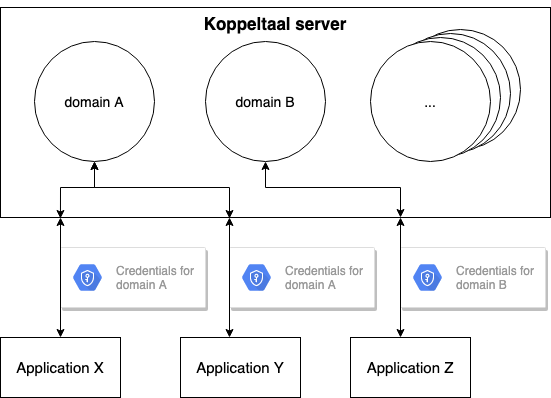
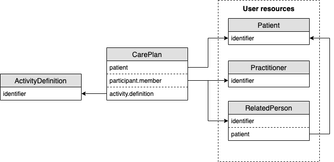

# Quick technical basics

Versie: 1.01  
Datum: 16 november 2020  
Auteurs: Joos Brokamp & Joris Scharp, [Headease b.v.](https://headease.nl)


De informatie in dit document is gebaseerd op [Koppeltaal 1.3.x architectuur](https://vzvz.gitbook.io/koppeltaal-1-3-architectuur/)


## Koppeltaal

Stichting Koppeltaal heeft als doel om interoperabiliteit tussen e-healthsystemen te vergroten door een standaard te ontwikkelen. Hier is de Koppeltaal integratiestandaard uit voortgekomen, die weer gebaseerd is op de HL7 FHIR standaard. Zo worden gegevensuitwisseling en applicatie-integratie vergemakkelijkt. Een van de kernconcepten voor de beveiliging van de gegevens en acties binnen Koppeltaal is het domein.


Lees meer over de business architectuur in het [Koppeltaal Architectuur document, Koppeltaal](https://vzvz.gitbook.io/koppeltaal-1-3-architectuur/bedrijfsarchitectuur#koppeltaal)


## Koppeltaal Domein

Een Koppeltaal Domein is een functionele encapsulatie van een Koppeltaal server ten behoeve van beveiliging. Het representeert een vertrouwelijk datadomein waarbinnen alle interoperabiliteit plaatsvindt binnen de context van een GGZ-instelling. Gegevens binnen het domein kunnen enkel uitgelezen worden door de applicaties die expliciet zijn toegelaten door de domeinbeheerder en daartoe voorzien zijn van een set credentials.


Lees meer over Koppeltaaldomeinen in het [Koppeltaal Architectuur document, Domein en Applicatie](https://vzvz.gitbook.io/koppeltaal-1-3-architectuur/informatiesystemen-architectuur#domein-en-applicatie)


### Domein credentials

Elke actie binnen een domein wordt geautoriseerd aan de hand van credentials. Credentials zijn gekoppeld aan een applicatie en een domein. De Koppeltaalserver weet welke credentials tot welk domein behoren \(figuur 1\). Een applicatie zou theoretisch meerdere credentials kunnen beheren die toegang verschaffen tot verschillende domeinen.


Lees meer over de credentials in het [Koppeltaal Architectuur document, Authenticatie](https://vzvz.gitbook.io/koppeltaal-1-3-architectuur/technologie-architectuur#authenticatie)


  
_Figuur 1: Applicaties worden geautoriseerd om handelingen binnen een domein uit te voeren door middel van de gebruikte credentials. Applicatie X en Applicatie Y kunnen elkaars berichten uitlezen omdat ze beiden toegang hebben tot Domein A. Applicatie Z is agnostisch t.o.v Domein A._

### Data binnen het domein

Elke applicatie met toegang tot het domein is trusted. Dat wil zeggen, alle informatie die in het domein wordt gedeeld kan uitgelezen worden door de applicaties. Applicaties bepalen zelf welke gepubliceerde gegevens ze bekijken, dit kan niet beperkt worden door een domeinbeheerder. Bijvoorbeeld: Patiëntgegevens in het domein kunnen door alle domeinapplicaties uitgelezen worden.

## Koppeltaal resources

Een van de kern use-cases die Koppeltaal faciliteert is het domeinbreed beschikbaar stellen van e-health content. Gegevensuitwisseling vindt plaats in de vorm van Koppeltaal resources. Een resource is een structuur met een aantal vastgelegde velden dat informatie bevat over de resource dit het beschrijft.

### ActivityDefinition

Een applicatie kan binnen het domein kenbaar maken dat deze een zekere e-health activiteit wil aanbieden aan patiënten. Hiervoor bestaat een daarvoor bestemde resource: ActivityDefinition. Deze abstractie beschrijft de activiteit in een aantal velden en wordt bij publicatie in het domein gedeeld met de andere applicaties. Een applicatie kan op basis van de ActivityDefinition een taak toevoegen aan het behandelplan van een patiënt.

### CarePlan

Het behandelplan wordt in Koppeltaal beschreven door de CarePlan resource. Hierin staan onder meer de personen die betrekking hebben op de behandeling en de taken die zijn toegewezen. Een taak maakt onderdeel uit van het CarePlan in de vorm van een CarePlanActivity, welke geen eigen resource is binnen Koppeltaal. Een taak bevat een cruciale referentie naar de ActivityDefinition op welke deze is gebaseerd, dit is nodig voor de Koppeltaal server om te weten waar een taak uitgevoerd moet worden. Ook bevat het CarePlan een lijst met referenties naar gebruikers genaamd participants. Deze referenties verwijzen naar behandelaren \(Practitioner\) en eventuele derden \(RelatedPerson\) die direct of indirect betrekking hebben op de behandeling \(figuur 2\).

  
_Figuur 2: Versimpelde weergave van belangrijke relaties rondom het CarePlan: Het CarePlan is altijd gekoppeld aan een patiënt. Taken \(CarePlanActivity\) verwijzen naar diens ActivityDefinition. Deelnemers \(participants\) verwijzen naar een user in het domein._


Lees meer over Koppeltaal resources in het [Koppeltaal Architectuur document, FHIR Resources](https://vzvz.gitbook.io/koppeltaal-1-3-architectuur/technologie-architectuur#fhir-resources)


### Koppeltaalberichten

Resources worden gecommuniceerd door middel van het FHIR-messaging model. Er zijn een vast aantal berichtsoorten \(events\) beschikbaar om de resources uit te wisselen binnen een domein. Elk berichtsoort heeft als doel om informatie over een zekere resource te communiceren, of een onderdeel daarvan \(tabel 1\).

| event | doel | gerelateerde resource |
| :--- | :--- | :--- |
| CreateOrUpdateActivityDefinition | e-health activiteit aanbieden | ActivityDefinition |
| CreateOrUpdateCarePlan | Behandelplan aanmaken of wijzigen | CarePlan |
| UpdateCarePlanActivityStatus | Verzoek tot wijziging van taakstatus | CarePlan |

_Tabel 1: Voorbeelden van berichtsoorten met event naam, doelomschrijving en gerelateerde resource._

Berichten dienen naar een centraal endpoint van de Koppeltaal server verstuurd te worden, de KoppeltaalMailbox. De gebruikte credentials waarmee het bericht verstuurd is, bepaalt in welk domein het bericht terecht komt. Enkel de applicaties die luisteren naar gekozen events \(abonnees\) zullen het bericht ontvangen.


Lees meer over Koppeltaalberichten in het [Koppeltaal Architectuur document, FHIR Messaging](https://vzvz.gitbook.io/koppeltaal-1-3-architectuur/technologie-architectuur#fhir-messaging)


### KoppeltaalMailbox

Ook wel bekend als de Koppelbox. Ontvangen berichten worden slechts minimaal door de server gevalideerd. Applicaties zijn grotendeels zelf verantwoordelijk voor het correct invullen van de beschikbare resource velden. Na ontvangst worden kopieën van het bericht gedistribueerd naar de inboxen van geabonneerde applicaties. Berichtgegevens worden na maximaal 56 dagen van de Koppeltaal server verwijderd en dienen voor die tijd lokaal opgeslagen te zijn. De Koppeltaal server fungeert dus voornamelijk als message broker.


Lees meer over de Koppelbox in het [Koppeltaal Architectuur document, Het applicatie model](https://vzvz.gitbook.io/koppeltaal-1-3-architectuur/technologie-architectuur#het-applicatie-model)


###  Adapters
Om berichten te kunnen versturen en/of te ontvangen worden adapters (ook bekend als connectors) aangeboden door Koppeltaal.
Elke programmeertaal heeft een eigen adapter nodig.

Een adapter kent de volgende verantwoordelijkheden:
1. Eenvoudig een connectie opzetten met de Koppeltaal server en het domein.  
2. Middels een simpele API Koppeltaal berichten samenstellen. Deze API is een facade van de HL7 FHIR en Koppeltaal complexiteit.
De adapter-gebruikers hoeven zich dus geen zorgen maken over de een correcte Koppelaal syntax (bij correct gebruik adapter)  
3. Berichten ophalen uit de `KoppeltaalMailbox` middels de [GetNextNewAndClaim](https://vzvz.gitbook.io/koppeltaal-1-3-architectuur/technologie-architectuur#bericht-ophalen) functionaliteit. 


Let op: Het is niet de verantwoordelijkheid van de adapters om Koppeltaal berichten uit de `KoppeltaalMailbox` in de applicatie-database
op te slaan. De applicaties moeten dus zelf code schrijven om de Koppeltaal data op te slaan en up-to-date te houden. 
Dit is geen gedeelde functionaliteit omdat er een groot aantal mogelijke combinaties van programmeertalen (en dus adapters) 
en databases is.


Er zijn adapters beschikbaar voor de volgende programmeertalen (onderstaande links zijn alleen toegankelijk voor leveranciers 
die toegevoegd zijn in GitHub): 
 
1. [C# Adapter](https://github.com/Koppeltaal/Koppeltaal-C-Sharp-Connector)
2. [PHP Adapter](https://github.com/Koppeltaal/Koppeltaal-PHP-Connector)
3. [Python Adapter](https://github.com/Koppeltaal/Koppeltaal-Python-Connector)
4. [Java Adapter](https://github.com/Koppeltaal/Koppeltaal-Java-Connector)

## Hoe doe ik x? \(Voorbeelden\)

Onderstaand een aantal veelvoorkomende gebruiksscenario’s.


Lees meer over door Koppeltaal ondersteunde scenario’s in het [Koppeltaal Architectuur document, Interacties](https://vzvz.gitbook.io/koppeltaal-1-3-architectuur/informatiesystemen-architectuur#interacties)


### Taken met voortgang tonen

Taken zijn altijd gebaseerd op een ActivityDefinition. Hierin staan de details van een activiteit zoals de titel en een beschrijving. Het toewijzen van een activiteit aan een individuele patiënt geschiedt doorgaans vanuit een behandelarenportaal of EPD. Er wordt dan een taak \(CarePlanActivity\) toegevoegd aan het behandelplan \(CarePlan\) van de patiënt. Voortgang \(ActivityStatus\) op de taak wordt bijgehouden in het CarePlan. Wanneer een applicatie de voortgang wil tonen van een taak met bijvoorbeeld een titel erbij moet deze informatie geaggregeerd worden uit de verschillende resources. De taak bevat de voortgang en een verwijzing naar zijn ActivityDefinition resource waar de additionele informatie te verkrijgen is.

Versimpelde actiesequentie:

1. Contentapplicatie publiceert activiteit \(ActivityDefinition\).
2. Een applicatie wijst taak \(CarePlanActivity\) toe aan patiënt via behandelplan \(CarePlan\).
3. Applicatie X ontvangt CarePlan van patiënt met de taak \(CarePlanActivity\).
4. Applicatie X aggregeert en toont de gewenste informatie op basis van de taak \(CarePlanActivity\) en bijbehorende definitie \(ActivityDefinition\).

### Taak uitvoeren als patiënt

Om te launchen naar een andere applicatie binnen het domein, moet die applicatie zich in eerste instantie kenbaar maken dat er een activiteit te doen is. Dit kan bereikt worden door middel van het publiceren van een ActivityDefinition in het domein die de activiteit beschrijft. Het toewijzen van een activiteit aan een individuele patiënt geschiedt doorgaans vanuit een behandelarenportaal of EPD. Er wordt dan een taak \(CarePlanActivity\) toegevoegd aan het CarePlan van de patiënt. Om de taak uit te kunnen voeren dient een Koppeltaal web launch uitgevoerd te worden middels een op OAuth2 gebaseerde SSO. Een launch dient altijd uitgevoerd te worden in de context van een persoon en activiteit.

Versimpelde actiesequentie:

1. Contentapplicatie publiceert activiteit \(ActivityDefinition\).
2. Een applicatie wijst taak \(CarePlanActivity\) toe aan patiënt via behandelplan \(CarePlan\).
3. Applicatie X ontvangt CarePlan van patiënt met de taak \(CarePlanActivity\).
4. Applicatie X voert web launch uit van taak \(CarePlanActivity\).


Lees meer over Koppeltaal launches in het [Koppeltaal Architectuur document, De Single-Sign-On \(SSO\) flow](https://vzvz.gitbook.io/koppeltaal-1-3-architectuur/technologie-architectuur#de-single-sign-on-sso-flow)


## Changelog
### Versie 1.0.1
* Informatie toegevoegd over de verantwoordelijkheden van de adapter